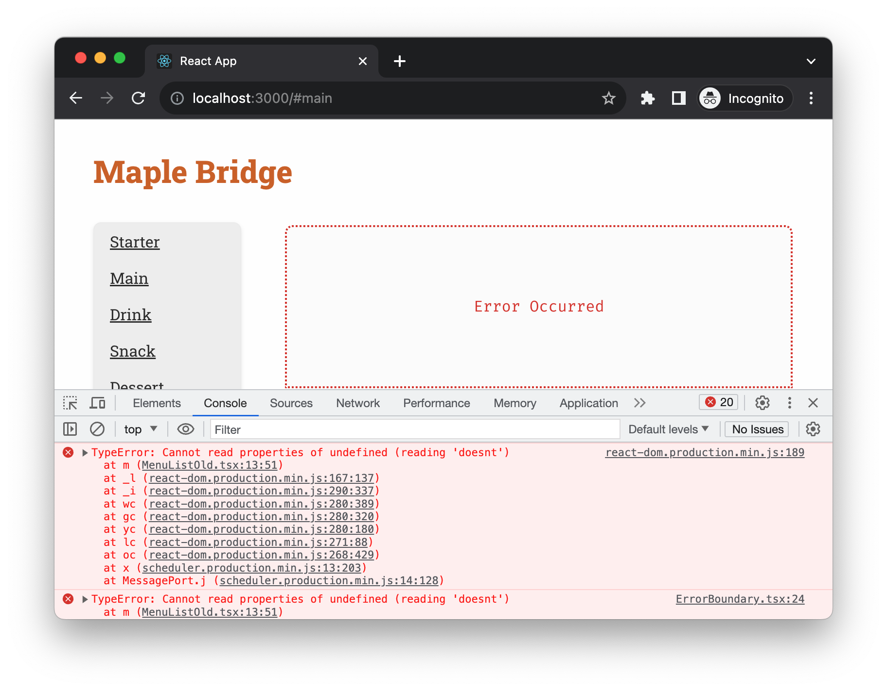

# Introduction

Navigating the complexities of building large React applications can be daunting. This opening chapter serves as a roadmap, outlining the challenges often encountered in projects of all sizes that I've been a part of. We'll delve into the intricacies later; for now, consider this a preview of the common hurdles we face. 

# What will be coverd

- Understanding why ui is difficult
- Exploring different ways of building ui
- Understanding the state management
- Exploring the unhappy paths
- Introducing our approach

# Understanding why build ui is difficult

Unless you're building a straightforward, document-like webpage—such as a basic article without advanced UI elements like search boxes or modals—the built-in languages offered by web browsers are generally insufficient. Most web applications are much more complex than a simple document.


The disparity between the language of the web and the UI experiences people encounter daily is substantial. Whether it's a ticket booking platform, a project management tool, or an image gallery, modern web UIs are intricate, and native web languages don't readily support them. You can go the extra mile to "simulate" UI components like accordions, toggle switches, or interactive cards, but fundamentally, you're still working with what amounts to a document, not a genuine UI component.

In an ideal world, building a user interface would resemble working with a visual UI designer. Tools like C++ Builder or Delphi, or more modern alternatives like Figma, let you drag-and-drop components onto a canvas that then renders seamlessly on any screen.

This isn't the case with web development. For instance, to create a custom search input, you'll need to wrap it in additional elements, fine-tune colors, adjust padding and fonts, and perhaps add an icon for user guidance. Creating an auto-suggestion list that appears right under the search box, matching its width exactly, is often far more labor-intensive than one might initially think.


Above is a Jira ticket - an issue view, and as you can tell it’s a relatively complicated user interface. For such a UI you might expect there is `Navigator` component, `Dropdown` list, `Accordion` and so on. But there isn’t, or should I say not directly. 

Developers have worked hard to simulate these with HTML, CSS and JavaScript. If I disable the CSS for the site temporarily, I will get something like this:


Utilizing a design system library can alleviate some of these challenges, offering developers a head start rather than building from scratch. However, design systems come with their own set of drawbacks and require thorough evaluation before integration into your project.

Note: Design System
A design system is a comprehensive set of guidelines, reusable UI components, and principles that help teams design and build digital products more efficiently and consistently. It serves as the single source of truth for both designers and developers, facilitating collaboration and speeding up the product development process. 

# Exploring a bit on ways of building ui

Let's move a bit back to history to see how the way we build web ui in the old time, and how the technique at different stage solve problems and why we end up with declartive ui library like React.

Firstly, let's start from a simple feature: given an array of strings, make a HTML list on the page. This is a common problem we face as a web developer - in real world scenario the data might come from a remote server, and the data might be more complicated, say, a nested object contains more data in each item, and we might need to render more sophiscated user interface, for example, a product card or a property listing. But we'll skip all these details and over simplify it for the demo here.

So the array is defined as the following content - it contains three famous quotes.

```ts
const quotes = [
    "The only way to do great work is to love what you do.",
    "The only limit to our realization of tomorrow is our doubts of today.",
    "In the end, we will remember not the words of our enemies, but the silence of our friends."
];
```

Let's beginging with implementing the feature with native DOM APIs.

Note: DOM
The Document Object Model (DOM) is a programming interface for web documents. It represents the structure of a document as a tree of objects, where each object corresponds to a part of the page such as an HTML tag. Essentially, the DOM serves as a representation of the web page so that languages like JavaScript can interact with it to change the document structure, style, and content. 

The DOM is not part of the JavaScript language, but rather a standard object-based representation of a web page, which can be manipulated using JavaScript. It allows for dynamic changes, enabling rich interactive web applications.

## Using DOM API

With the raw DOM API, you'll have to create each element and append it to the parent manually.

```ts
const ul = document.createElement('ul');

quotes.forEach(quote => {
  const li = document.createElement('li');
  li.innerText = quote;
  ul.appendChild(li);
});

document.body.appendChild(ul);
```

We use JavaScript's native DOM API to create an unordered list by invoking document.createElement('ul'). Then, for each quote in our quotes array, we create a new li element and set its inner text to the quote description. Finally, we append each li to the ul, and the ul gets appended to the document body with `document.body.appendChild(ul)`.

This approach offers the most control but is quite verbose and easy to get wrong. You directly interact with the DOM, meaning you're responsible for managing all aspects of element creation, updating, and deletion. This could lead to more errors and makes the code harder to manage and debug.

The native DOM API is a bit verbose and easy to go wrong if you don't pay enough attention. And jQuery changed the way people write code to manipulate the DOM.

## Using jQuery

```ts
const ul = $('<ul>');

quotes.forEach(quote => {
  const li = $('<li>').text(quote);
  ul.append(li);
});

$('body').append(ul);
```

Similarly, we start by creating an empty `<ul>` element using the jQuery constructor function `$('<ul>')`. For each quote in our array, we create a new `<li>` element, setting its text to the quote string using `.text()`. We then append each `<li>` to the `<ul>` using the `.append()` method. Finally, we append the complete `<ul>` to the body of the document using `$('body').append(ul)`.

Using jQuery simplifies the process and reduces boilerplate code. It abstracts away many complexities of native DOM manipulation, making the code more concise and less prone to errors. Instead of directly interacting with the DOM, we benefit from the utility methods jQuery offers, which internally handle the lower-level operations. This generally results in cleaner, more maintainable code that is easier to debug.

But still, we're thinking in how to do DOM manipulations, we need to consider which node to be inserted to where. 

## Using Backbone.js

Frameworks like Backbone.js attempted to bring structure to the frontend, introducing the MVC (Model-View-Controller) pattern to JavaScript development. While Backbone.js added more organization, it also increased complexity by necessitating a deep understanding of models, views, and routers.

For example, if we write the same function above with Backbone.js, we'll end up with some fairly complicated code like following:

```ts
const QuoteView = Backbone.View.extend({
  tagName: 'li',
  initialize: function(options) {
    this.text = options.text;
  },
  render: function() {
    this.$el.html(this.text);
    return this;
  }
});

const QuotesListView = Backbone.View.extend({
  el: '#quote-list',
  initialize: function(options) {
    this.quotes = options.quotes;
  },
  render: function() {
    this.quotes.forEach((quoteText) => {
      const quoteView = new QuoteView({ text: quoteText });
      this.$el.append(quoteView.render().el);
    });
    return this;
  }
});

const quotesListView = new QuotesListView({ quotes });
quotesListView.render();
```

In the Backbone.js code, we define two distinct views: `QuoteView` and `QuotesListView`. A view in Backbone.js is a piece of the user interface that is responsible for displaying data and handling user interactions. The `QuoteView` is responsible for rendering a single quote as a list item. It uses the `tagName` property to specify that it should generate an 'li' element. When initialized, it sets its internal `text` property to the quote text passed through the `options` argument.

The `QuotesListView` is a more complex view that manages a collection of `QuoteView` instances. A collection in Backbone.js is an ordered set of models that provides methods for managing them. The `el` property links the view to an existing DOM element, in this case, an element with the id `quote-list`. When the `QuotesListView` is initialized, it receives an array of quotes via `options`, which it sets as its internal `quotes` property.

The `render` method in `QuotesListView` iterates over the `quotes` array and for each quote, creates a new `QuoteView` instance, renders it, and appends it to its root element. This composition of views makes the application easier to manage and scale, as each view has a well-defined role.

In contrast to directly manipulating the DOM or using jQuery, Backbone.js offers a structured approach that separates the concerns of data management and UI rendering, making it easier to maintain and extend the codebase.

Backbone.js, while offering a structured approach to building web applications, has some challenges that led developers to explore alternative paradigms like two-way data binding:

1. Boilerplate Code: Backbone often requires a lot of boilerplate to get simple features up and running. For example, you have to manually set up listeners for model changes to update the view.

2. Manual DOM Management: With Backbone, you're still required to write logic to manipulate the DOM. This is tedious and error-prone.

3. Lack of Data Binding: Unlike frameworks that support two-way data binding, Backbone requires you to write custom code to sync your views with your models. This can become cumbersome for complex applications.

4. Complexity: As your application grows, you may find yourself managing a lot of views, models, and their interconnections. This could lead to spaghetti code if not managed carefully.

Two-way data binding frameworks like AngularJS (1.x) sought to address these issues by providing a more declarative way to sync the view with the model. With two-way data binding, any changes to the model are automatically reflected in the view and vice versa, without the need for manual DOM manipulation or event handling for synchronization.

Note: Two-way data binding
Two-way data binding is a mechanism where the User Interface (UI) fields are bound to model data dynamically, such that when a UI field changes, the model data changes with it and vice versa. This can significantly simplify how changes in your UI are reflected in your application state and how changes in your application state are reflected back in your UI.

Two-way data binding also had its downsides, such as performance issues on large applications and difficulties in debugging, as changes could be triggered from either the view or the model. This led to the adoption of a one-way data flow architecture in newer frameworks like React and Angular 2+, which offer greater control and predictability.

- Performance: Constantly watching for changes in the DOM and updating the model, and vice versa, can be resource-intensive, especially for large applications.
- Complexity: It can make the data flow in your application harder to understand and debug because changes can be initiated from both the UI and the model.
- Predictability: Two-way data binding can lead to situations where changes in one part of the application unexpectedly and undesirably affect other parts, which makes the system harder to reason about.

## Using React

There are many new things with React compare to its predecessors. Namingly:

1. **One-Way Data Flow**: React employs a unidirectional data flow, ensuring that child components can't affect parent data. This creates a single source of truth within the application, which simplifies debugging and makes the state more predictable. This is a departure from two-way data binding methods found in older frameworks, where changes could propagate in both directions, often making it harder to track state changes and debug issues.

2. **Virtual DOM**: Unlike earlier libraries and frameworks that directly manipulated the real DOM, React creates a virtual DOM in-memory. When an element's state changes, React first performs the changes on the virtual DOM, then compares it with the real DOM, and finally updates only the differing parts. This results in enhanced performance by reducing costly DOM manipulations and repaints.

3. **Component-Based Architecture**: React brought a highly composable component-based architecture to the forefront. This not only allows for better code reusability but also makes it easier to manage state and lifecycle methods. Components are the building blocks of a React application, and they make it simpler to develop, maintain, and scale large applications.

4. **Server-Side Rendering**: Unlike some client-side rendering-only libraries, React allows for server-side rendering (SSR) out of the box. SSR can significantly improve the initial load time of a web application, which is crucial for both user experience and SEO.

5. **Immutable Data**: React pairs well with immutable data structures. This enables optimized rendering and improves the application's performance. When data is immutable, React can more easily determine changes, which is beneficial for optimizing re-renders.

These features set React apart from many of its predecessors, offering a more robust, maintainable, and scalable solution for building modern web applications.

Now let's write the same example with in React:

```tsx
function Quotes() {
  return (
    <ul>
      {quotes.map((quote, index) => <li key={index}>{quote}</li>)}
    </ul>
  );
}
```

In this React functional component named `Quotes`, an unordered list (`<ul>`) is rendered. Inside this list, the `.map()` function iterates over the `quotes` array to generate a list item (`<li>`) for each quote. The `{quote}` syntax injects the actual text of the quote into each list item.

A `key` attribute is also set to the index of each quote within the array, ensuring each list item has a unique identifier, as per React's best practices. This helps React optimize re-rendering by quickly identifying which items have changed.

Compared to the vanilla JavaScript example (and jQuery version), this React code is more declarative and easier to understand. You describe what you want (a list of quotes) rather than detailing all the steps to create it. This makes the code easier to debug and maintain in the long run.

## Summary

You can see that as we progress from the raw DOM API to React, the code becomes easier to read and understand. In the DOM API, you have to explicitly create and append each element. jQuery improves upon this but still involves manual DOM manipulation. Backbone introduces the concept of views, but you still have to handle the rendering yourself.

React takes a step further by letting you focus on describing what the UI should look like, not how to get there. This declarative approach simplifies the mental model, reduces side effects, and makes the code much more maintainable.

The benefits of using a declarative API, as found in React, are manifold. One of the most significant advantages is that it abstracts away the manual manipulation of the DOM, allowing developers to focus more on the application's state and logic rather than how it is rendered. You describe what you want the UI to look like, and React takes care of making it so. This simplifies the codebase and makes it easier to maintain.

Another benefit is reusability. In React, components can be easily shared and reused across different parts of an application or even across different projects. This DRY (Don't Repeat Yourself) approach enhances code quality and speeds up development.

Declarative APIs also enhance the predictability and reliability of applications. Because you're describing what the UI should look like for a given state, it's easier to reason about the application's behavior. This makes debugging and testing simpler, as well as improves the overall maintainability of the codebase.

Lastly, React's declarative nature works well with modern development tooling and practices, such as component-driven development and various state management libraries. This ecosystem integration further eases the development process, providing a robust, efficient, and scalable way to build user interfaces.

In summary, React's declarative API offers a more maintainable, reusable, and predictable way to build UIs compared to the manual and error-prone methods required when using the native DOM API. It lets you focus on the 'what' rather than the 'how,' streamlining the development process and improving code quality.

# Understanding the State management

Managing the state in modern frontend development is a complex task. Nearly every application has to retrieve data from a remote server via a network - we can call them remote states. Remote state originates from an external source—typically a backend server or API. This is in contrast to local state, which is generated and managed entirely within the frontend application itself.

There are many dark side of remote states, it makes the frontend development difficult if you don't pay close attention to. Here I'll just list a few obvious considerations:

1. **Asynchronous Nature**: Fetching data from a remote source is usually an asynchronous operation. This adds complexity in terms of timing, especially when you have to synchronize multiple pieces of remote data.

2. **Error Handling**: Connections to remote sources might fail, or the server might return errors. Properly managing these scenarios for a smooth user experience can be challenging.

3. **Loading States**: While waiting for data to arrive from a remote source, the application needs to handle "loading" states effectively. This usually involves showing loading indicators or fallback UIs.

4. **Consistency**: Keeping the frontend state in sync with the backend can be difficult, especially in real-time applications or those that involve multiple users altering the same piece of data.

5. **Caching**: Storing some remote state locally can improve performance but brings its own challenges, such as invalidation and staleness.

6. **Updates and Optimistic UI**: When a user makes a change, you can update the UI optimistically assuming the server call will succeed. But if it doesn't, you'll need a way to roll back those changes in your frontend state.

When the data is stored and accessible immediately in frontend, you basically think in linear way. For instance, to render an list, you can map the data into JSX elements:

```tsx
function Quotes() {
  return (
    <ul>
      {quotes.map((quote, index) => <li key={index}>{quote}</li>)}
    </ul>
  );
}
```

However, if the `quotes` are from a remote server, the code will turn into something like (Don't worry if you don't understand everything, we have a chapter to cover React essentials):

```tsx
import React, { useState, useEffect } from 'react';

function Quotes() {
  const [quotes, setQuotes] = useState([]);

  useEffect(() => {
    fetch('https://quote-service.com/quotes')
      .then(response => response.json())
      .then(data => setQuotes(data));
  }, []);

  return (
    <ul>
      {quotes.map((quote, index) => <li key={index}>{quote}</li>)}
    </ul>
  );
}

export default Quotes;
```

In this React component, we use `useState` to create a `quotes` state variable, initially set as an empty array. The `useEffect` hook fetches quotes from a remote server when the component mounts. It then updates the `quotes` state with the fetched data. Finally, the component renders a list of quotes, iterating through the `quotes` array. No need to sweat the details for now, we'll delve into them in the next chapter.

The code example above shows the ideal scenario, but in reality, asynchronous calls come with their own challenges. We have to think about what to display while data is being fetched and how to handle various error scenarios, like network issues or resource unavailability. These added complexities can make the code lengthier and more difficult to grasp.

```tsx
function Quotes() {
  const [quotes, setQuotes] = useState([]);
  const [isLoading, setIsLoading] = useState(false);
  const [error, setError] = useState(null);

  useEffect(() => {
    setIsLoading(true); // Set loading to true

    fetch('https://quote-service.com/quotes')
      .then(response => {
        if (!response.ok) {
          throw new Error('Failed to fetch quotes');
        }
        return response.json();
      })
      .then(data => {
        setQuotes(data);  // Update the quotes state
      })
      .catch(err => {
        setError(err.message); // Set error message
      })
      .finally(() => {
        setIsLoading(false); // Set loading to false
      });
  }, []);

  return (
    <div>
      {isLoading && <p>Loading...</p>}
      {error && <p>Error: {error}</p>}
      <ul>
        {quotes.map((quote, index) => <li key={index}>{quote}</li>)}
      </ul>
    </div>
  );
}
```

The code above uses `useState` to manage three pieces of state: `quotes` for storing the quotes, `isLoading` for tracking the loading status, and `error` for any fetch errors. The `useEffect` hook triggers the fetch operation. If the fetch is successful, the quotes are displayed, and `isLoading` is set to false. If an error occurs, an error message is displayed, and `isLoading` is also set to false.

As you can observe, the portion of the component dedicated to actual rendering is quite small. In contrast, managing the state consumes nearly two-thirds of the function's body.

But that's just one aspect; there's also the matter of managing local state. For example, as demonstrated in the image below, an accordion component needs to track whether it's expanded or collapsed. Similarly a text field in a form might manage its own value.


Using a third-party state management library like Redux or MobX can be beneficial when your application reaches a level of complexity that makes state tracking difficult. However, this approach isn't without its caveats and should be considered carefully. 

Many developers are leaning towards using React's built-in Context API for state management. Additional complexities such as steep learning curves, boilerplate code, and potential performance overhead are some reasons why these libraries might not be suitable for everyone.

# Exploring the Unhappy Paths

When it comes to UI development, our primary focus is often on the "happy path"—the optimal user journey where everything goes as planned. However, neglecting the "unhappy paths" can make your UI far more complicated than you might initially think. Here are some scenarios that could lead to unhappy paths and consequently complicate your UI development efforts:

## Errors in Another Component

Imagine you're using a third-party component or even another team's component within your application. If that component throws an error, it could potentially break your UI or lead to unexpected behaviors that you have to account for. This can involve adding conditional logic or error boundaries to handle these errors gracefully, making your UI more complex than initially anticipated.

For example, the following code we’re trying to access something doesn’t exist in the passed in props - a common **TypeError: Cannot read properties of undefined (reading 'doesnt')** and it throws an exception.

```tsx
const MenuItem = ({
  item,
  onItemClick,
}: {
  item: MenuItemType;
  onItemClick: (item: MenuItemType) => void;
}) => {
  // @ts-ignore
  const information = item.something.doesnt.exist;

  return (
    <li key={item.name}>
      <h3>{item.name}</h3>
      <p>{item.description}</p>
      <button onClick={() => onItemClick(item)}>Add to Cart</button>
    </li>
  );
};
```

It can cause the whole application to crash if we don’t isolate the error into a Error Boundary.



Note: Error Boundary
Error Boundaries in React are a feature that allows you to catch JavaScript errors that occur in child components, log those errors, and display a fallback UI instead of letting the whole app crash. Error Boundaries catch errors during rendering, in lifecycle methods, and in constructors of the whole tree below them.

## Downstream Systems Are Down

Your UI might depend on various microservices or APIs for fetching data. If any of these downstream systems are down, your UI has to account for it. You'll need to design fallbacks, loading indicators, or friendly error messages that guide the user on what to do next. Handling these scenarios effectively often involves both frontend and backend logic, thus adding another layer of complexity to your UI development tasks.

## Unexpected User Behavior

No matter how perfectly you design your UI, users will always find ways to use your system in manners you didn't anticipate. Whether they input special characters in text fields, try to submit forms too quickly, or use browser extensions that interfere with your site, you have to design your UI to handle these edge cases. This means implementing additional validation, checks, and safeguards that can complicate your UI codebase.

Understanding and effectively managing these unhappy paths are critical for creating a robust, resilient, and user-friendly interface. Not only do they make your application more reliable, but they also contribute to a more comprehensive and well-thought-out user experience.


# Introducing Our Approach

Navigating the labyrinthine world of frontend development can certainly feel overwhelming, but the good news is that we're not alone in this journey. Many have walked this path before us, leaving behind valuable blueprints—patterns, tooling, and methodologies—that can aid us in crafting high-quality frontend applications. 

## Understanding Anti-Patterns

First and foremost, awareness of common anti-patterns is crucial. These are the traps that developers frequently fall into, leading to code that is harder to maintain, less efficient, and prone to errors. By recognizing these pitfalls, you can steer clear of them, resulting in a codebase that's not only more robust but also easier to understand. Ignorance may be bliss, but not when it compromises the quality of your application.

## Leveraging Established Design Patterns

Understanding the fundamentals of well-established design patterns can serve as a guiding light for your frontend architecture. These patterns have been rigorously tested in various contexts and offer solutions to recurring problems. The benefit is twofold: Not only do you get a proven blueprint to solve specific problems, but you also make it easier for other developers to understand your approach, thereby fostering better collaboration.

## Ensuring Robust Testing Strategy

A comprehensive testing strategy is your safety net. It serves as a protective layer, catching any unexpected changes that could break functionalities. It also allows you to update and modify code with a higher degree of confidence, knowing that your tests will flag any discrepancies. In the long run, a strong testing strategy can save you countless hours of debugging and stress.

## Embracing Test-Driven Development and Refactoring 

The principles of Test-Driven Development (TDD) and continuous refactoring go hand-in-hand in elevating the quality of your code. TDD encourages writing tests before writing the code that needs to be tested, thereby ensuring that your application is thoroughly vetted for issues from the get-go. This is complemented by the practice of continuous refactoring, which involves regularly revisiting and refining the code. This not only helps to maintain a high-quality codebase but also makes it more adaptive to future changes.

# Summary

In this chapter, we explored the challenges of UI development, from its complexities to state management issues. We also discussed various UI building methods, how to handle errors, and introduced our approach that combines best practices and effective testing strategies. This sets the foundation for more efficient and robust frontend development.

In the upcoming chapter, we'll dive deep into React Essentials, giving you the tools and knowledge you need to master this powerful library. Stay tuned!