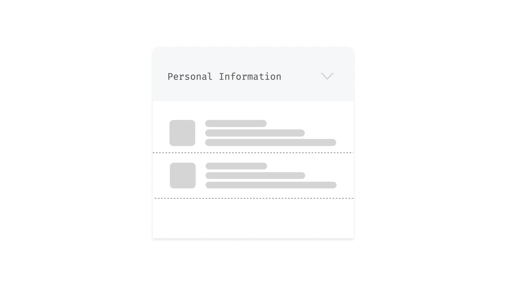
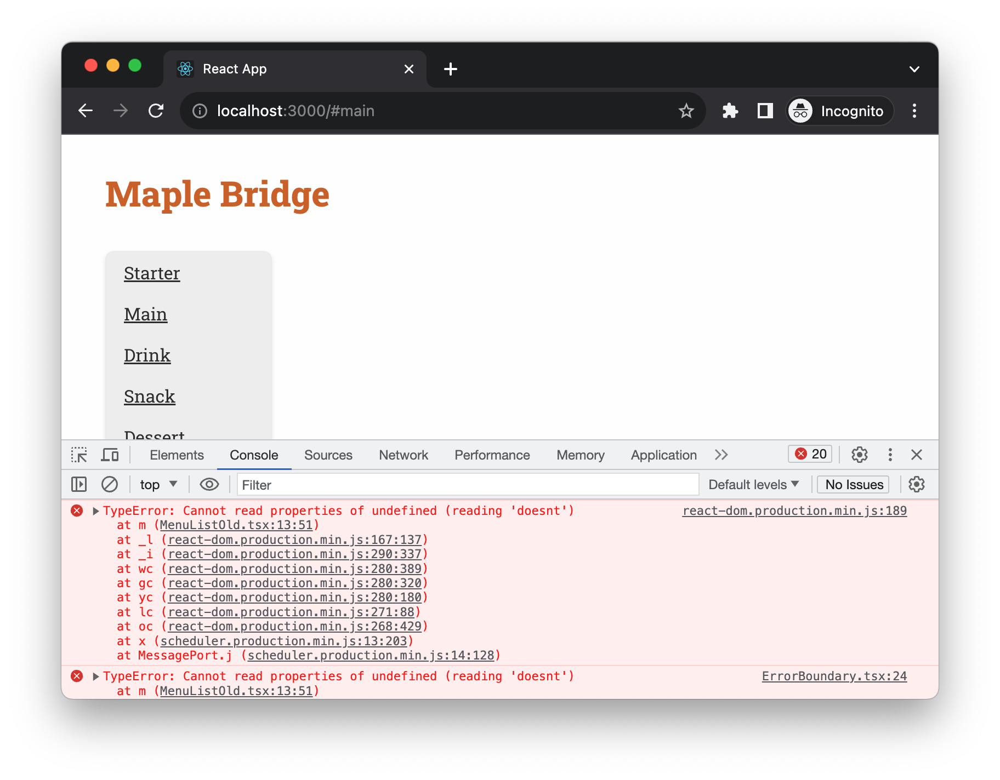

# Understanding the State management

Managing the state in modern frontend development is a complex task. Nearly every application has to retrieve data from a remote server via a network - we can call them remote states. Remote state originates from an external source—typically a backend server or API. This is in contrast to local state, which is generated and managed entirely within the frontend application itself.

There are many dark side of remote states, it makes the frontend development difficult if you don't pay close attention to. Here I'll just list a few obvious considerations:

1. **Asynchronous Nature**: Fetching data from a remote source is usually an asynchronous operation. This adds complexity in terms of timing, especially when you have to synchronize multiple pieces of remote data.

2. **Error Handling**: Connections to remote sources might fail, or the server might return errors. Properly managing these scenarios for a smooth user experience can be challenging.

3. **Loading States**: While waiting for data to arrive from a remote source, the application needs to handle "loading" states effectively. This usually involves showing loading indicators or fallback UIs.

4. **Consistency**: Keeping the frontend state in sync with the backend can be difficult, especially in real-time applications or those that involve multiple users altering the same piece of data.

5. **Caching**: Storing some remote state locally can improve performance but brings its own challenges, such as invalidation and staleness.

6. **Updates and Optimistic UI**: When a user makes a change, you can update the UI optimistically assuming the server call will succeed. But if it doesn't, you'll need a way to roll back those changes in your frontend state.

When the data is stored and accessible immediately in frontend, you basically think in linear way. For instance, to render an list, you can map the data into JSX elements:

```tsx
function Quotes() {
  return (
    <ul>
      {quotes.map((quote, index) => <li key={index}>{quote}</li>)}
    </ul>
  );
}
```

However, if the `quotes` are from a remote server, the code will turn into something like (Don't worry if you don't understand everything, we have a chapter to cover React essentials):

```tsx
import React, { useState, useEffect } from 'react';

function Quotes() {
  const [quotes, setQuotes] = useState([]);

  useEffect(() => {
    fetch('https://quote-service.com/quotes')
      .then(response => response.json())
      .then(data => setQuotes(data));
  }, []);

  return (
    <ul>
      {quotes.map((quote, index) => <li key={index}>{quote}</li>)}
    </ul>
  );
}

export default Quotes;
```

In this React component, we use `useState` to create a `quotes` state variable, initially set as an empty array. The `useEffect` hook fetches quotes from a remote server when the component mounts. It then updates the `quotes` state with the fetched data. Finally, the component renders a list of quotes, iterating through the `quotes` array. No need to sweat the details for now, we'll delve into them in the next chapter.

The code example above shows the ideal scenario, but in reality, asynchronous calls come with their own challenges. We have to think about what to display while data is being fetched and how to handle various error scenarios, like network issues or resource unavailability. These added complexities can make the code lengthier and more difficult to grasp.

```tsx
function Quotes() {
  const [quotes, setQuotes] = useState([]);
  const [isLoading, setIsLoading] = useState(false);
  const [error, setError] = useState(null);

  useEffect(() => {
    setIsLoading(true); // Set loading to true

    fetch('https://quote-service.com/quotes')
      .then(response => {
        if (!response.ok) {
          throw new Error('Failed to fetch quotes');
        }
        return response.json();
      })
      .then(data => {
        setQuotes(data);  // Update the quotes state
      })
      .catch(err => {
        setError(err.message); // Set error message
      })
      .finally(() => {
        setIsLoading(false); // Set loading to false
      });
  }, []);

  return (
    <div>
      {isLoading && <p>Loading...</p>}
      {error && <p>Error: {error}</p>}
      <ul>
        {quotes.map((quote, index) => <li key={index}>{quote}</li>)}
      </ul>
    </div>
  );
}
```

The code above uses `useState` to manage three pieces of state: `quotes` for storing the quotes, `isLoading` for tracking the loading status, and `error` for any fetch errors. The `useEffect` hook triggers the fetch operation. If the fetch is successful, the quotes are displayed, and `isLoading` is set to false. If an error occurs, an error message is displayed, and `isLoading` is also set to false.

As you can observe, the portion of the component dedicated to actual rendering is quite small. In contrast, managing the state consumes nearly two-thirds of the function's body.

But that's just one aspect; there's also the matter of managing local state. For example, as demonstrated in the image below, an accordion component needs to track whether it's expanded or collapsed. Similarly a text field in a form might manage its own value.



Using a third-party state management library like Redux or MobX can be beneficial when your application reaches a level of complexity that makes state tracking difficult. However, this approach isn't without its caveats and should be considered carefully. 

Many developers are leaning towards using React's built-in Context API for state management. Additional complexities such as steep learning curves, boilerplate code, and potential performance overhead are some reasons why these libraries might not be suitable for everyone.


---

# Exploring the Unhappy Paths

When it comes to UI development, our primary focus is often on the "happy path"—the optimal user journey where everything goes as planned. However, neglecting the "unhappy paths" can make your UI far more complicated than you might initially think. Here are some scenarios that could lead to unhappy paths and consequently complicate your UI development efforts:

## Errors in Another Component

Imagine you're using a third-party component or even another team's component within your application. If that component throws an error, it could potentially break your UI or lead to unexpected behaviors that you have to account for. This can involve adding conditional logic or error boundaries to handle these errors gracefully, making your UI more complex than initially anticipated.

For example, the following code we’re trying to access something doesn’t exist in the passed in props - a common **TypeError: Cannot read properties of undefined (reading 'doesnt')** and it throws an exception.

```tsx
const MenuItem = ({
  item,
  onItemClick,
}: {
  item: MenuItemType;
  onItemClick: (item: MenuItemType) => void;
}) => {
  // @ts-ignore
  const information = item.something.doesnt.exist;

  return (
    <li key={item.name}>
      <h3>{item.name}</h3>
      <p>{item.description}</p>
      <button onClick={() => onItemClick(item)}>Add to Cart</button>
    </li>
  );
};
```

It can cause the whole application to crash if we don’t isolate the error into a Error Boundary.



Note: Error Boundary
Error Boundaries in React are a feature that allows you to catch JavaScript errors that occur in child components, log those errors, and display a fallback UI instead of letting the whole app crash. Error Boundaries catch errors during rendering, in lifecycle methods, and in constructors of the whole tree below them.

## Downstream Systems Are Down

Your UI might depend on various microservices or APIs for fetching data. If any of these downstream systems are down, your UI has to account for it. You'll need to design fallbacks, loading indicators, or friendly error messages that guide the user on what to do next. Handling these scenarios effectively often involves both frontend and backend logic, thus adding another layer of complexity to your UI development tasks.

## Unexpected User Behavior

No matter how perfectly you design your UI, users will always find ways to use your system in manners you didn't anticipate. Whether they input special characters in text fields, try to submit forms too quickly, or use browser extensions that interfere with your site, you have to design your UI to handle these edge cases. This means implementing additional validation, checks, and safeguards that can complicate your UI codebase.

Understanding and effectively managing these unhappy paths are critical for creating a robust, resilient, and user-friendly interface. Not only do they make your application more reliable, but they also contribute to a more comprehensive and well-thought-out user experience.