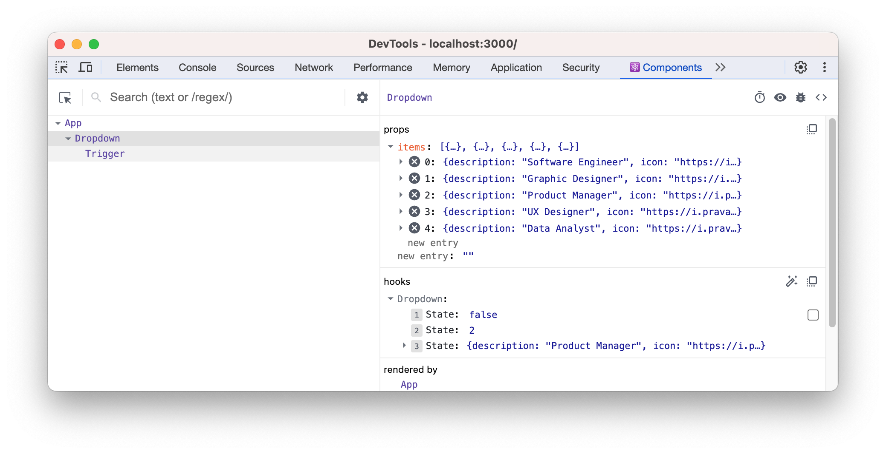
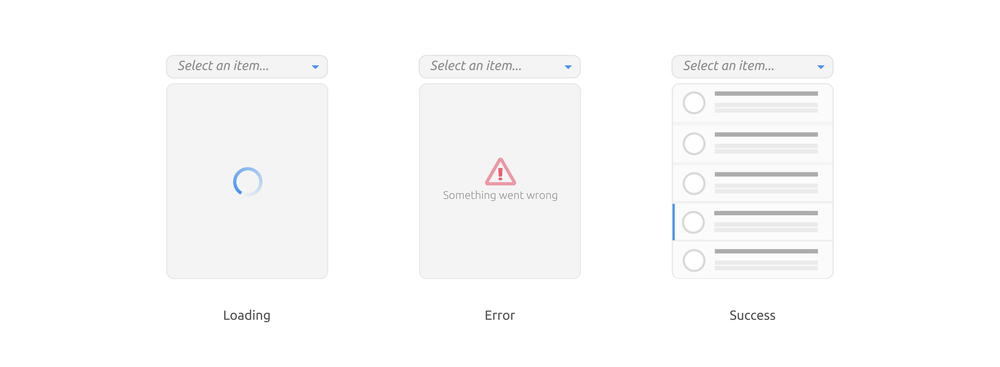
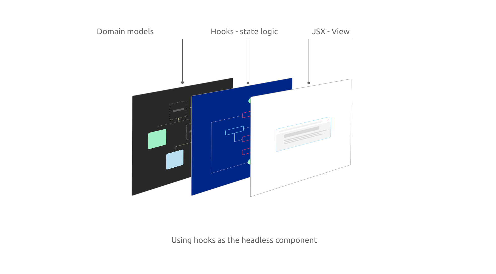

# Diving deep in composition patterns

The journey of building scalable and maintainable user interfaces is riddled with challenges. One primary challenge faced by developers is ensuring that components remain modular, reusable, and easy to understand as the codebase grows. The more intertwined and tightly-coupled our components become, the harder it is to maintain, test, or even onboard new team members.

Composition has emerged as a powerful technique to address this challenge, enabling developers to build more organized, scalable, and cleaner codebases. Instead of creating large, monolithic components that carry out numerous tasks, we break them down into smaller, more manageable pieces that can be combined in versatile ways. This offers us a clear path to streamline logic, enhance reusability, and maintain a clear separation of concerns.

This chapter is dedicated to understanding and mastering composition in React. We'll delve into foundational techniques like higher-order functions before transitioning into higher-order components and hooks. You'll learn how these tools seamlessly align with the principles of composition, allowing us to build more robust applications with React. Our journey will culminate with a deep dive into headless components, a paradigm that encapsulates logic without dictating the UI, offering unparalleled flexibility.

By the chapter's end, you'll appreciate the benefits of employing composition techniques. You'll be equipped to create UIs that are not just scalable and maintainable but also a pleasure to work with. Let's embark on this enlightening exploration of composition in React.

In this chapter, we will cover the following topics:

- Understanding composition through Higher-order components
- Diving deep into custom hooks
- Building a dropdown list component
- Exploring headless component pattern

# Technical requirements

A GitHub repository has been created to host all the code we discuss in the book. For this chapter, you can find the recommended structure under *https://github.com/PacktPublishing/React-Anti-Patterns/tree/main/ch10*.

# Understanding composition through Higher-order components

## Briefing on Higher-order Functions

In the realm of functional programming, a higher-order function (HOF) is a function that either takes another function as its argument, returns a function, or both. This might sound unfamiliar, especially if you're more accustomed to the world of object-oriented programming where such concepts are less common.

Consider the following example:

```tsx
const report = (content: string) => {
  const header = "=== Header ===";
  const footer = "=== Footer ===";

  return [header, content, footer].join("\n");
};
```

Here, the `report` function generates a formatted report containing a header, the provided content, and a footer. For instance, given the input "hello world", the output would be:

```
=== Header ===
hello world
=== Footer ===
```

Imagine a scenario where some users wish to print the content in uppercase. While we could achieve this with `content.toUpperCase()`, other users might prefer the content as-is. Introducing conditions within our `report` function is one approach. However, drawing inspiration from our previous discussion about the Title example, we can allow a transformer function to be passed. This enables clients to format the string as they desire.

```ts
const report = (content: string, transformer: (s: string) => string) => {
  const header = "=== Header ===";
  const footer = "=== Footer ===";

  return [header, transformer(content), footer].join("\n");
};
```

For flexibility, we can provide a default transformer, ensuring that those who don't wish to customize the format can use the function without changes.

```ts
const report = (
  content: string,
  transformer: (s: string) => string = (s) => s
) => {
  const header = "=== Header ===";
  const footer = "=== Footer ===";

  return [header, transformer(content), footer].join("\n");
};
```

The `report` function generates a string with a defined header and footer, and the main content in between. It accepts a `content` string and an optional `transformer` function. If the `transformer` is provided, it modifies the content; otherwise, the content remains unchanged. The result is a formatted report with the modified or original content placed between the header and footer.

Reflecting upon this, an interesting thought emerges: can we incorporate this composable and functional approach into our React applications? 

Indeed, we can. The ability to augment components isn't just limited to standard functions. In React, we have Higher-Order Components (HOCs). An HOC is essentially a function that accepts a component and returns a new, enhanced version of it.

## Introducing Higher-order Components

The principle behind Higher-order Components (HOCs) is straightforward: they allow you to inject additional functionality into an existing component. This pattern is especially beneficial when you want to reuse certain behaviors across multiple components.

Let's delve into an example:

```tsx
const checkAuthorization = () => {
    // Perform authorization check, e.g., check local storage or send a request to a remote server
}

const withAuthorization = (Component: React.FC): React.FC => {
  return (props: any) => {
    const isAuthorized = checkAuthorization();
    return isAuthorized ? <Component {...props} /> : <Login />;
  };
};
```

In this snippet, we define a function `checkAuthorization` to handle the authorization check. Next, we create a Higher-Order Component `withAuthorization`. This HOC takes a component (`Component`) as its argument and returns a new function. This returned function, when rendered, will either render the original `Component` (if the user is authorized) or a `Login` component (if the user is not authorized).

Now, suppose we have a `ProfileComponent` that we want to secure. We can use `withAuthorization` to create a new, secured version of `ProfileComponent`:

```tsx
const Profile = withAuthorization(ProfileComponent);
```

Now, whenever `Profile` is rendered, it will first check if the user is authorized. If so, it renders `ProfileComponent`; otherwise, it redirects the user to the `Login` component.

Now that we've seen how higher-order components can control access with `withAuthorization`, let's shift our focus to enhancing user interactions. We'll delve into an `ExpandablePanel` component, showcasing how higher-order components can also manage interactive UI elements and state transitions.

## Implementing an ExpandablePanel Component

Let's kick things off with a basic ExpandablePanel component. This component, as the name suggests, consists of a title and a content area. Initially, the content area is collapsed, but with a click on the title, it expands to reveal the content.


The code for such a component is straightforward:

```tsx
export type PanelProps = {
  heading: string;
  content: ReactNode;
};

const ExpandablePanel = ({ heading, content }: PanelProps) => {
  const [isOpen, setIsOpen] = useState<boolean>(false);

  return (
    <section>
      <header onClick={() => setIsOpen((isOpen) => !isOpen)}>{heading}</header>
      {isOpen && <main>{content}</main>}
    </section>
  );
};
```

Now, suppose we want to jazz it up a bit: make the panel expand automatically when rendered, and then collapse after a few seconds. Here's how we could adjust the code to achieve that:

```tsx
const AutoCloseExpandablePanel = ({ heading, content }: PanelProps) => {
  const [isOpen, setIsOpen] = useState<boolean>(true);

  useEffect(() => {
    const id = setTimeout(() => {
      setIsOpen(false);
    }, 3000);

    return () => {
      clearTimeout(id);
    };
  });

  return (
    <section>
      <header onClick={() => setIsOpen((isOpen) => !isOpen)}>{heading}</header>
      {isOpen && <main>{content}</main>}
    </section>
  );
};
```

In this revised version, we initialize `isOpen` to `true` so the panel starts expanded. Then we utilize `useEffect` to set a timer that collapses the panel after 3000 milliseconds (3 seconds).

This pattern of auto-collapsing components is quite common in UI development - think of notifications, alerts, or tooltips that disappear after a while. To promote code reusability, let's extract this auto-collapsing logic into a Higher-Order Component:

```tsx
interface Toggleable {
  isOpen: boolean;
  toggle: () => void;
}

const withAutoClose = <T extends Partial<Toggleable>>(
  Component: React.FC<T>,
  duration: number = 2000
) => (props: T) => {
  const [show, setShow] = useState<boolean>(true);

  useEffect(() => {
    if (show) {
      const timerId = setTimeout(() => setShow(false), duration);
      return () => clearTimeout(timerId);
    }
  }, [show]);

  return (
    <Component
      {...props}
      isOpen={show}
      toggle={() => setShow((show) => !show)}
    />
  );
};
```

In `withAutoClose`, we define a generic HOC that adds auto-closing functionality to any component. This HOC accepts a `duration` parameter to customize the auto-close delay, defaulting to 2000 milliseconds (2 seconds).

To ensure a smooth integration, we extend `PanelProps` to include optional `Toggleable` properties:

```tsx
type PanelProps = {
  heading: string;
  content: ReactNode;
}  & Partial<Toggleable>;
```

Now, we can refactor `ExpandablePanel` to accept `isOpen` and `toggle` props from `withAutoClose`:

```tsx
const ExpandablePanel = ({
  isOpen,
  toggle,
  heading,
  content,
}: PanelProps) => {
  return (
    <section>
      <header onClick={toggle}>{heading}</header>
      {isOpen && <main>{content}</main>}
    </section>
  );
};
```

With this setup, creating an auto-closing version of `ExpandablePanel` is a breeze:

```tsx
export default withAutoClose(ExpandablePanel, 3000);
```

And guess what? The auto-closing logic we've encapsulated in `withAutoClose` can be reused across various components:

```tsx
const AutoDismissToast = withAutoClose(Toast, 3000);
const TimedTooltip = withAutoClose(Tooltip, 3000);
```

The versatility of Higher-Order Components (HOCs) shines when it comes to composition - the ability to apply one HOC to the result of another. This capability aligns well with the principle of function composition in functional programming. Let's consider another HOC, `withKeyboardToggle`, which augments a panel's behavior to respond to keyboard inputs for toggling the panel's expanded/collapsed state.

Here's the code for `withKeyboardToggle`:

```tsx
const noop = () => {};

const withKeyboardToggle =
  <T extends Partial<Toggleable>>(Component: React.FC<T>) =>
  (props: T) => {
    const divRef = useRef<HTMLDivElement>(null);

    const handleKeyDown = (event: KeyboardEvent<HTMLDivElement>) => {
      if (event.key === "Enter" || event.key === " ") {
        event.preventDefault();
        (props.toggle ?? noop)();
      }

      if (event.key === "Escape" && divRef.current) {
        divRef.current.blur();
      }
    };

    return (
      <div onKeyDown={handleKeyDown} tabIndex={0} ref={divRef}>
        <Component {...props} />
      </div>
    );
  };

export default withKeyboardToggle;
```

In the `withKeyboardToggle` HOC, a reference (`divRef`) is created for the wrapping `div` to enable keyboard interactions. The `handleKeyDown` function defines the behavior for the Enter, Space, and Escape keys. The Enter or Space keys toggle the panel's state, while the Escape key removes focus from the panel.

Now, let's compose `withKeyboardToggle` and `withAutoClose` together to create a new component `AccessibleAutoClosePanel`:

```tsx
const AccessibleAutoClosePanel = withAutoClose(withKeyboardToggle(ExpandablePanel), 2000);
```

In the expression `withAutoClose(withKeyboardToggle(ExpandablePanel), 2000);`, `withKeyboardToggle` is first applied to `ExpandablePanel`, enhancing it with keyboard toggle capability. The result is then fed into `withAutoClose`, which further enhances the component to auto-close after a 2000 millisecond delay. This chaining of HOCs results in a new component, `AccessibleAutoClosePanel`, which inherits both the keyboard toggle and auto-close behaviors. This is a vivid example of how HOCs can be nested and composed to build more complex behavior from simpler, single-responsibility components.


If you have some background in object-oriented programming, this concept might resonate with you as it aligns with the decorator design pattern. Assuming you may not be familiar, I'll provide a simple refresher on this pattern since it's fundamental and we'll likely encounter it again.

Note: Decorator pattern

## Exploring React Hooks

> ...With Hooks, you can extract stateful logic from a component so it can be tested independently and reused. Hooks allow you to reuse stateful logic without changing your component hierarchy...

Hooks provide a means to extract stateful logic from a component, enabling its independent testing and reuse. They pave the way for reutilizing stateful logic without altering your component hierarchy. Essentially, Hooks let you "hook into" React state and other lifecycle features from function components.

```tsx
const useAutoClose = (duration: number) => {
  const [isOpen, setIsOpen] = useState<boolean>(true);

  useEffect(() => {
    if (isOpen) {
      const timerId = setTimeout(() => setIsOpen(false), duration);
      return () => clearTimeout(timerId);
    }
  }, [duration, isOpen]);

  const toggle = () => setIsOpen((show) => !show);

  return { isOpen, toggle };
};

export default useAutoClose;
```

In this `useAutoClose` hook, we create a state `isOpen` and a function `toggle` to switch the state. The `useEffect` function sets a timer to change `isOpen` to false after a specified duration, but only if `isOpen` is true. It also cleans up the timer to prevent memory leaks.

Now, to integrate this hook into our `ExpandablePanel`, minimal amendments are needed:

```tsx
const ExpandablePanel = ({ heading, content }: PanelProps) => {
  const { isOpen, toggle } = useAutoClose(2000);

  return (
    <section>
      <header onClick={toggle}>{heading}</header>
      {isOpen && <main>{content}</main>}
    </section>
  );
};
```
The `ExpandablePanel` now utilizes `useAutoClose`, seamlessly incorporating the auto-close functionality. Next, to incorporate keyboard navigation, we define another hook, `useKeyboard`, which captures key events to toggle the panel:

```tsx
const useKeyboard = (toggle: () => void) => {
  const handleKeyDown = (event: KeyboardEvent) => {
    if (event.key === "Enter" || event.key === " ") {
      event.preventDefault();
      toggle();
    }
  };

  return { handleKeyDown };
};
```

Embedding `useKeyboard` within `ExpandablePanel` is straightforward:

```tsx
const ExpandablePanel = ({ heading, content }: PanelProps) => {
  const { isOpen, toggle } = useAutoClose(2000);
  const { handleKeyDown } = useKeyboard(toggle);

  return (
    <section onKeyDown={handleKeyDown} tabIndex={0}>
      <header onClick={toggle}>{heading}</header>
      {isOpen && <main>{content}</main>}
    </section>
  );
};
```

Here, `handleKeyDown` from `useKeyboard` is employed to detect key presses, enhancing our component with keyboard interactivity.


Hooks embody a neat package of reusable logic, isolated from the component, yet easily integrated. Unlike the wrapping approach of HOCs, hooks offer a plug-in mechanism, making them lightweight and well-managed by React. This characteristic of hooks not only promotes code modularity but also facilitates a cleaner and more intuitive way to enrich our components with additional functionalities.

Please be aware that hooks offer more versatility than initially apparent. They're not just for managing UI-related state but are also effective for handling UI side effects, such as data fetching and global event handling (like page-level keyboard shortcuts). Now, let's explore how hooks can streamline network requests.

### Unveiling Remote Data Fetching

In previous chapters, we've already leveraged `useEffect` for data fetching, a prevalent approach. When retrieving data from a remote server, it typically necessitates the introduction of three distinct states: `loading`, `error`, and `data`.

Here's a method to implement this:

```tsx
//...
  const [loading, setLoading] = useState<boolean>(false);
  const [data, setData] = useState<Item[] | null>(null);
  const [error, setError] = useState<Error | undefined>(undefined);

  useEffect(() => {
    const fetchData = async () => {
      setLoading(true);

      try {
        const response = await fetch("/api/users");

        if (!response.ok) {
          const error = await response.json();
          throw new Error(`Error: ${error.error || response.status}`);
        }

        const data = await response.json();
        setData(data);
      } catch (e) {
        setError(e as Error);
      } finally {
        setLoading(false);
      }
    };

    fetchData();
  }, []);

//...
```

In the code, we use React hooks to manage asynchronous data fetching. We initialize states for `loading`, `data`, and `error`. Inside `useEffect`, the `fetchData` function attempts to retrieve user data from the "/api/users" endpoint. If successful, the data is stored; if not, an error is recorded. Regardless of the outcome, the `loading` state is updated to reflect completion. The `useEffect` runs only once, similar to the component's initial mounting phase.

### Refactoring for Elegance and Reusability

Incorporating fetching logic directly within our component can work, but it's not the most elegant or reusable approach. Let’s refactor this by extracting the fetching logic into a separate function:

```tsx
const fetchUsers = async () => {
  const response = await fetch("/api/users");

  if (!response.ok) {
    const error = await response.json();
    throw new Error('Something went wrong');
  }

  return await response.json();
};
```

Now with the `fetchUsers` function in place, we can take a step further by abstracting our fetching logic into a generic hook. This hook will accept a fetch function and will manage the associated loading, error, and data states:

```tsx
const useService = <T>(fetch: () => Promise<T>) => {
  const [loading, setLoading] = useState<boolean>(false);
  const [data, setData] = useState<T | null>(null);
  const [error, setError] = useState<Error | undefined>(undefined);

  useEffect(() => {
    const fetchData = async () => {
      setLoading(true);

      try {
        const data = await fetch();
        setData(data);
      } catch(e) {
        setError(e as Error);
      } finally {
        setLoading(false);
      }
    };

    fetchData();
  }, [fetch]);

  return {
    loading,
    error,
    data,
  };
}
```

Now, the `useService` hook emerges as a reusable solution for data fetching across our application. It's a neat abstraction that we can employ to fetch various types of data, as demonstrated below:

```tsx
const { loading, error, data } = useService(fetchProducts);
//or 
const { loading, error, data } = useService(fetchTickets);
```

With this refactoring, we've not only simplified our data fetching logic but also made it reusable across different scenarios in our application. This sets a solid foundation as we continue to enhance our dropdown component and delve deeper into more advanced features and optimizations.

As we have explored hooks and their capabilities in managing state and logic, let's apply this knowledge to build a more complex UI component from scratch — a dropdown list. This exercise will not only reinforce our understanding of hooks but also demonstrate their practical application in creating interactive UI elements. 

We'll start with a basic version of a dropdown list, then gradually introduce more features to make it functional and user-friendly. This process will also set the stage for a later discussion on headless components, showcasing a design pattern that further abstracts and manages state and logic in UI components.

# Implementing a Dropdown List

A dropdown list is a common component used in many places. Although there's a native select component for basic use cases, a more advanced version offering more control over each option provides a better user experience.


Creating one from scratch, a complete implementation, requires more effort than it appears at first glance. It's essential to consider keyboard navigation, accessibility (for instance, screen reader compatibility), and usability on mobile devices, among others.

We'll begin with a simple, desktop version that only supports mouse clicks, and gradually build in more features to make it realistic. Note that the goal here is to reveal a few software design patterns rather than teach how to build a dropdown list for production use - actually, I don’t recommend doing this from scratch and would instead suggest using more mature libraries.

Basically, we need an element (let's call it a trigger) for the user to click, and a state to control the show and hide actions of a list panel. Initially, we hide the panel, and when the trigger is clicked, we show the list panel.

```jsx
import { useState } from "react";

interface Item {
  icon: string;
  text: string;
  description: string;
}

type DropdownProps = {
  items: Item[];
};

const Dropdown = ({ items }: DropdownProps) => {
  const [isOpen, setIsOpen] = useState(false);
  const [selectedItem, setSelectedItem] = useState<Item | null>(null);

  return (
    <div className="dropdown">
      <div className="trigger" tabIndex={0} onClick={() => setIsOpen(!isOpen)}>
        <span className="selection">
          {selectedItem ? selectedItem.text : "Select an item..."}
        </span>
      </div>
      {isOpen && (
        <div className="dropdown-menu">
          {items.map((item, index) => (
            <div
              key={index}
              onClick={() => setSelectedItem(item)}
              className="item-container"
            >
              
              <div className="details">
                <div>{item.text}</div>
                <small>{item.description}</small>
              </div>
            </div>
          ))}
        </div>
      )}
    </div>
  );
};
```

In the code above, we've set up the basic structure for our dropdown component. Using the `useState` hook, we manage the `isOpen` and `selectedItem` states to control the dropdown's behavior. A simple click on the trigger toggles the dropdown menu, while selecting an item updates the `selectedItem` state.

Let's break down the component into smaller, manageable pieces to see it more clearly. We'll start by extracting a `Trigger` component to handle user clicks:

```tsx
const Trigger = ({
  label,
  onClick,
}: {
  label: string;
  onClick: () => void;
}) => {
  return (
    <div className="trigger" tabIndex={0} onClick={onClick}>
      <span className="selection">{label}</span>
    </div>
  );
};
```

Similarly, we'll extract a `DropdownMenu` component to render the list of items:

```tsx
const DropdownMenu = ({
  items,
  onItemClick,
}: {
  items: Item[];
  onItemClick: (item: Item) => void;
}) => {
  return (
    <div className="dropdown-menu">
      {items.map((item, index) => (
        <div
          key={index}
          onClick={() => onItemClick(item)}
          className="item-container"
        >
          
          <div className="details">
            <div>{item.text}</div>
            <small>{item.description}</small>
          </div>
        </div>
      ))}
    </div>
  );
};
```

Now, in the `Dropdown` component, we simply use these two components, passing in the corresponding state, turning them into purely controlled components (stateless components).

```tsx
const Dropdown = ({ items }: DropdownProps) => {
  const [isOpen, setIsOpen] = useState(false);
  const [selectedItem, setSelectedItem] = useState<Item | null>(null);

  return (
    <div className="dropdown">
      <Trigger
        label={selectedItem ? selectedItem.text : "Select an item..."}
        onClick={() => setIsOpen(!isOpen)}
      />
      {isOpen && <DropdownMenu items={items} onItemClick={setSelectedItem} />}
    </div>
  );
};
```

In this updated code structure, we've separated concerns by creating specialized components for different parts of the dropdown, making the code more organized and easier to manage.


## Implementing Keyboard Navigation

Incorporating keyboard navigation within our dropdown list enhances the user experience by providing an alternative to mouse interactions. This is particularly important for accessibility and offers a seamless navigation experience on the web page. Let's explore how we can achieve this using the `onKeyDown` event handler.

Initially, we'll attach a `handleKeyDown` function to the `onKeyDown` event in our `Dropdown` component. Here, we utilize a switch statement to determine the specific key pressed and perform actions accordingly. For instance, when the "Enter" or "Space" key is pressed, the dropdown is toggled. Similarly, the "ArrowDown" and "ArrowUp" keys allow navigation through the list items, cycling back to the start or end of the list when necessary.

```tsx
const Dropdown = ({ items }: DropdownProps) => {
  // ... previous state variables ...

  const handleKeyDown = (e: React.KeyboardEvent) => {
    switch (e.key) {
      // ... case blocks ...
    }
  };

  return (
    <div className="dropdown" onKeyDown={handleKeyDown}>
      {/* ... rest of the JSX ... */}
    </div>
  );
};
```

Additionally, we have updated our `DropdownMenu` component to accept a `selectedIndex` prop. This prop is used to apply a highlighted style and set the `aria-selected` attribute to the currently selected item, enhancing the visual feedback and accessibility.

```jsx
const DropdownMenu = ({
  items,
  selectedIndex,
  onItemClick,
}: {
  items: Item[];
  selectedIndex: number;
  onItemClick: (item: Item) => void;
}) => {
  return (
    <div className="dropdown-menu" role="listbox">
      {/* ... rest of the JSX ... */}
    </div>
  );
};
```

Moving forward, we can encapsulate the state and keyboard event handling logic within a custom hook named `useDropdown`. This hook returns an object containing the necessary states and functions, which can be de-structured and used within our `Dropdown` component, keeping it clean and maintainable.

```jsx
const useDropdown = (items: Item[]) => {
  // ... state variables ...

  const handleKeyDown = (e: React.KeyboardEvent) => {
    // ... switch statement ...
  };
  
  const toggleDropdown = () => setIsOpen((isOpen) => !isOpen);

  return {
    isOpen,
    toggleDropdown,
    handleKeyDown,
    selectedItem,
    setSelectedItem,
    selectedIndex,
  };
};
```

Now, our `Dropdown` component is simplified and more readable. It leverages the `useDropdown` hook to manage its state and handle keyboard interactions, demonstrating a clear separation of concerns and making the code easier to understand and manage.

```jsx
const Dropdown = ({ items }: DropdownProps) => {
  const {
    isOpen,
    selectedItem,
    selectedIndex,
    toggleDropdown,
    handleKeyDown,
    setSelectedItem,
  } = useDropdown(items);

  return (
    <div className="dropdown" onKeyDown={handleKeyDown}>
      <Trigger
        onClick={toggleDropdown}
        label={selectedItem ? selectedItem.text : "Select an item..."}
      />
      {isOpen && (
        <DropdownMenu
          items={items}
          onItemClick={setSelectedItem}
          selectedIndex={selectedIndex}
        />
      )}
    </div>
  );
};
```

Through these modifications, we have successfully implemented keyboard navigation in our dropdown list, making it more accessible and user-friendly. This example also illustrates how hooks can be utilized to manage complex state and logic in a structured and modular manner, paving the way for further enhancements and feature additions to our UI components.

We can visualise the code a bit better with the React Devtools, note in the *hooks* section, all the states are listed in it:



The power of extracting our logic into a hook comes into full play when we need to implement a different UI while maintaining the same underlying functionality. By doing so, we've segregated our state management and interaction logic from the UI rendering, making it a breeze to change the UI without touching the logic.

## Adapting to a New UI Requirement

Consider a scenario where a new design requires using a button as a trigger and displaying avatars alongside the text in the dropdown list. With the logic already encapsulated in our `useDropdown` hook, adapting to this new UI is straightforward.

In the new `DropdownTailwind` component below, we've made use of Tailwind CSS (TailwindCSS is a utility-first CSS framework that allows developers to rapidly build custom user interfaces without writing any custom CSS) to style our elements. The structure is slightly modified; a button is used as the trigger, and each item in the dropdown list now includes an image. Despite these UI changes, the core functionality remains intact, thanks to our `useDropdown` hook.

```tsx
const DropdownTailwind = ({ items }: DropdownProps) => {
  const {
    isOpen,
    selectedItem,
    selectedIndex,
    toggleDropdown,
    handleKeyDown,
    setSelectedItem,
  } = useDropdown<Item>(items);

  return (
    <div
      className="relative"
      onClick={toggleDropdown}
      onKeyDown={handleKeyDown}
    >
      <button className="btn p-2 border ..." tabIndex={0}>
        {selectedItem ? selectedItem.text : "Select an item..."}
      </button>

      {isOpen && (
        <ul
          className="dropdown-menu ..."
          role="listbox"
        >
          {(items).map((item, index) => (
            <li
              key={index}
              role="option"
            >
            {/* ... rest of the JSX ... */}
            </li>
          ))}
        </ul>
      )}
    </div>
  );
};
```

In this rendition, the `DropdownTailwind` component interfaces with the `useDropdown` hook to manage its state and interactions. This design ensures that any UI modifications or enhancements do not necessitate a reimplementation of the underlying logic, significantly easing the adaptation to new design requirements. 

The image below illustrates how the new Tailwind styled dropdown looks, showcasing a different UI while retaining the core dropdown functionality and keyboard interactions.

Through this exercise, we've underscored the importance and efficiency of separating logic from the UI rendering, a practice that significantly boosts code reusability and maintainability, especially when dealing with UI components in a large-scale application.

## Diving Deeper with Additional States

As we advance with our dropdown component, let's explore more intricate states that come into play when dealing with remote data. The scenario of fetching data from a remote source brings forth the necessity to manage a few more states - specifically, we need to handle loading, error, and data states.



## Maintaining Simplicity in the Dropdown Component

Incorporating remote data fetching has not complicated our `Dropdown` component, thanks to the abstracted logic in the `useService` and `useDropdown` hooks. Our component code remains in its simplest form, effectively managing the fetching states and rendering the content based on the data received.

```tsx
const Dropdown = () => {
  const { data, loading, error } = useService(fetchUsers);

  const {
    toggleDropdown,
    dropdownRef,
    isOpen,
    selectedItem,
    selectedIndex,
    updateSelectedItem,
    getAriaAttributes,
  } = useDropdown<Item>(data || []);

  const renderContent = () => {
    if (loading) return <Loading />;
    if (error) return <Error />;
    if (data) {
      return (
        <DropdownMenu
          items={data}
          updateSelectedItem={updateSelectedItem}
          selectedIndex={selectedIndex}
        />
      );
    }
    return null;
  };

  return (
    <div
      className="dropdown"
      ref={dropdownRef as RefObject<HTMLDivElement>}
      {...getAriaAttributes()}
    >
      <Trigger
        onClick={toggleDropdown}
        text={selectedItem ? selectedItem.text : "Select an item..."}
      />
      {isOpen && renderContent()}
    </div>
  );
};
```

In this updated `Dropdown` component, we utilize the `useService` hook to manage the data fetching states, and the `useDropdown` hook to manage the dropdown-specific states and interactions. The `renderContent` function elegantly handles the rendering logic based on the fetching states, ensuring that the correct content is displayed whether it's loading, an error, or the data. 

Through the separation of concerns and the use of hooks, our `Dropdown` component remains clean and straightforward, showcasing the power of composable logic in React.

# Introducing Headless Component Pattern

The headless component pattern unveils a robust avenue for cleanly segregating our JSX code from the underlying logic. While composing declarative UI with JSX comes naturally, the real challenge burgeons in managing state. This is where headless components come into play by shouldering all the state management intricacies, propelling us towards a new horizon of abstraction.

In essence, a headless component is a function or object that encapsulates logic, but doesn’t render anything itself. It leaves the rendering part to the consumer, thus offering a high degree of flexibility in how the UI is rendered. This pattern can be exceedingly useful when we have complex logic that we want to reuse across different visual representations.

```jsx
function useDropdownLogic() {
  // ... all the dropdown logic
  return {
    // ... exposed logic
  };
}

function MyDropdown() {
  const dropdownLogic = useDropdownLogic();
  return (
    // ... render the UI using the logic from dropdownLogic
  );
}
```

In a visual representation, the headless component acts as a thin interface layer. On one side, it interacts with JSX views, and on the other, it communicates with underlying data models. We touched upon data modeling in Chapter 8 and will revisit it in Chapter 11. This pattern is particularly beneficial for individuals seeking solely the behavior or state management aspect of the UI, as it conveniently segregates these from the visual representation.



## Advantages of headless component:

1. **Reusability**: The logic encapsulated in headless components can be reused across multiple components. This fosters DRY (Don’t Repeat Yourself) principles in your codebase.
2. **Separation of Concerns**: By decoupling logic from rendering, headless components promote a clear separation of concerns which is a cornerstone of maintainable code.
3. **Flexibility**: They allow for varying UI implementations while sharing the same core logic, making it easier to adapt to different design requirements or frameworks.

## Drawbacks of headless component:

1. **Learning Curve**: The pattern may introduce a learning curve for developers unfamiliar with it, potentially slowing down development initially.
2. **Over-abstraction**: If not managed judiciously, the abstraction created by headless components can lead to a level of indirection that might make the code harder to follow.

This pattern not only educates us on managing complex logic and state but also nudges us to explore production-ready libraries that have honed the headless component approach to deliver robust, accessible, and customizable components for real-world use.

## Libraries and Further Exploration:

The headless component pattern has been embraced by various libraries to facilitate the creation of accessible, customizable, and reusable components. Here are some notable libraries along with a brief description of each:

- **[React ARIA](https://react-spectrum.adobe.com/react-aria/)**: A library from Adobe that provides accessibility primitives and hooks for building inclusive React applications. It offers a collection of hooks to manage keyboard interactions, focus management, and ARIA annotations, making it easier to create accessible UI components.

- **[Headless UI](https://headlessui.dev/)**: A completely unstyled, fully accessible UI component library, designed to integrate beautifully with Tailwind CSS. It provides the behavior and accessibility foundation upon which you can build your own styled components.

- **[React Table](https://react-table.tanstack.com/)**: A headless utility for building fast and extendable tables and datagrids for React. It provides a flexible hook that allows you to create complex tables with ease, leaving the UI representation up to you.

- **[Downshift](https://www.downshift-js.com/)**: A minimalist library to help you create accessible and customizable dropdowns, comboboxes, and more. It handles all the logic while letting you define the rendering aspect.


These libraries embody the essence of the headless component pattern by encapsulating complex logic and behaviors, making it straightforward to create highly interactive and accessible UI components. While the provided example serves as a learning stepping stone, it's prudent to leverage these production-ready libraries for building robust, accessible, and customizable components in a real-world scenario.

This pattern not only educates us on managing complex logic and state but also nudges us to explore production-ready libraries that have honed the headless component approach to deliver robust, accessible, and customizable components for real-world use.

# Summary

In this chapter, we delved into the world of Higher-Order Components (HOCs) and Hooks in React, exploring their utility in enhancing component logic while maintaining a clean, readable codebase. Through the lens of creating an expandable panel and a dropdown list, we illustrated the composability of HOCs and the encapsulation of stateful logic that Hooks offer. Transitioning to a more intricate dropdown list, we introduced asynchronous data fetching, demonstrating how Hooks can simplify state management in data loading scenarios.

We then transitioned into the realm of headless components, a powerful pattern that separates logic from the JSX code, providing a robust framework for managing state while leaving the UI representation to the developer. Through examples, we demonstrated how this separation facilitates the creation of reusable, accessible, and customizable components. The discussion was enriched with a review of notable libraries like React Table, Downshift, React UseGesture, React ARIA, and Headless UI that embody the headless component pattern, providing ready-to-use solutions for building interactive and accessible UI components.

In the upcoming chapter, we'll implement the patterns we've discussed and delve into architectural strategies to enhance modularity. We'll also address the challenges posed by larger applications.