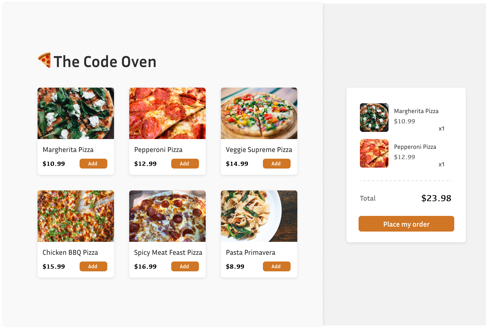
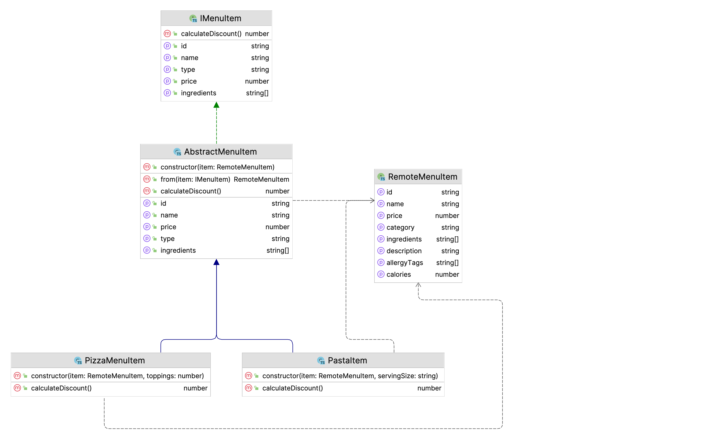
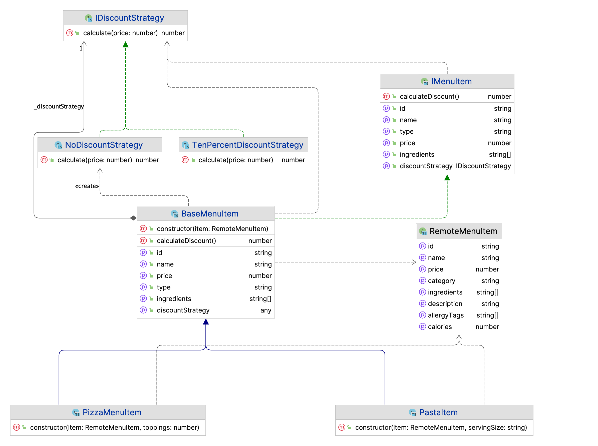
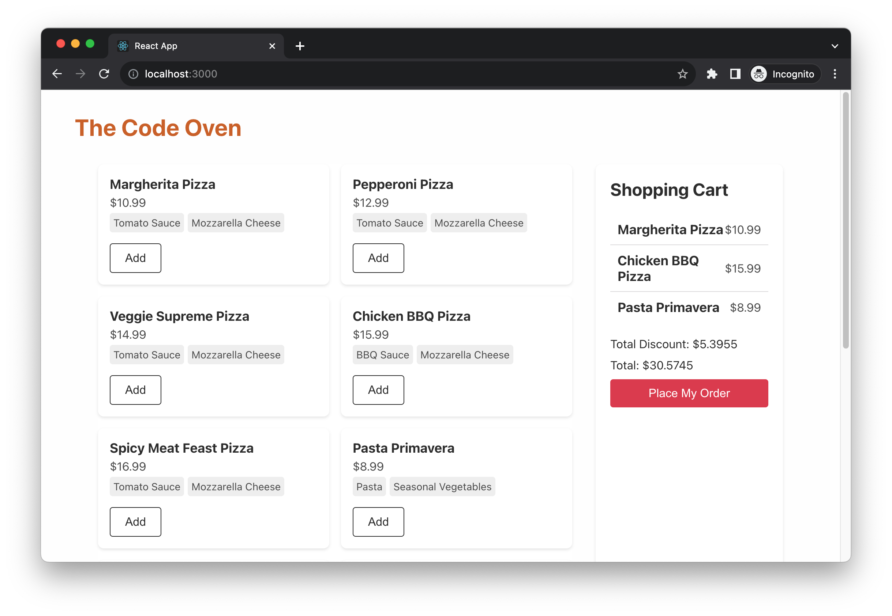

# Introducing layered architecture in React

As React applications grow in size and complexity, managing code efficiently becomes a challenge. The linear growth of features can lead to an exponential increase in complexity, making the codebase difficult to understand, test, and maintain. Enter Layered Architecture, a design approach that's not just confined to back-end systems but is equally beneficial for client-side applications.

In this chapter, we will explore the concept of Layered Architecture in the context of a React application. We'll delve into the extraction of Application Concern Layers (ACLs), define precise Data Models, and illustrate the use of Strategy Patterns. 

Structuring your React application in a layered manner solves several key problems:

1. **Separation of Concerns**: Different layers handle different responsibilities, making the codebase easier to navigate and understand.

2. **Reusability**: Business logic and data models become easily reusable across different parts of the application.

3. **Testability**: A layered architecture makes it simpler to write unit and integration tests, leading to a more robust application.

4. **Maintainability**: As the application scales, making changes or adding features becomes significantly easier when following a layered structure.

In this chapter, we will cover the following topics:

- Understanding the evolution of a React application
- Introducing data modelling in React
- Using polymorphism with classes
- Exploring the layered architecture

Through a step-by-step example, we'll see how to practically implement these concepts and why they are indispensable for large-scale applications. So let's get started!

# Technical requirements

A GitHub repository has been created to host all the code we discuss in the book. For this chapter, you can find the recommended structure under *https://github.com/PacktPublishing/React-Anti-Patterns/tree/main/ch11*.


# Understanding the evolution of a React application

For small or one-off projects, you might find that all logic is just written inside React components. You may see one or only a few components in total. The code looks pretty much like HTML, with only some variable or state used to make the page “dynamic”. Some might send requests to fetch data on `useEffect` after the components render.

As the application grows, and more and more code are added to codebase. Without a proper way to organise them, soon the codebase will turn into unmaintainable state, meaning that even adding small features can be time-consuming as developers need more time to read the code.

So I’ll list a few steps that can help to relief the maintainable problem. It generally require a bit more efforts, but it will pay off to have the structure in you application. Let’s have a quick review of these steps to build front-end applications that scale.

## Single Component Application

It can be called pretty much a Single Component Application:


But soon, you realise one single component requires a lot of time just to read what is going on. For example, there is logic to iterate through a list and generate each item. Also, there is some logic for using 3rd-party components with only a few _configuration_ code, apart from other logic.

## Multiple Component Application

You decided to split the component into several components, with these structures reflecting what’s happening on the result HTML is a good idea, and it helps you to focus on one component at a time.


And as your application grows, apart from the view, there are things like sending network requests, converting data into different shapes for the view to consume, and collecting data to send back to the server. And having this code inside components doesn’t feel right as they’re not really about user interfaces. Also, some components have too many internal states.

## State management with hooks

It’s a better idea to split this logic into a separate places. Luckily in React, you can define your own hooks. This is a great way to share these _state_ and the logic of whenever states change.


That’s awesome! You have a bunch of elements extracted from your single component application, and you have a few pure presentational components and some reusable hooks that make other components stateful. The only problem is that in hooks, apart from the side effect and state management, some logic doesn’t seem to belong to the _state_ management but pure calculations.

## Business models emerged

So you’ve started to become aware that extracting this logic into yet another place can bring you many benefits. For example, with that split, the logic can be cohesive and independent of any views. Then you extract a few domain objects.

These simple objects can handle data mapping (from one format to another), check nulls and use fallback values as required. Also, as the amount of these domain objects grows, you find you need some inheritance or polymorphism to make things even cleaner. Thus you applied many design patterns you found helpful from other places into the front-end application here.


## Layered frontend application

The application keeps evolving, and then you find some patterns emerge. There are a bunch of objects that do not belong to any user interface, and they also don’t care about whether the underlying data is from remote service, local storage or cache. And then, you want to split them into different layers. Here is a detailed explanation about the layer splitting [Presentation Domain Data Layering](https://martinfowler.com/bliki/PresentationDomainDataLayering.html).


The above evolution process is a high-level overview, and you should have a taste of how you should structure your code or at least what the direction should be. However, there will be many details you need to consider before applying the theory in your application.

In the following sections, I'll guide you through expanding the Code Oven application we introduced in Chapter 7, to showcase essential patterns and design principles for large frontend applications.

# Enhancing Code Oven

Recall that at the end of Chapter 7, we developed the basic structure of a pizza store application named Code Oven (showing in Figure 11-6. below), leveraging Test-Driven Development to establish a solid foundation for the app. Note that we employ the design mockup as a guide, not to implement all the details exhaustively - the primary goal remains to illustrate how to refactor the code while preserving its maintainability.



Although we didn't delve much into feature implementation in that chapter, in this chapter, we'll extend our setup further. We'll explore how different architectural types can assist us in managing complexity.

As a refresher, by the end of Chapter 7, our structure looked like this:

```tsx
export function PizzaShopApp() {
  const [cartItems, setCartItems] = useState<string[]>([]);

  const addItem = (item: string) => {
    setCartItems([...cartItems, item]);
  };

  return (
    <>
      <h1>The Code Oven</h1>
      <MenuList onAddMenuItem={addItem} />
      <ShoppingCart cartItems={cartItems} />
    </>
  );
}
```

And we assumed the data to be in this shape:

```tsx
const pizzas = [
  "Margherita Pizza",
  "Pepperoni Pizza",
  "Veggie Supreme Pizza",
  "Chicken BBQ Pizza",
  "Spicy Meat Feast Pizza",
  "Pasta Primavera",
  "Caesar Salad",
  "Chocolate Lava Cake",
];
```

While this setup allows consumers to browse what the restaurant offers, it would be significantly more useful if we enabled online ordering. One immediate issue is that the pizzas lack price and description, crucial for supporting online orders. Descriptions are also vital as they list the ingredients, informing consumers of what's included.

Moreover, it's not practical to define menu data within the JavaScript code. Typically, we'd have a service hosting such data, providing more detailed information.

Suppose we have data hosted on a remote service at `https://api.code-oven.com/menus`, defined as:

```tsx
[
  {
    "id": "p1",
    "name": "Margherita Pizza",
    "price": 10.99,
    "description": "Classic pizza with tomato sauce and mozzarella",
    "ingredients": ["Tomato Sauce", "Mozzarella Cheese", "Basil", "Olive Oil"],
    "allergyTags": ["Dairy"],
    "calories": 250,
    "category": "Pizza"
  },
  //...
]
```

To bridge the gap between our app and this data, we need to define a type for the remote data:

```ts
type RemoteMenuItem = {
  id: string;
  name: string;
  price: number;
  description: string;
  ingredients: string[];
  allergyTags: string[];
  category: string;
  calories: number
}
```

Now, to integrate this remote menu data, we'll utilize `useEffect` to fetch the data, then display the items once fetched. We'll make these changes within the `MenuList` component:

```tsx
const MenuList = ({
  onAddMenuItem,
}: {
  onAddMenuItem: (item: string) => void;
}) => {
  const [menuItems, setMenuItems] = useState<string[]>([]);

  useEffect(() => {
    const fetchMenuItems = async () => {
      const result = await fetch('https://api.code-oven.com/menus');
      const menuItems = await result.json();

      setMenuItems(menuItems.map((item: RemoteMenuItem) => item.name));
    }

    fetchMenuItems();
  }, [])

  return (
    <div data-testid="menu-list">
      <ol>
        {menuItems.map((item) => (
          <li key={item}>
            {item}
            <button onClick={() => onAddMenuItem(item)}>Add</button>
          </li>
        ))}
      </ol>
    </div>
  );
};
```

Here, the `MenuList` component fetches a list of menu items from an external API upon the initial render and displays this list. Each item comes with an "Add" button, and clicking this button triggers the `onAddMenuItem` function, passed as a prop to `MenuList`, with the item name as its argument.

By mapping the `RemoteMenuItem` to a string after fetching the data, we ensure minimal impact—our tests continue to pass. Now, we aim to surface the price and display the ingredients. However, given the potentially long list of ingredients, we'll only show the first three to avoid occupying too much screen space, also we want to use the lowercase of `category` and rename it to `type`. This adjustment means we'll slightly alter the `setMenuItems(menuItems.map(item => item.name))`. Additionally, we'll transition from rendering a string to rendering an object.
Initially, we define a new type to better structure our data:

```tsx
type MenuItem = {
  id: string;
  name: string;
  price: number;
  ingredients: string[];
  type: string;
}
```

Here, `MenuItem` type includes properties for the item's `id`, `name`, `price`, `ingredients`, and `type`. Now, it's time to update our `MenuList` component to use this new type:

```tsx
const MenuList = ({
  onAddMenuItem,
}: {
  onAddMenuItem: (item: string) => void;
}) => {
  const [menuItems, setMenuItems] = useState<MenuItem[]>([]);

  useEffect(() => {
    const fetchMenuItems = async () => {
      const result = await fetch("http://api.code-oven.com/menus");
      const menuItems = await result.json();

      setMenuItems(
        menuItems.map((item: RemoteMenuItem) => {
          return {
            id: item.id,
            name: item.name,
            price: item.price,
            type: item.category.toUpperCase(),
            ingredients: item.ingredients.slice(0, 3),
          };
        })
      );
    };

    fetchMenuItems();
  }, []);

  return (
    <div data-testid="menu-list">
      <ol>
        {menuItems.map((item) => (
          <li key={item.id}>
            <h3>{item.name}</h3>
            <span>${item.price}</span>
            <div>
              {item.ingredients.map((ingredient) => (
                <span>{ingredient}</span>
              ))}
            </div>
            <button onClick={() => onAddMenuItem(item.name)}>Add</button>
          </li>
        ))}
      </ol>
    </div>
  );
};
```

In the `MenuList` component, we've now made use of the `MenuItem` type in our `useState` hook. The `fetchMenuItems` function, triggered within the `useEffect`, reaches out to the API, fetches the menu items, and maps over them to transform the data into the desired `MenuItem` format. This transformation includes retaining only the first three items from the `ingredients` array for each item.

Each `MenuItem` is then rendered as a list item within the component. We display the item's `name`, `price`, and iterate over the `ingredients` array to render each ingredient.

While the code is functional, there's a concern: we've intertwined network requests, data mapping, and rendering logic within a single component. It's a sound practice to separate view-related code from non-view code, ensuring cleaner, more maintainable code.

## Refactoring - Simplifying Through a Custom Hook

We're no strangers to using custom hooks for data fetching. It's a practice that enhances readability and organizes logic neatly. In our scenario, extracting the `menuItems` state and the fetching logic into a separate hook will declutter the `MenuList` component. Let's create a hook named `useMenuItems`:

```tsx
const useMenuItems = () => {
  const [menuItems, setMenuItems] = useState<MenuItem[]>([]);

  useEffect(() => {
    const fetchMenuItems = async () => {
      const result = await fetch(
        "https://api.code-oven.com/menus"
      );
      const menuItems = await result.json();

      setMenuItems(
        menuItems.map((item: RemoteMenuItem) => {
          // ... transform RemoteMenuItem to MenuItem
        })
      );
    };

    fetchMenuItems();
  }, []);

  return { menuItems };
};
```

Within the `useMenuItems` hook, we initialize the `menuItems` state with an empty array. When the hook mounts, it triggers the `fetchMenuItems` function that fetches data from the specified URL. Following the fetch, a mapping operation is performed to convert each `RemoteMenuItem` object to a `MenuItem` object. The transformation details are omitted here but it's where we adapt the fetched data to the desired format. Subsequently, the transformed menu items are set to the `menuItems` state.

Now, in our `MenuList` component, we can simply call `useMenuItems` to obtain the `menuItems` array:

```tsx
const MenuList = ({
  onAddMenuItem,
}: {
  onAddMenuItem: (item: string) => void;
}) => {
  const { menuItems } = useMenuItems();
  //...
}
```

This refactoring is quite beneficial. It redirects `MenuList` back to a streamlined state, reinstating its single responsibility. However, when we shift our focus to the `useMenuItems` hook, particularly the data mapping segment, a few operations are occurring. It fetches data, trims off some unused fields like `description` and `calories` from the remote data, although we might need these fields soon. Additionally, it encapsulates a logic to retain only the first three ingredients. Ideally, we'd like to centralize these transformation logics into a common location, ensuring a tidy and manageable code structure.

## Transitioning to a Class-Based Model

As touched upon in Chapter 8, employing the ACL (Abstraction, Composition, and Lifetime) pattern can be a strategic move for managing our data effectively. A significant step in this direction would be transitioning our `MenuItem` type definition into a class, hence centralizing all mapping logic within this class. This setup will serve as a dedicated hub for any future data shape alterations and related logic.

Transitioning `MenuItem` from a type to a class is straightforward. We require a constructor to accept a `RemoteMenuItem` and some getter functions to access the data:

```tsx
export class MenuItem {
  private readonly _id: string;
  private readonly _name: string;
  private readonly _type: string;
  private readonly _price: number;
  private readonly _ingredients: string[];

  constructor(item: RemoteMenuItem) {
    this._id = item.id;
    this._name = item.name;
    this._price = item.price;
    this._type = item.category;
    this._ingredients = item.ingredients;
  }

  // ... getter functions for id, name, price just returns the private fields

  get type() {
    return this._type.toLowerCase();
  }

  get ingredients() {
    return this._ingredients.slice(0, 3);
  }
}
```

In the `MenuItem` class, we define private readonly properties for id, name, type, price, and ingredients. The constructor initializes these properties using values from a `RemoteMenuItem` object passed to it. We then have getter methods for each property to provide read-only access to their values. Particularly, the `ingredients` getter returns only the first three items from the ingredients array.

Though at a glance, this setup seems to have more code compared to a simple type definition, it effectively encapsulates the data and exposes it in a controlled manner. This aligns with the principles of immutability and encapsulation. The class structure's beauty is its capability to house behaviors—in our case, the slicing logic for ingredients is tucked neatly within the class.

With this new class in place, our `useMenuItems` hook becomes more streamlined:

```tsx
export const useMenuItems = () => {
  //...

  useEffect(() => {
    const fetchMenuItems = async () => {
      //...
      setMenuItems(
        menuItems.map((item: RemoteMenuItem) => {
          return new MenuItem(item);
        })
      );
    };

    fetchMenuItems();
  }, []);

  return { menuItems };
};
```

Now, the `useMenuItems` hook merely maps over the fetched menu items, creating a new instance of `MenuItem` for each, which significantly tidies up the transformation logic previously housed within the hook.

## The Benefits of a Class-Based Model

Transitioning to a class-based model from a simple type comes with a set of advantages that could serve our application well in the long run. Here's a breakdown:

1. **Encapsulation**: A class brings related properties and methods under one roof, thus promoting clear structure and organization. It also restricts direct data access, fostering better control and data integrity.
2. **Method Behavior**: For complex behaviors or operations associated with a menu item, a class provides a structured platform to define these methods, whether they relate to data manipulation or other business logic.
3. **Inheritance and Polymorphism**: In case of a hierarchy or polymorphic behavior among menu items, a class structure is indispensable. It allows different menu item types to inherit from a common base class, overriding or extending behavior as needed.
4. **Consistent Interface**: Classes ensure a consistent interface to the data, which is invaluable when multiple application parts interact with menu items.
5. **Read-Only Properties**: Classes enable the definition of read-only properties, thereby controlling data mutation—a crucial aspect for maintaining data integrity and working with immutable data structures.

As we transition into expanding our application's functionality with a shopping cart, it's crucial to approach this new section with the lessons learned from our data modeling exercise. This will ensure a structured and effective implementation, paving the way for a user-friendly online ordering experience.

# Implementing the ShoppingCart Component

As we venture into the implementation of the ShoppingCart component, we aim to provide a seamless interface for users to review their selected items before proceeding to checkout. Besides displaying the items, we also intend to reward our customers with some appealing discount policies.

Initially, we have a rudimentary ShoppingCart component as shown below:

```tsx
export const ShoppingCart = ({ cartItems }: { cartItems: string[] }) => {
  return (
    <div data-testid="shopping-cart">
      <ol>
        {cartItems.map((item) => (
          <li key={item}>{item}</li>
        ))}
      </ol>
      <button disabled={cartItems.length === 0}>Place My Order</button>
    </div>
  );
};
```

The `ShoppingCart` component accepts a prop `cartItems` which is an array of strings. It returns a div containing an ordered list (`<ol>`), where each item in `cartItems` is rendered as a list item (`<li>`). Below the list, a "Place My Order" button is rendered, which is disabled if `cartItems` is empty.

However, to enhance the user experience, it's crucial to display the price for each item and a total amount beneath the item list, yet above the "Place My Order" button. Here's how we can augment our component to fulfill these requirements:

```tsx
export const ShoppingCart = ({ cartItems }: { cartItems: MenuItem[] }) => {
  const totalPrice = cartItems.reduce((acc, item) => (acc += item.price), 0);

  return (
    <div data-testid="shopping-cart" className="shopping-cart">
      <ol>
        {cartItems.map((item) => (
          <li key={item.id}>
            <h3>{item.name}</h3>
            <span>${item.price}</span>
          </li>
        ))}
      </ol>
      <div>Total: ${totalPrice}</div>
      <button disabled={cartItems.length === 0}>Place My Order</button>
    </div>
  );
};
```

The `ShoppingCart` component is now equipped to accept a `cartItems` prop, which comprises an array of `MenuItem` objects (instead of a simple string). To compute the total price of items in the cart, we employ the `reduce` method. This method iterates over each item, accumulating their prices to present a total. The component then returns a JSX markup that renders a list of cart items, each displaying its name and price.

This revamped `ShoppingCart` component not only enhances the clarity of the order for users but also lays down a foundation for introducing discount policies, which we can explore as we continue refining our application.

## Applying Discounts to Items

Let's assume we have different discount policies for different types of menu items. For instance, pizzas with more than three toppings receive a 10 percent discount, while large pastas enjoy a 15 percent discount. 

We initially attempt to extend the `MenuItem` class with a new field called `calculateDiscount`:

```tsx
export class MenuItem {
  //... the private fields

  constructor(item: RemoteMenuItem) {
    //... assignment
  }

  get calculateDiscount() {
    return this.type === 'pizza' && this.toppings >= 3 ? this.price * 0.1 : 0;
  }
}
```

However, we encounter a problem since pastas don't have toppings, leading to a type error. To resolve this, we first extract an interface, and then have `Pizza` and `Pasta` classes implement this interface:

```tsx
export interface IMenuItem {
  id: string;
  name: string;
  type: string;
  price: number;
  ingredients: string[];

  calculateDiscount(): number;
}
```

Next, we define an abstract class to implement the interface, allowing `PizzaMenuItem` and `PastaMenuItem` to extend the abstract class respectively:

```ts
export abstract class AbstractMenuItem implements IMenuItem {
  private readonly _id: string;
  private readonly _name: string;
  private readonly _price: number;
  private readonly _ingredients: string[];

  protected constructor(item: RemoteMenuItem) {
    this._id = item.id;
    this._name = item.name;
    this._price = item.price;
    this._ingredients = item.ingredients;
  }

  static from(item: IMenuItem): RemoteMenuItem {
    return {
      id: item.id,
      name: item.name,
      price: item.price,
      category: item.type,
      ingredients: item.ingredients,
    };
  }

  //... the getter functions

  abstract calculateDiscount(): number;
}
```

In the `AbstractMenuItem` class, we introduced a static `from` method. This method takes an `IMenuItem` instance and transforms it into a `RemoteMenuItem` instance, preserving the necessary fields for our application.

The method `calculateDiscount` is declared as an abstract method, requiring its child classes to implement the actual discount calculation. 

Note: Abstract Class
An abstract class serves as a base class for other classes and cannot be instantiated on its own. It's a way to define a common interface and/or implementation for a set of derived classes. Abstract classes often contain abstract methods, which are declared without implementations, leaving it to derived classes to provide the specific implementations. By doing so, abstract classes enable a common structure while ensuring that certain methods are implemented in derived classes, promoting a consistent behavior across all derived types. They are a key feature in object-oriented programming, supporting polymorphism, and encapsulation.

For a `PizzaMenuItem`, it simply extends `AbstractMenuItem` and implements `calculateDiscount`:

```tsx
export class PizzaMenuItem extends AbstractMenuItem {
  private readonly toppings: number;

  constructor(item: RemoteMenuItem, toppings: number) {
    super(item);
    this.toppings = toppings;
  }

  calculateDiscount(): number {
    return this.toppings >= 3 ? this.price * 0.1 : 0;
  }
}
```

The `PizzaMenuItem` class extends `AbstractMenuItem`, inheriting its properties and methods. It defines a private readonly property `toppings` to hold the number of toppings. In the constructor, it takes two arguments: a `RemoteMenuItem` object `item` and a number `toppings`. It calls the constructor of `AbstractMenuItem` with `item` using `super(item)`, and initializes `this.toppings` with the `toppings` argument. The `calculateDiscount` method is implemented to return a 10% discount if the number of toppings is 3 or more, otherwise, it returns 0. This method overrides the abstract `calculateDiscount` method from `AbstractMenuItem`.

Similarly, we create a `PastaMenuItem` class:

```tsx
export class PastaItem extends AbstractMenuItem {
  private readonly servingSize: string;

  constructor(item: RemoteMenuItem, servingSize: string) {
    super(item);
    this.servingSize = servingSize;
  }

  calculateDiscount(): number {
    return this.servingSize === "large" ? this.price * 0.15 : 0;
  }
}
```

The relationship of these classes can be visualised as in Figure-11.7 below.



The abstract class `AbstractMenuItem` implements `IMenuItem` interface, and uses `RemoteMenuItem`. Both `PizzaItem` and `PastaItem` are extending `AbstractMenuItem` and has their own logic for calculate the discount.

In the `MenuList` component, when adding items to the shopping cart, we create instances of the right class based on the item type:

```tsx
export const MenuList = ({}) => {
  //... 
  const [toppings, setToppings] = useState([]);
  const [size, setSize] = useState<string>("small");

  const handleAddMenuItem = (item: IMenuItem) => {
    const remoteItem = AbstractMenuItem.from(item);
    if (item.type === "pizza") {
      onAddMenuItem(new PizzaMenuItem(remoteItem, toppings.length));
    } else if (item.type === "pasta") {
      onAddMenuItem(new PastaItem(remoteItem, size));
    } else {
      onAddMenuItem(item);
    }
  };

  return (
    //...
  );
};
```

The `handleAddMenuItem` function transforms the `IMenuItem` object `item` into a `RemoteMenuItem` object using the `AbstractMenuItem.from(item)` method. Following this, it checks the `type` property of the `item` to determine if it's a "pizza" or "pasta". If it's a "pizza", a new `PizzaMenuItem` instance is created using `remoteItem` and the selected number of toppings, and this new item is added to the cart via the `onAddMenuItem` function. If the item is neither a "pizza" nor "pasta", the original item is added to the cart directly through the `onAddMenuItem` function.

Lastly, within the `ShoppingCart` component, we calculate the total discount value similarly to how we calculated the total price, and use it for rendering:

```tsx
export const ShoppingCart = ({ cartItems }: { cartItems: IMenuItem[] }) => {
  const totalPrice = cartItems.reduce((acc, item) => (acc += item.price), 0);
  const totalDiscount = cartItems.reduce(
    (acc, item) => (acc += item.calculateDiscount()),
    0
  );

  return (
    <div data-testid="shopping-cart" className="shopping-cart">
      {/* rendering the list */}
      <div>Total Discount: ${totalDiscount}</div>
      <div>Total: ${totalPrice - totalDiscount}</div>
      <button disabled={cartItems.length === 0}>Place My Order</button>
    </div>
  );
};
```

The `ShoppingCart` component calculates `totalPrice` by iterating over the `cartItems` array and summing up the price of each item. Similarly, it calculates `totalDiscount` by summing up the discounts for each item, obtained by calling `calculateDiscount()` method on each item. In the returned JSX, it renders a list (assumed to be handled in the commented out portion), and displays the `totalDiscount` and the final total price (which is `totalPrice - totalDiscount`) below the list.

## Exploring the Strategy Pattern

Suppose it's a bustling Friday night, and we wish to offer a special discount on all pizzas and drinks. However, we don't intend to apply additional discounts on items already discounted — for instance, a pizza with four toppings should only receive this specific special discount.

Handling such arbitrary discounts can be complex, necessitating a decoupling of the calculation logic from the item type. Moreover, we'd like the flexibility to remove these discounts post-Friday or after a certain period. To achieve this, we'll extract the logic into a separate entity, defining a strategy interface as follows:

```ts
export interface IDiscountStrategy {
  calculate(price: number): number;
}
```

This interface provides a blueprint for different discount strategies. For example, we could have a strategy with no discount:

```tsx
class NoDiscountStrategy implements IDiscountStrategy {
  calculate(price: number): number {
    return 0;
  }
}
```

The `NoDiscountStrategy` class implements the `IDiscountStrategy` interface with a `calculate` method that takes a price as input and returns zero, signifying no discount is applied. Or a special discount strategy, offering a 15% discount:

```ts
class SpecialDiscountStrategy implements IDiscountStrategy {
  calculate(price: number): number {
    return price * 0.15;
  }
}
```

To utilize these strategies, we need to slightly modify the `IMenuItem` interface:

```ts
export interface IMenuItem {
  // ... other fields
  discountStrategy: IDiscountStrategy;
}
```

We added a discountStrategy filed int `IMenuItem` interface. With this setup, our `AbstractMenuItem` class will no longer remain abstract - so we renamed it to `BaseMenuItem` instead. Instead, it will incorporate a setter for the discount strategy and implement the discount calculation:

```tsx
export class BaseMenuItem implements IMenuItem {
  // ... other fields 
  private _discountStrategy: IDiscountStrategy;

  constructor(item: RemoteMenuItem) {
    // ... other fields 
    this._discountStrategy = new NoDiscountStrategy();
  }

  // ... other getters

  set discountStrategy(strategy: IDiscountStrategy) {
    this._discountStrategy = strategy;
  }

  calculateDiscount() {
    return this._discountStrategy.calculate(this.price);
  }
}
```

The `BaseMenuItem` class now implements the `IMenuItem` interface and encapsulates a discount strategy, initially set to `NoDiscountStrategy`. It defines a setter to update the discount strategy, and a `calculateDiscount` method which delegates the discount calculation to the encapsulated discount strategy's `calculate` method, passing the item's price as an argument.

The figure 11-8. should give you a much cleaner look of what the relations are:



As observed, `BaseMenuItem` implements the `IMenuItem` interface and utilizes `IDiscountStrategy`. There are multiple implementations of the `IDiscountStrategy` interface for specific discount algorithms, and several classes extend the `BaseMenuItem` class too. The type `RemoteMenuItem` is used by all the classes implements `IMenuItem` interface as well.

Now, when we need to apply a particular strategy, it can be done effortlessly like so:

```tsx
export const MenuList = ({
  onAddMenuItem,
}: {
  onAddMenuItem: (item: IMenuItem) => void;
}) => {
  // ...
  const handleAddMenuItem = (item: IMenuItem) => {
    if (isTodayFriday()) {
      item.discountStrategy = new SpecialDiscountStrategy();
    }

    onAddMenuItem(item);
  };
```

In the `MenuList` component, the `handleAddMenuItem` function checks if today is Friday using the `isTodayFriday` function. If it is, it sets the `discountStrategy` of the `item` to a new instance of `SpecialDiscountStrategy` before passing the `item` to the `onAddMenuItem` function, which is received as a prop. This way, a special discount is applied to the menu item on Fridays.

This setup grants us the desired flexibility. For instance, in the `handleAddMenuItem` function, depending on whether it's Friday or the item is a pizza, we can easily switch the discount strategy:

```tsx
const handleAddMenuItem = (item: IMenuItem) => {
  if (isTodayFriday()) {
    item.discountStrategy = new SpecialDiscountStrategy();
  }

  if(item.type === 'pizza') {
    item.discountStrategy = new PizzaDiscountStrategy();
  }
  
  onAddMenuItem(item);
};
```

In this function `handleAddMenuItem`, depending on certain conditions, a different discount strategy is applied to the `item` before it's passed to the `onAddMenuItem` function. Initially, it checks if today is Friday using `isTodayFriday()` and if true, it assigns a new instance of `SpecialDiscountStrategy` to `item.discountStrategy`. However, if the `item` is of type 'pizza', irrespective of the day, it overwrites the `item.discountStrategy` with a new instance of `PizzaDiscountStrategy`.

This approach keeps our discount logic modular and easy to adjust, catering to different scenarios with minimal code modification. As we're extracting new logic components - hooks, data models, domain logic (discount strategies) and views out of the application code, we're evolving into a layered frontend application.

# Delving into Layered Architecture

Our application has transitioned wonderfully to a more robust state, with clear, understandable, and modifiable logic, which is now also more test-friendly.

A further refinement I envision is relocating the logic present in `ShoppingCart` to a custom hook:

```tsx
export const useShoppingCart = (items: IMenuItem[]) => {
  const totalPrice = useMemo(
    () => items.reduce((acc, item) => (acc += item.price), 0),
    [items]
  );

  const totalDiscount = useMemo(
    () => items.reduce((acc, item) => (acc += item.calculateDiscount()), 0),
    [items]
  );

  return {
    totalPrice,
    totalDiscount,
  };
};
```

The `useShoppingCart` hook accepts an array of `IMenuItem` objects and computes two values: `totalPrice` and `totalDiscount`. `totalPrice` is calculated by reducing over the items, summing up their price property. Similarly, `totalDiscount` is calculated by reducing over the items, summing up the discount for each item obtained by calling `item.calculateDiscount()`. Both calculations are wrapped in `useMemo` to ensure they are only recomputed when the `items` array changes.

With this modification, `ShoppingCart` becomes elegantly simplified and can easily utilize these values:

```tsx
export const ShoppingCart = ({ cartItems }: { cartItems: IMenuItem[] }) => {
  const { totalPrice, totalDiscount } = useShoppingCart(cartItems);

  return (
    {/* JSX for the rendering logic */}
  );
};
```

An alternative approach would be employing the context and `useReducer` hook to manage all logic within context and hooks, however, since we explored that in Chapter 8, I'll leave further exploration to you.

Our application now exhibits a fresh structural anatomy:

```tsx
src
├── App.tsx
├── hooks
│   ├── useMenuItems.ts
│   └── useShoppingCart.ts
├── models
│   ├── BaseMenuItem.ts
│   ├── IMenuItem.ts
│   ├── PastaItem.ts
│   ├── PizzaMenuItem.ts
│   ├── RemoteMenuItem.ts
│   └── strategy
│       ├── IDiscountStrategy.ts
│       ├── NoDiscountStrategy.ts
│       ├── SpecialDiscountStrategy.ts
│       └── TenPercentageDiscountStrategy.ts
└── views
    ├── MenuList.tsx
    └── ShoppingCart.tsx
```

Within the views, we have primarily pure TSX rendering straightforward tags. These views leverage hooks for state and side effect management. Meanwhile, the models encompass business logic, algorithms for toggling between different discount strategies, and data shape transformations, among other functionalities.



## Advantages of Layered Architecture

The layered architecture delineated above confers numerous benefits:

1. **Enhanced Maintainability**: The division of a component into distinct segments facilitates easier identification and rectification of defects in specific code sections, thus minimizing time spent and reducing the likelihood of engendering new bugs during modifications.
2. **Increased Modularity**: This architecture is inherently more modular, promoting code reuse and simplifying the addition of new features. Even within each layer, such as views, the code tends to be more composable.
3. **Enhanced Readability**: The logic within the code becomes significantly more understandable and navigable, an asset not only for the original developer but also for others who may interact with the codebase. This clarity is central to effecting changes in the code.
4. **Improved Scalability**: The reduced complexity within each module renders the application more scalable, making it easier to introduce new features or alterations without impacting the entire system—a critical advantage for large, complex applications projected to evolve over time.
5. **Tech-stack Migration**: Albeit unlikely in most projects, should the need arise, the view layer can be replaced without altering the underlying models and logic, thanks to the encapsulation of domain logic in pure JavaScript (or TypeScript) code, oblivious to the views' existence.

We elucidates the transition of our application to a Layered Architecture, enhancing its maintainability, modularity, readability, scalability, and potential for tech-stack migration. By segregating logic, refining the `ShoppingCart` through a custom hook, and organizing the application into distinct layers, we've significantly bolstered the code's structure and ease of management. This architectural approach not only streamlines the current codebase but also lays a solid foundation for future expansions and refinements.

# Summary

Building React application, or a frontend application with React as its view, should not be treated as a new type of software. Most of the patterns and principles for building the traditional user interface still apply. Even the patterns for constructing a headless service in the backend are also valid in the frontend field. We can use layers in the frontend and have the user interface as thin as possible, sink the logic into a supporting model layer, and data access into another.

The benefit of having these layers in frontend applications is that you only need to understand one piece without worrying about others. Also, with the improvement of reusability, making changes to existing code would be relatively more manageable than before.

In next chapter, we'll look into an end-to-end journey of implemeneting a application from scrath, using the user acceptance test-driven development approach, doing refactoring and clean up along the way, and always keep our code as clean as we could.
