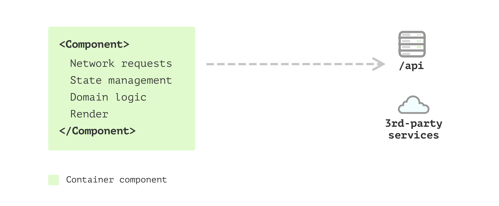
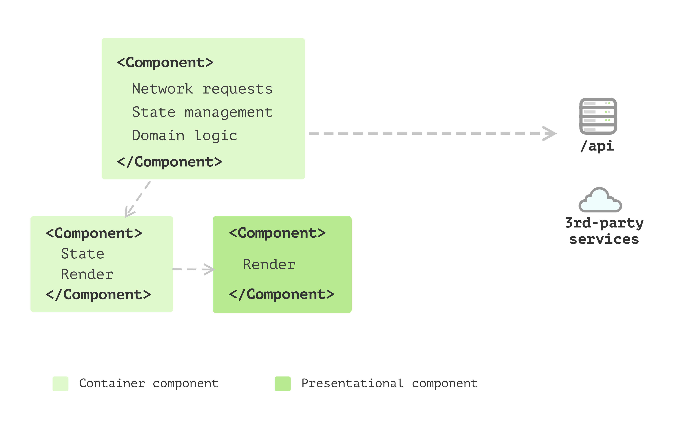
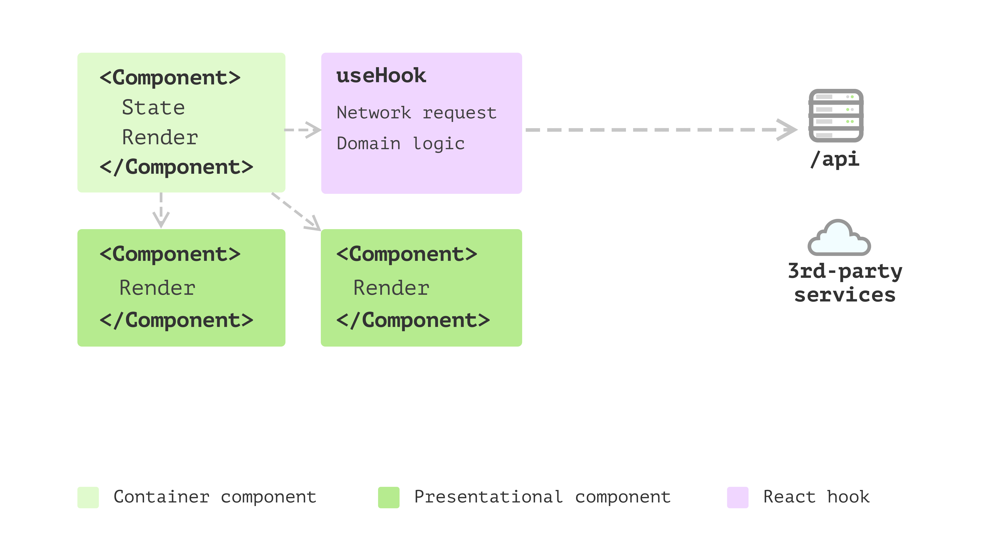
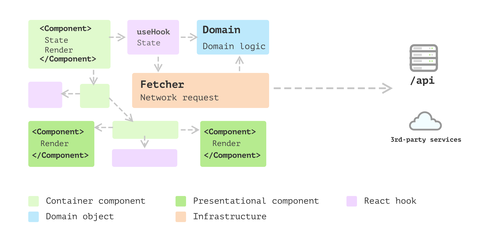
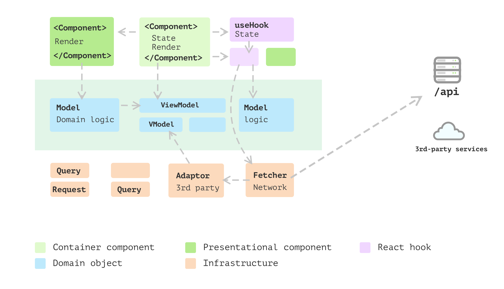
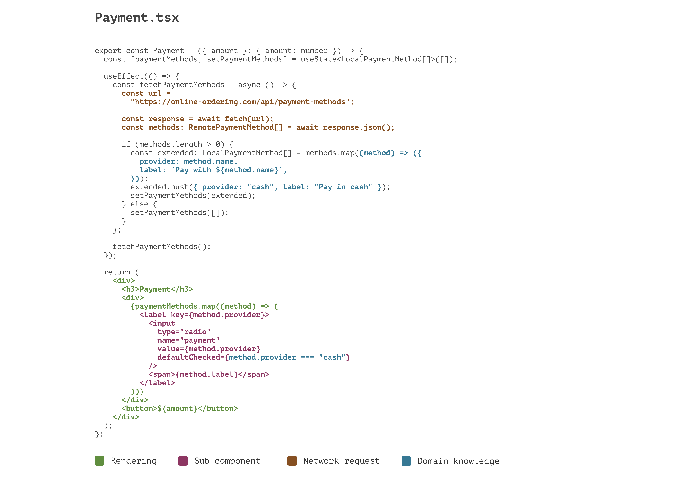
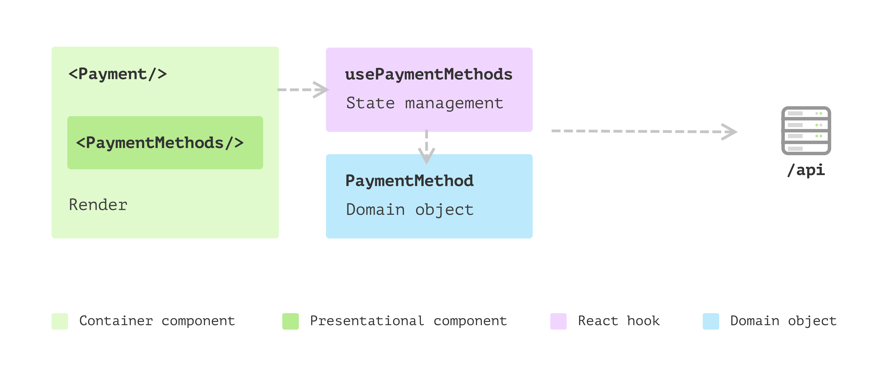
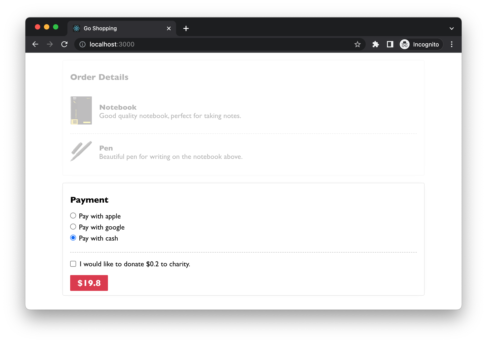
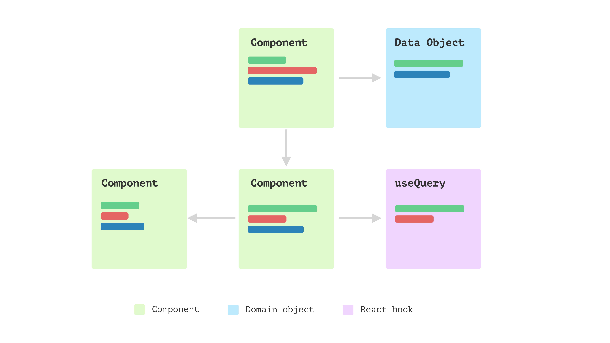
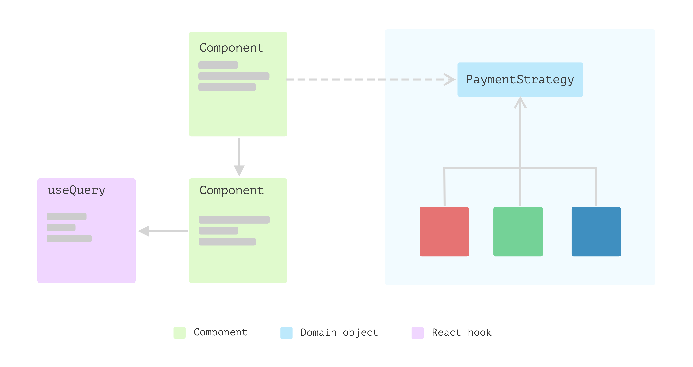

# Introducing layered architecture in React

As React applications grow in size and complexity, managing code efficiently becomes a challenge. The linear growth of features can lead to an exponential increase in complexity, making the codebase difficult to understand, test, and maintain. Enter Layered Architecture, a design approach that's not just confined to back-end systems but is equally beneficial for client-side applications.

In this chapter, we will explore the concept of Layered Architecture in the context of a React application. We'll delve into the extraction of Application Concern Layers (ACLs), define precise Data Models, and illustrate the use of Strategy Patterns. 

Structuring your React application in a layered manner solves several key problems:

1. **Separation of Concerns**: Different layers handle different responsibilities, making the codebase easier to navigate and understand.

2. **Reusability**: Business logic and data models become easily reusable across different parts of the application.

3. **Testability**: A layered architecture makes it simpler to write unit and integration tests, leading to a more robust application.

4. **Maintainability**: As the application scales, making changes or adding features becomes significantly easier when following a layered structure.

In this chapter, we will cover the following topics:

- Understanding the evolution of a React application
- Introducing data modelling in React
- Using polymorphism with classes
- Exploring the layered architecture

Through a step-by-step example, we'll see how to practically implement these concepts and why they are indispensable for large-scale applications. So let's get started!

# Technical requirements

A GitHub repository has been created to host all the code we discuss in the book. For this chapter, you can find the recommended structure under *https://github.com/PacktPublishing/React-Anti-Patterns/tree/main/ch11*.


# Understanding the evolution of a React application

For small or one-off projects, you might find that all logic is just written inside React components. You may see one or only a few components in total. The code looks pretty much like HTML, with only some variable or state used to make the page “dynamic”. Some might send requests to fetch data on `useEffect` after the components render.

As the application grows, and more and more code are added to codebase. Without a proper way to organise them, soon the codebase will turn into unmaintainable state, meaning that even adding small features can be time-consuming as developers need more time to read the code.

So I’ll list a few steps that can help to relief the maintainable problem. It generally require a bit more efforts, but it will pay off to have the structure in you application. Let’s have a quick review of these steps to build front-end applications that scale.

## Single Component Application

It can be called pretty much a Single Component Application:




But soon, you realise one single component requires a lot of time just to read what is going on. For example, there is logic to iterate through a list and generate each item. Also, there is some logic for using 3rd-party components with only a few _configuration_ code, apart from other logic.

## Multiple Component Application

You decided to split the component into several components, with these structures reflecting what’s happening on the result HTML is a good idea, and it helps you to focus on one component at a time.



And as your application grows, apart from the view, there are things like sending network requests, converting data into different shapes for the view to consume, and collecting data to send back to the server. And having this code inside components doesn’t feel right as they’re not really about user interfaces. Also, some components have too many internal states.

## State management with hooks

It’s a better idea to split this logic into a separate places. Luckily in React, you can define your own hooks. This is a great way to share these _state_ and the logic of whenever states change.



That’s awesome! You have a bunch of elements extracted from your single component application, and you have a few pure presentational components and some reusable hooks that make other components stateful. The only problem is that in hooks, apart from the side effect and state management, some logic doesn’t seem to belong to the _state_ management but pure calculations.

## Business models emerged

So you’ve started to become aware that extracting this logic into yet another place can bring you many benefits. For example, with that split, the logic can be cohesive and independent of any views. Then you extract a few domain objects.

These simple objects can handle data mapping (from one format to another), check nulls and use fallback values as required. Also, as the amount of these domain objects grows, you find you need some inheritance or polymorphism to make things even cleaner. Thus you applied many design patterns you found helpful from other places into the front-end application here.



## Layered frontend application

The application keeps evolving, and then you find some patterns emerge. There are a bunch of objects that do not belong to any user interface, and they also don’t care about whether the underlying data is from remote service, local storage or cache. And then, you want to split them into different layers. Here is a detailed explanation about the layer splitting [Presentation Domain Data Layering](https://martinfowler.com/bliki/PresentationDomainDataLayering.html).



The above evolution process is a high-level overview, and you should have a taste of how you should structure your code or at least what the direction should be. However, there will be many details you need to consider before applying the theory in your application.

In the following sections, I’ll walk you through a feature I extracted from a real project to demonstrate all the patterns and design principles I think useful for big frontend applications.

# Introducing data modelling in React

Note: Data Modelling

I’m using an simplified online ordering application as a starting point. In this application, a customer can pick up some products and add them to the order, and then they will need to select one of the payment methods to continue.


These payment method options are configured on the server side, and customers from different countries may see other options. For example, Apple Pay may only be popular in some countries. The radio buttons are data-driven - whatever is fetched from the backend service will be surfaced. The only exception is that when no configured payment methods are returned, we don’t show anything and treat it as “pay in cash" by default.

For simplicity, I’ll skip the actual payment process and focus on the `Payment` component. Let’s say that after reading the React hello world doc and a couple of stackoverflow searches, you came up with some code like this:

```tsx
  export const Payment = ({ amount }: { amount: number }) => {
    const [paymentMethods, setPaymentMethods] = useState<LocalPaymentMethod[]>(
      []
    );
  
    useEffect(() => {
      const fetchPaymentMethods = async () => {
        const url = "https://online-ordering.com/api/payment-methods";
  
        const response = await fetch(url);
        const methods: RemotePaymentMethod[] = await response.json();
  
        if (methods.length > 0) {
          const extended: LocalPaymentMethod[] = methods.map((method) => ({
            provider: method.name,
            label: `Pay with ${method.name}`,
          }));
          extended.push({ provider: "cash", label: "Pay in cash" });
          setPaymentMethods(extended);
        } else {
          setPaymentMethods([]);
        }
      };
  
      fetchPaymentMethods();
    }, []);
  
    return (
      <div>
        <h3>Payment</h3>
        <div>
          {paymentMethods.map((method) => (
            <label key={method.provider}>
              <input
                type="radio"
                name="payment"
                value={method.provider}
                defaultChecked={method.provider === "cash"}
              />
              <span>{method.label}</span>
            </label>
          ))}
        </div>
        <button>${amount}</button>
      </div>
    );
  };
```


The code above is pretty typical. You might have seen it in the get started tutorial somewhere. And it's not necessary bad. However, as we mentioned above, the code has mixed different concerns all in a single component and makes it a bit difficult to read.

## The problem with the initial implementation

The first issue I would like to address is how _busy_ the component is. By that, I mean `Payment` deals with different things and makes the code difficult to read as you have to switch context in your head as you read.

In order to make any changes you have to comprehend how to initialise network request , how to map the data to a local format that the component can understand , how to render each payment method , and the rendering logic for `Payment` component itself .



It's not a big problem at this stage for this simple example. However, as the code gets bigger and more complex, we'll need to refactoring them a bit.

It’s good practice to split view and non-view code into separate places. The reason is, in general, views are changing more frequently than non-view logic. Also, as they deal with different aspects of the application, separating them allows you to focus on a particular self-contained module that is much more manageable when implementing new features.

## The split of view and non-view code

In React, we can use a custom hook to maintain _state_ of a component while keeping the component itself more or less _stateless_. We can use [Extract Function](http://refactoring.com/catalog/extractFunction.html) to create a function called `usePaymentMethods` (the prefix `use` is a convention in React to indicate the function is a hook and handling some states in it):

```tsx
  const usePaymentMethods = () => {
    const [paymentMethods, setPaymentMethods] = useState<LocalPaymentMethod[]>(
      []
    );
  
    useEffect(() => {
      const fetchPaymentMethods = async () => {
        const url = "https://online-ordering.com/api/payment-methods";
  
        const response = await fetch(url);
        const methods: RemotePaymentMethod[] = await response.json();
  
        if (methods.length > 0) {
          const extended: LocalPaymentMethod[] = methods.map((method) => ({
            provider: method.name,
            label: `Pay with ${method.name}`,
          }));
          extended.push({ provider: "cash", label: "Pay in cash" });
          setPaymentMethods(extended);
        } else {
          setPaymentMethods([]);
        }
      };
  
      fetchPaymentMethods();
    }, []);
  
    return {
      paymentMethods,
    };
  };
```


This returns a `paymentMethods` array (in type `LocalPaymentMethod`) as internal state and is ready to be used in _rendering_. So the logic in `Payment` can be simplified as:

```tsx
  export const Payment = ({ amount }: { amount: number }) => {
    const { paymentMethods } = usePaymentMethods();
  
    return (
      <div>
        <h3>Payment</h3>
        <div>
          {paymentMethods.map((method) => (
            <label key={method.provider}>
              <input
                type="radio"
                name="payment"
                value={method.provider}
                defaultChecked={method.provider === "cash"}
              />
              <span>{method.label}</span>
            </label>
          ))}
        </div>
        <button>${amount}</button>
      </div>
    );
  };
```


This helps relieve the pain in the `Payment` component. However, if you look at the block for iterating through `paymentMethods`, it seems a concept is missing here. In other words, this block deserves its own component. Ideally, we want each component to focus on, only one thing.

## Data modelling to encapsulate logic

So far, the changes we have made are all about splitting view and non-view code into different places. It works well. The hook handles data fetching and reshaping. Both `Payment` and `PaymentMethods` are relatively small and easy to understand.

However, if you look closely, there is still room for improvement. To start with, in the pure function component `PaymentMethods`, we have a bit of logic to check if a payment method should be checked by default:

```tsx
  const PaymentMethods = ({
    paymentMethods,
  }: {
    paymentMethods: LocalPaymentMethod[];
  }) => (
    <>
      {paymentMethods.map((method) => (
        <label key={method.provider}>
          <input
            type="radio"
            name="payment"
            value={method.provider}
            defaultChecked={method.provider === "cash"}
          />
          <span>{method.label}</span>
        </label>
      ))}
    </>
  );
```

These test statements in a view can be considered a business logic leak (we have covered that in Chapter 8), and gradually they can be scatted in different places and make modification harder.

Another point of potential logic leakage is in the data conversion where we fetch data:

```tsx
  const usePaymentMethods = () => {
    const [paymentMethods, setPaymentMethods] = useState<LocalPaymentMethod[]>(
      []
    );
  
    useEffect(() => {
      const fetchPaymentMethods = async () => {
        const url = "https://online-ordering.com/api/payment-methods";
  
        const response = await fetch(url);
        const methods: RemotePaymentMethod[] = await response.json();
  
        if (methods.length > 0) {
          const extended: LocalPaymentMethod[] = methods.map((method) => ({
            provider: method.name,
            label: `Pay with ${method.name}`,
          }));
          extended.push({ provider: "cash", label: "Pay in cash" });
          setPaymentMethods(extended);
        } else {
          setPaymentMethods([]);
        }
      };
  
      fetchPaymentMethods();
    }, []);
  
    return {
      paymentMethods,
    };
  };
```


Note the anonymous function inside `methods.map` does the conversion silently, and this logic, along with the `method.provider === "cash"` above can be extracted into a class.

We could have a class `PaymentMethod` with the data and behaviour centralised into a single place:

```tsx
  class PaymentMethod {
    private remotePaymentMethod: RemotePaymentMethod;
  
    constructor(remotePaymentMethod: RemotePaymentMethod) {
      this.remotePaymentMethod = remotePaymentMethod;
    }
  
    get provider() {
      return this.remotePaymentMethod.name;
    }
  
    get label() {
      if(this.provider === 'cash') {
        return `Pay in ${this.provider}`
      }
      return `Pay with ${this.provider}`;
    }
  
    get isDefaultMethod() {
      return this.provider === "cash";
    }
  }
```


With the class, I can define the default cash payment method:

```tsx
const payInCash = new PaymentMethod({ name: "cash" });
```


And during the conversion - after the payment methods are fetched from the remote service - I can construct the `PaymentMethod` object in-place. Or even extract a small function called `convertPaymentMethods`:

```tsx
  const convertPaymentMethods = (methods: RemotePaymentMethod[]) => {
    if (methods.length === 0) {
      return [];
    }
  
    const extended: PaymentMethod[] = methods.map(
      (method) => new PaymentMethod(method)
    );
    extended.push(payInCash);
  
    return extended;
  };
```


Also, in the `PaymentMethods` component, we don’t use the `method.provider === "cash"`to check anymore, and instead call the `getter`:

```tsx
  export const PaymentMethods = ({ options }: { options: PaymentMethod[] }) => (
    <>
      {options.map((method) => (
        <label key={method.provider}>
          <input
            type="radio"
            name="payment"
            value={method.provider}
            defaultChecked={method.isDefaultMethod}
          />
          <span>{method.label}</span>
        </label>
      ))}
    </>
  );
```


Now we’re restructuring our `Payment` component into a bunch of smaller parts that work together to finish the work.



## The benefits of the new structure

*   Having a class encapsulates all the logic around a payment method. It’s a domain object and doesn’t have any UI-related information. So testing and potentially modifying logic here is much easier than when embedded in a view.
*   The new extracted component `PaymentMethods` is a pure function and only depends on a domain object array, which makes it super easy to test and reuse elsewhere. We might need to pass in a `onSelect` callback to it, but even in that case, it’s a pure function and doesn’t have to touch any external states.
*   Each part of the feature is clear. If a new requirement comes, we can navigate to the right place without reading all the code.

I have to make the example in this article sufficiently complex so that many patterns can be extracted. All these patterns and principles are there to help simplify our code's modifications.

# Using polymorphism with OOP

Let’s examine the theory here with some further changes to the application. The new requirement is that we want to offer an option for customers to donate a small amount of money as a tip to a charity along with their order.

For example, if the order amount is $19.80, we ask if they would like to donate $0.20. And if a user agrees to donate it, we’ll show the total number on the button.



Before we make any changes, let's have a quick look at the current code structure. I prefer have different parts in their folder so it's easy for me to navigate when it grows bigger.

```
  src
  ├── App.tsx
  ├── components
  │   ├── Payment.tsx
  │   └── PaymentMethods.tsx
  ├── hooks
  │   └── usePaymentMethods.ts
  ├── models
  │   └── PaymentMethod.ts
  └── types.ts
```

`App.tsx` is the main entry, it uses `Payment` component, and `Payment` uses `PaymentMethods` for rendering different payment options. The hook `usePaymentMethods` is responsible for fetching data from remote service and then convert it to a `PaymentMethod` domain object that is used to hold `label` and the `isDefaultChecked` flag.

## Internal state: agree to donation

To make these changes in `Payment`, we need a boolean state `agreeToDonate` to indicate whether a user selected the checkbox on the page.

```tsx
  const [agreeToDonate, setAgreeToDonate] = useState<boolean>(false);

  const { total, tip } = useMemo(
    () => ({
      total: agreeToDonate ? Math.floor(amount + 1) : amount,
      tip: parseFloat((Math.floor(amount + 1) - amount).toPrecision(10)),
    }),
    [amount, agreeToDonate]
  );
```


The function `Math.floor` will round the number down so we can get the correct amount when the user selects `agreeToDonate`, and the difference between the rounded-up value and the original amount will be assigned to `tip`.

And for the view, the JSX will be a checkbox plus a short description:

```tsx
  return (
    <div>
      <h3>Payment</h3>
      <PaymentMethods options={paymentMethods} />
      <div>
        <label>
          <input
            type="checkbox"
            onChange={handleChange}
            checked={agreeToDonate}
          />
          <p>
            {agreeToDonate
              ? "Thanks for your donation."
              : `I would like to donate ${tip} to charity.`}
          </p>
        </label>
      </div>
      <button>${total}</button>
    </div>
  );
```

With these new changes, our code starts handling multiple things again. It’s essential to stay alert for potential mixing of view and non-view code. If you find any unnecessary mixing, look for ways to split them.

Note that it's not a set-in-stone rule. Keep things all together nice and tidy for small and cohesive components, so you don't have to look in multiple places to understand the overall behaviour. Generally, you should be aware to avoid the component file growing too big to comprehend.

## More changes about round-up logic

The round-up looks good so far, and as the business expands to other countries, it comes with new requirements. The same logic doesn’t work in Japan market as 0.1 Yen is too small as a donation, and it needs to round up to the nearest hundred for the Japanese currency. And for Denmark, it needs to round up to the nearest tens.

It sounds like an easy fix. All I need is a `countryCode` passed into the `Payment` component, right?

```tsx
<Payment amount={3312} countryCode="JP" />;
```


And because all of the logic is now defined in the `useRoundUp` hook, I can also pass the `countryCode` through to the hook.

```tsx
const useRoundUp = (amount: number, countryCode: string) => {
  //...

  const { total, tip } = useMemo(
    () => ({
      total: agreeToDonate
        ? countryCode === "JP"
          ? Math.floor(amount / 100 + 1) * 100
          : Math.floor(amount + 1)
        : amount,
      //...
    }),
    [amount, agreeToDonate, countryCode]
  );
  //...
};
```

You will notice that the if-else can go on and on as a new `countryCode` is added in the `useEffect` block. And for the `getTipMessage`, we need the same if-else checks as a different country may use other currency sign (instead of a dollar sign by default):

```tsx
const formatCheckboxLabel = (
  agreeToDonate: boolean,
  tip: number,
  countryCode: string
) => {
  const currencySign = countryCode === "JP" ? "¥" : "$";

  return agreeToDonate
    ? "Thanks for your donation."
    : `I would like to donate ${currencySign}${tip} to charity.`;
};
```

One last thing we also need to change is the currency sign on the button:

```tsx
<button>
  {countryCode === "JP" ? "¥" : "$"}
  {total}
</button>;
```

## The shotgun surgery problem

This scenario is the famous “shotgun surgery” smell we see in many places (not particularly in React applications). This essentially says that we'll have to touch several modules whenever we need to modify the code for either a bug fixing or adding a new feature. And indeed, it’s easier to make mistakes with this many changes, especially when your tests are insufficient.



As illustrated above, the coloured lines indicate branches of country code checks that cross many files. In views, we’ll need to do separate things for different country code, while in hooks, we’ll need similar branches. And whenever we need to add a new country code, we’ll have to touch all these parts.

For example, if we consider Denmark as a new country the business is expanding to, we’ll end up with code in many places like:

```tsx
const currencySignMap = {
  JP: "¥",
  DK: "Kr.",
  AU: "$",
};

const getCurrencySign = (countryCode: CountryCode) =>
  currencySignMap[countryCode];
```

One possible solution for the problem of having branches scattered in different places is to use polymorphism to replace these switch cases or table look-up logic. We can use [Extract Class](http://refactoring.com/catalog/extractClass.html) on those properties and then [Replace Conditional with Polymorphism](http://refactoring.com/catalog/replaceConditionalWithPolymorphism.html).

## Polymorphism to the rescue

The first thing we can do is examine all the variations to see what need to be extracted into a class. For example, different countries have different currency signs, so `getCurrencySign` can be extracted into a public interface. Also ,countries might have different round-up algorithms, thus `getRoundUpAmount` and `getTip` can go to the interface.

```tsx
export interface PaymentStrategy {
  getRoundUpAmount(amount: number): number;

  getTip(amount: number): number;
}
```

A concrete implementation of the strategy interface would be like following the code snippet: `PaymentStrategyAU`.

```tsx
export class PaymentStrategyAU implements PaymentStrategy {
  get currencySign(): string {
    return "$";
  }

  getRoundUpAmount(amount: number): number {
    return Math.floor(amount + 1);
  }

  getTip(amount: number): number {
    return parseFloat((this.getRoundUpAmount(amount) - amount).toPrecision(10));
  }
}
```

Note here the interface and classes have nothing to do with the UI directly. This logic can be shared in other places in the application or even moved to backend services (if the backend is written in Node, for example).

We could have subclasses for each country, and each has the country specific round-up logic. However, as function is first-class citizen in JavaScript, we can pass in the round-up algorithm into the strategy implementation to make the code less overhead without subclasses. And becaues we have only one implementation of the interface, we can use [Inline Class](http://refactoring.com/catalog/inlineClass.html) to reduce the single-implementation-interface.

```tsx
  export class CountryPayment {
    private readonly _currencySign: string;
    private readonly algorithm: RoundUpStrategy;
  
    public constructor(currencySign: string, roundUpAlgorithm: RoundUpStrategy) {
      this._currencySign = currencySign;
      this.algorithm = roundUpAlgorithm;
    }
  
    get currencySign(): string {
      return this._currencySign;
    }
  
    getRoundUpAmount(amount: number): number {
      return this.algorithm(amount);
    }
  
    getTip(amount: number): number {
      return calculateTipFor(this.getRoundUpAmount.bind(this))(amount);
    }
  }
```


As illustrated below, instead of depend on scattered logic in components and hooks, they now only rely on a single class `PaymentStrategy`. And at runtime, we can easily substitute one instance of `PaymentStrategy` for another (the red, green and blue square indicates different instances of `PaymentStrategy` class).



And the `useRoundUp` hook, the code could be simplified as:

```tsx
  export const useRoundUp = (amount: number, strategy: PaymentStrategy) => {
    const [agreeToDonate, setAgreeToDonate] = useState<boolean>(false);
  
    const { total, tip } = useMemo(
      () => ({
        total: agreeToDonate ? strategy.getRoundUpAmount(amount) : amount,
        tip: strategy.getTip(amount),
      }),
      [agreeToDonate, amount, strategy]
    );
  
    const updateAgreeToDonate = () => {
      setAgreeToDonate((agreeToDonate) => !agreeToDonate);
    };
  
    return {
      total,
      tip,
      agreeToDonate,
      updateAgreeToDonate,
    };
  };
```


In the `Payment` component, we pass the strategy from `props` through to the hook:

```tsx
  export const Payment = ({
    amount,
    strategy = new PaymentStrategy("$", roundUpToNearestInteger),
  }: {
    amount: number;
    strategy?: PaymentStrategy;
  }) => {
    const { paymentMethods } = usePaymentMethods();
  
    const { total, tip, agreeToDonate, updateAgreeToDonate } = useRoundUp(
      amount,
      strategy
    );
  
    return (
      <div>
        <h3>Payment</h3>
        <PaymentMethods options={paymentMethods} />
        <DonationCheckbox
          onChange={updateAgreeToDonate}
          checked={agreeToDonate}
          content={formatCheckboxLabel(agreeToDonate, tip, strategy)}
        />
        <button>{formatButtonLabel(strategy, total)}</button>
      </div>
    );
  };
```


And I then did a bit clean up to extract a few helper functions for generating the labels:

```tsx
  export const formatCheckboxLabel = (
    agreeToDonate: boolean,
    tip: number,
    strategy: CountryPayment
  ) => {
    return agreeToDonate
      ? "Thanks for your donation."
      : `I would like to donate ${strategy.currencySign}${tip} to charity.`;
  };
```


I hope you have noticed that we’re trying to directly extract non-view code into separate places or abstract new mechanisms to reform it to be more modular.

You can think of it this way: the React view is only one of the consumers of your non-view code. For example, if you would build a new interface - maybe with Vue or Angular or even a command line tool - how much code can you reuse with your current implementation?

## The benefits of having these layers

As demonstrated above, these layers brings us many advantages:

1.  Enhanced maintainability: by separating a component into distinct parts, it is easier to locate and fix defects in specific parts of the code. This can save time and reduce the risk of introducing new bugs while making changes.
2.  Increased modularity: the layered structure is more modular, which can make it easier to reuse code and build new features. Even in each layer, take views for example, tend to be more composable.
3.  Enhanced readability: it's much easier to understand and follow the logic of the code. This can be especially helpful for other developers who are reading and working with the code. That's the core of making changes to the codebase.
4.  Improved scalability: with reduced complixity in each individual module, the application is often more scalable, as it is easier to add new features or make changes without affecting the entire system. This can be especially important for large, complex applications that are expected to evolve over time.
5.  Migrate to other techstack: if we have to (even very unlikely in most projects), we can replace the view layer without changing the underlying models and logic. All because the domain logic is encapsulated in pure JavaScript (or TypeScript) code and isn't aware of the existence of views.

# Summary

Building React application, or a frontend application with React as its view, should not be treated as a new type of software. Most of the patterns and principles for building the traditional user interface still apply. Even the patterns for constructing a headless service in the backend are also valid in the frontend field. We can use layers in the frontend and have the user interface as thin as possible, sink the logic into a supporting model layer, and data access into another.

The benefit of having these layers in frontend applications is that you only need to understand one piece without worrying about others. Also, with the improvement of reusability, making changes to existing code would be relatively more manageable than before.
