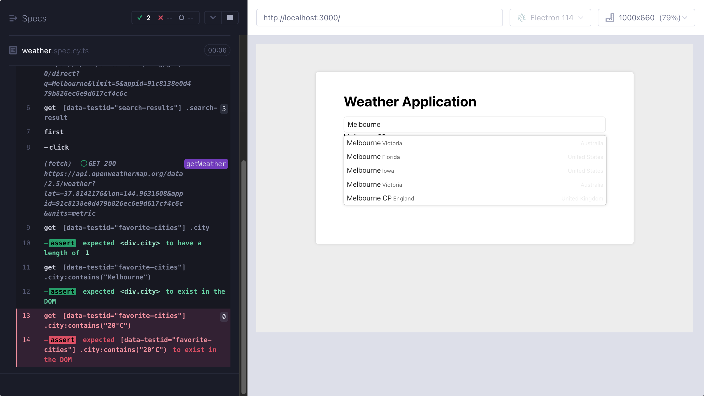
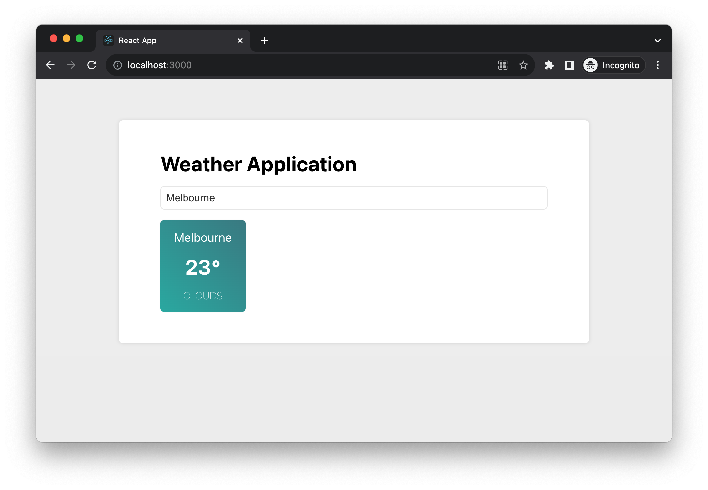

# An End-To-End Journey - Weather Application

In the preceding chapters, we've delved into a variety of topics including testing, Test-Driven Development, design patterns, and design principles. These concepts are invaluable as they pave the way towards a more resilient and maintainable codebase. Now, I'd like to embark on a journey of constructing an application from the ground up, applying the knowledge we've acquired to tackle an end-to-end scenario.

The aim is to illustrate how we can dissect requirements into actionable tasks, and subsequently test and implement them. We'll also explore how to stub network requests, eliminating dependencies on remote systems during development, and how to confidently refactor code without fear of breaking existing functionality.

We'll venture into building a functional weather application from scratch, interfacing with a genuine weather API server to fetch and display a list of weather data. Along the way, we'll implement accessibility features such as keyboard interactions, revisit the anti-corruption layer, single responsibility principle, and much more.

The overarching goal is to showcase the end-to-end process of crafting a functioning software solution, all while keeping the code in a maintainable, understandable, and extensible state.

What will be covered:

- Unveiling the Requirements
- Crafting Our Initial Acceptance Test
- Implementing City Search feature
- Implementing Anti-Corruption Layer
- Implementing add to favorite 
- Fetching weather when application launches

# Technical requirements

A GitHub repository has been created to host all the code we discuss in the book. For this chapter, you can find the recommended structure under *https://github.com/PacktPublishing/React-Anti-Patterns/tree/main/ch12*.

## Getting a OpenWeatherMap API Key

To utilize OpenWeatherMap, you'll need to create an account on https://openweathermap.org/. Although various plans are available based on usage, the free plan suffices for our purposes. After registering, navigate to "My API keys" to find your API key as displayed in Figure 12-1.


Keep a copy of this key handy, as we'll use it for making calls to the weather API to fetch data.

## Preparing the project codebase

If you prefer to follow along with me, you will need to install a few packages before we start. However, if you want to see the final results, it's already in the repo mentioned earlier. I would recommend you to follow along to see how we evolve our applicaion into the final state. 

To kick things off, we'll create a new React app using the commands below:

```bash
npx create-react-app weather-app --template typescript
cd weather-app
yarn add cypress jest-fetch-mock -D
yarn install
```

These commands are used to set up a new React project with TypeScript and Cypress.

1. `npx create-react-app weather-app --template typescript`: This command utilizes `npx` to run the `create-react-app` utility, which scaffolds out a new React application in a directory named `weather-app`. The `--template typescript` option specifies that this project should be configured to use TypeScript.

2. `yarn add cypress jest-fetch-mock -D`: This command installs Cypress, a testing framework, as a development dependency in the project, and `jest-fetch-mock` - for mocking the fetch function in jest tests. The `-D` flag indicates that this is a development dependency, meaning it's not required for the production version of the application.

3. `yarn install`: This command installs all the dependencies listed in the `package.json` file of the project, ensuring that all the necessary libraries and tools are available.

And finally we can start the template application by running the following command:

```bash
yarn start
```

It will launch the application on port 3000. You can leave the application running on 3000 open and open another terminal window for running tests.

# Unveiling the Requirements

Our envisioned weather application is designed to be a fully functional platform with the following capabilities:

1. Enables users to search for cities of interest, be it their hometown, current residence, or a future travel destination.
2. Allows users to add cities to a favorite list, with the selection persisting locally for easy access during future visits.
3. Supports the addition of multiple cities to the user's list.
4. Ensures the site is thoroughly navigable via keyboard, facilitating ease of access for all users.

The end result will resemble what's illustrated in Figure 12-1. While it's not an overly complex application, it encompasses several intriguing elements. For instance, we'll navigate through the hurdles of applying Test-Driven Development in a UI application, testing hooks, and making informed decisions on when to employ user acceptance tests versus lower level tests.


## Crafting Our Initial Acceptance Test

Chapter 7 familiarized us with the notion of starting with an acceptance test—a test approached from an end user's standpoint, as opposed to a developer's perspective. Essentially, we aim for our test to validate aspects a user would perceive or interact with on the webpage, rather than technicalities like function calls or class initializations.

Within the folder you created in Technical requirements (e.g. "weather-app"), let's create a Cypress test within `cypress/e2e/weather.spec.cy.ts`:

```tsx
describe('weather application', () => {
  it('displays the application title', () => {
    cy.visit('http://localhost:3000/');
    cy.contains('Weather Application');
  });
});
```

In this code snippet, we defined a test suite named 'weather application'. It uses the `describe` function from the Cypress testing framework. This test case comprises two main actions: navigating to the local development server at 'http://localhost:3000/' using `cy.visit`, and then checking the page to ensure it contains the text 'Weather Application' using `cy.contains`. If 'Weather Application' is found on the page, the test will pass; if not, it will fail.

Executing the test using `npx cypress run` will, as expected, yield an error on the console due to our yet unmodified app:

```plaintext
  1) weather application
       displays the application title:
     AssertionError: Timed out retrying after 4000ms: Expected to find content: 'Weather Application' but never did.
      at Context.eval (webpack://tdd-weather/./cypress/e2e/weather.spec.cy.ts:4:7)
```

The error reveals that it was anticipating the text "Weather Application" but didn't locate it within the default 4-second timeout specified by Cypress. To rectify this, we'll need to tweak `App.tsx` to include this text. 

After clearing the current content in `App.tsx` (generated by `create-react-app`), we’ll insert a simple `h1` tag to display the text.

```tsx
import React from 'react';
import './App.css';

function App() {
  return (
    <div className="App">
      <h1>Weather Application</h1>
    </div>
  );
}

export default App;
```

This code defines a functional component named `App` in React, which renders a div containing an h1 element with the text 'Weather Application'. And with this heading defined our Cypress test will pass.

# Implementing City Search feature

Let's commence the development of our first feature - city search. Users will be able to enter a city name into a search box, which triggers a request to a remote server. Upon receiving the data, we'll render it into a list for user selection. Throughout this chapter, we'll utilize the OpenWeatherMap API for city searches as well as retrieving weather information.

## Introducing OpenWeatherMap API

OpenWeatherMap is a service that offers global weather data via an API, allowing users to access current, forecasted, and historical weather data for any location worldwide. It's a popular choice among developers for embedding real-time weather updates into apps and websites.

We're going to use two APIs in our weather applicaiton, one for search city by name, another for getting the acutal real-time weather. To use the API, we'll need the API key you get from the Technical requirements section. 

You can try send the request either in browser or with command line tool like `curl` or `http` (from https://httpie.io/):

```bash
http https://api.openweathermap.org/geo/1.0/direct?q="Melbourne"&limit=5&appid=<your-app-key>
```

This line is utilizing the `http` command to send an HTTP request to the OpenWeatherMap API, specifically to its geocoding endpoint (`geo/1.0/direct`). It's looking up cities named "Melbourne," with a limit of 5 results. The `appid` parameter is where you'd insert your OpenWeatherMap API key to authenticate the request. The command fetches basic geocoding information about cities named "Melbourne," which can later be used to get weather data for those locations.

You will get the result in JSON format like the following:

```json
[
    {
        "country": "AU",
        "lat": -37.8142176,
        "local_names": {},
        "lon": 144.9631608,
        "name": "Melbourne",
        "state": "Victoria"
    },
    {
        "country": "US",
        "lat": 28.106471,
        "local_names": {
        },
        "lon": -80.6371513,
        "name": "Melbourne",
        "state": "Florida"
    }
    //...
]
```

Be aware that the OpenWeatherMap free plan comes with a rate limit, restricting us to a maximum of 60 requests per minute and 1,000,000 requests per month. While these limits may seem high, the number of requests can accumulate quickly during development through testing and debugging. To conserve our request allowance, we'll avoid making requests to the real server and instead stub these requests, returning predefined values. For a refresher on stubbing, refer back to Chapter 5.

Let's make a request and save the resultant data into a text file named `search-results.json`, located under `cypress/fixtures/search-result.json`.

## Stubbing the Search Results

With the file inplace, we can write a test for the feature "Search city by name". We'll intercept network request send to the API and return the file content created above "fixtures/search-result.json".

```tsx
import searchResults from '../fixtures/search-result.json';

describe('weather application', () => {
  //...

  it('searches for a city', () => {
    cy.intercept("GET", "https://api.openweathermap.org/geo/1.0/direct?q=*", {
      statusCode: 200,
      body: searchResults,
    });

    cy.visit('http://localhost:3000/');

    cy.get('[data-testid="search-input"]').type('Melbourne');
    cy.get('[data-testid="search-input"]').type('{enter}');

    cy.get('[data-testid="search-results"] .search-result')
      .should('have.length', 5);
  });
});
```

We created a test case 'searches for a city'. The test case does the following steps:

1. It sets up an interception for HTTP GET requests going to the OpenWeatherMap API endpoint for city searches. Whenever a request matching the criteria is made, it responds with a 200 status code and the body content from a predefined 'searchResults' file, essentially mocking the API response.
2. It then navigates to the application running on 'http://localhost:3000/'.
3. It simulates a user typing 'Melbourne' into an input field with a data-testid of 'search-input', and pressing the 'Enter' key.
4. Lastly, it checks that a container with a data-testid of 'search-results' contains exactly five elements with a class of 'search-result', which are the search results returned from the stubbed API request. This verifies that the application correctly displays the search results.

We're in the *red* step in TDD, so let's go to our application code App.tsx to fix the test:

```tsx
function App() {
  const [query, setQuery] = useState<string>("");
  const [searchResults, setSearchResults] = useState<any[]>([]);

  const handleKeyDown = (e: KeyboardEvent<HTMLInputElement>) => {
    if (e.key === "Enter") {
      fetchCities();
    }
  };

  const handleChange = (e: ChangeEvent<HTMLInputElement>) => {
    setQuery(e.target.value);
  };

  const fetchCities = () => {
    fetch(
      `https://api.openweathermap.org/geo/1.0/direct?q=${query}&limit=5&appid=<app-key>`
    )
      .then((r) => r.json())
      .then((cities) => {
        setSearchResults(
          cities.map((city: any) => ({
            name: city.name,
          }))
        );
      });
  };

  return (
    <div className="app">
      <h1>Weather Application</h1>

      <div className="search-bar">
        <input
          type="text"
          data-testid="search-input"
          onKeyDown={handleKeyDown}
          onChange={handleChange}
          placeholder="Enter city name (e.g. Melbourne, New York)"
        />
      </div>

      <div className="search-results-popup">
        {searchResults.length > 0 && (
          <ul data-testid="search-results" className="search-results">
            {searchResults.map((city, index) => (
              <li key={index} className="search-result">
                {city.name}
              </li>
            ))}
          </ul>
        )}
      </div>
    </div>
  );
}
```

The `App` function in this code sets up a simple weather application using React. It initializes state variables `query` and `searchResults` to handle user input and display search results, respectively. Event handlers `handleKeyDown` and `handleChange` are set up to update the search query and trigger a city search when the user presses Enter. The `fetchCities` function sends a request to the OpenWeatherMap API, processes the response to extract the city names, and updates `searchResults`. 

In the rendering part - the JSX, an input field is provided for the user to type a city name, and a list displays the search results whenever there are any available. 

The tests are now passing with these changes, and we can launch the browser to access the application. As depicted in Figure 12-2, our implementation now displays a dropdown list of cities upon conducting a search.


Please note that I've incorporated some CSS to enhance the visual appeal. However, to maintain focus on the core content, the CSS has not been included here. For a complete understanding, you can refer to the repository mentioned in the Technical Requirements section to see the full implementation.

## Enhancing the Search Result List

As we utilize city names for search queries, it's common to encounter multiple matches in the search results. To refine this, we could enrich each item with additional details like the state name, country name, or even coordinates to make the results more distinctive.

Following the Test-Driven Development approach, we'll start with a test. Although a Cypress test could be crafted, detailing such aspects is better suited for lower-level tests like unit tests. Cypress tests are end-to-end, encompassing all the parts—pages, network (even with interceptors), and from its standpoint, it perceives no components, just HTML, CSS, and JavaScript. This makes them more costly to run, extending the feedback loop compared to lower-level tests which generally operate in an in-memory browser and focus on isolated areas.

For this enhancement, we'll employ Jest tests, which are more lightweight, faster, and offer specificity in test case writing.

In the snippet below, we aim to test if an item displays the city name:

```tsx
it("shows a city name", () => {
  render(<SearchResultItem item={{ city: "Melbourne" }} />);
  expect(screen.getByText("Melbourne")).toBeInTheDocument();
});
```

Here, we invoke the `render` method from React Testing Library on a `SearchResultItem` component, passing a prop `item` with a `city` field. Then, we assert that the text "Melbourne" is present in the document.

At this point, we lack a `SearchResultItem` component ready for testing. However, a slight refactoring can help us extract one. We create a `SearchResultItem.tsx` file, defining the component as follows:

```tsx
export const SearchResultItem = ({ item }: { item: { city: string } }) => {
  return <li className="search-result">{item.city}</li>;
};
```

Now, integrate it in `App.tsx`:

```tsx
function App() {
  //...
  <div className="search-results-popup">
    {searchResults.length > 0 && (
      <ul data-testid="search-results" className="search-results">
        {searchResults.map((city, index) => (
          <SearchResultItem key={index} item={{ city }} />
        ))}
      </ul>
    )}
  </div>
  //...
}
```

In this part of `App.tsx`, we map through `searchResults`, rendering a `SearchResultItem` for each city, passing the city data as a prop.

Let's extend our tests to check for the city name, state, and country:

```tsx
it("shows a city name, the state, and the country", () => {
  render(
    <SearchResultItem
      item={{ city: "Melbourne", state: "Victoria", country: "Australia" }}
    />
  );
  expect(screen.getByText("Melbourne")).toBeInTheDocument();
  expect(screen.getByText("Victoria")).toBeInTheDocument();
  expect(screen.getByText("Australia")).toBeInTheDocument();
});
```

To accommodate these new fields, we'll tweak the `SearchResultItem`'s type definition and render the passed props:

```tsx
type SearchResultItemProps = {
  city: string;
  state: string;
  country: string;
};

export const SearchResultItem = ({ item }: { item: SearchResultItemProps }) => {
  return (
    <li className="search-result">
      <span>{item.city}</span>
      <span>{item.state}</span>
      <span>{item.country}</span>
    </li>
  );
};
```

In this final snippet, we define a `SearchResultItemProps` type to specify the shape of the `item` prop, ensuring it contains the `city`, `state`, and `country` fields. Our `SearchResultItem` component then renders these fields within a list item, each in a separate span element.


Now the list item provides more details to help users distinguish between the results. Before we proceed to the next major feature, let's first tackle some housekeeping tasks. While we've been focused on delivering the feature, we haven't given much attention to code quality so far.

# Implementing Anti-Corruption Layer

Within our application, the `SearchResultItem` component serves its purpose well. However, the challenge arises from the discrepancy between the data shape we require and the data shape we receive from the remote server.

Consider the server's response; it includes many elements we don't need. Moreover, we want to shield our `SearchResultItem` from any future changes to the data shape from the server.

```tsx
[
    {
    "country": "US",
    "lat": 28.106471,
    "local_names": {
      "en": "Melbourne",
      "ja": "メルボーン",
      "ru": "Мельбурн",
      "uk": "Мелборн"
    },
    "lon": -80.6371513,
    "name": "Melbourne",
    "state": "Florida"
  }
]
```

As discussed in Chapter 8, we can employ an Anti-Corruption Layer to address this issue. We aim to map the city name and state directly, but for the country, we want to display its full name to avoid any ambiguity in the UI.

Initially, we define a type `RemoteSearchResultItem` to represent the remote data shape:

```tsx
interface RemoteSearchResultItem {
  city: string;
  state: string;
  country: string;

  lon: number;
  lat: number;

  local_names: {
    [key: string]: string
  }
}
```

Next, we change the type `SearchResultItemProps` into a class, enabling its initialization within the TypeScript code.

```tsx
const countryMap = {
  "AU": "Australia",
  "US": "United States",
  "GB": "United Kingdom"
  //...
}

class SearchResultItemType {
  private readonly _city: string;
  private readonly _state: string;
  private readonly _country: string;

  constructor(item: RemoteSearchResultItem) {
    this._city = item.city;
    this._state = item.state;
    this._country = item.country
  }

  get city() {
    return this._city
  }

  get state() {
    return this._state
  }

  get country() {
    return countryMap[this._country] || this._country;
  }
}
```

This segment of code defines a class `SearchResultItemType` which accepts a `RemoteSearchResultItem` object in its constructor, and initializes its properties accordingly. It also provides getter methods to access these properties, with a special handling for the `country` property to map country code to its full name.

Now, our `SearchResultItem` component can utilize this newly defined class:

```tsx
import React from "react";
import { SearchResultItemType } from "./models/SearchResultItemType";

export const SearchResultItem = ({ item }: { item: SearchResultItemType }) => {
  return (
    <li className="search-result">
      <span>{item.city}</span>
      <span>{item.state}</span>
      <span>{item.country}</span>
    </li>
  );
};
```

Note here how we use getter functions `item.city`, `item.state` just like a regular JavaScript Object. And testing the transformation logic is straightforward as seen below:

```tsx
it("converts the remote type to local", () => {
  const remote = {
    country: "US",
    lat: 28.106471,
    local_names: {
      en: "Melbourne",
      ja: "メルボーン",
      ru: "Мельбурн",
      uk: "Мелборн",
    },
    lon: -80.6371513,
    name: "Melbourne",
    state: "Florida",
  };

  const model = new SearchResultItemType(remote);

  expect(model.city).toEqual('Melbourne');
  expect(model.state).toEqual('Florida');
  expect(model.country).toEqual('United States');
});
```

In this test, we create an instance of `SearchResultItemType` using a mock `RemoteSearchResultItem` object, and verify that the transformation logic works as intended - the fields are correctly mapped and country has its fullname too.

Once the tests confirm the expected behavior, we can apply this new class within our application code as follows:

```tsx
const fetchCities = () => {
  fetch(
    `https://api.openweathermap.org/geo/1.0/direct?q=${query}&limit=5&appid=<api-key>`
  )
    .then((r) => r.json())
    .then((cities) => {
      setSearchResults(
        cities.map(
          (item: RemoteSearchResultItem) => new SearchResultItemType(item)
        )
      );
    });
};
```

This function fetches city data from the remote server, transforms the received data into instances of `SearchResultItemType`, and then updates the `searchResults` state.

With enriched details in the dropdown, users can clearly identify their desired city. Having achieved this, we can proceed to allow users to add cities to their favorite list, paving the way to display weather information for these selected cities.

Given our Cypress feature tests, there's a safeguard against inadvertently breaking functionality. Additionally, with the newly incorporated unit tests, any discrepancies between remote and local data shapes will be automatically detected. We are now well-positioned to embark on developing the next feature.

# Implementing add to favorite 

Let's look into implementing our next feature: add city to favorite list. Because this is a feature that is critical in the weather application, we want to make sure user can see the city being added and the dropdown is closed. So we can start with another cypress test:

```tsx
it('adds city to favorite list', () => {
  cy.intercept("GET", "https://api.openweathermap.org/geo/1.0/direct?q=*", {
    statusCode: 200,
    body: searchResults,
  });

  cy.visit('http://localhost:3000/');

  cy.get('[data-testid="search-input"]').type('Melbourne');
  cy.get('[data-testid="search-input"]').type('{enter}');

  cy.get('[data-testid="search-results"] .search-result')
    .first()
    .click();

  cy.get('[data-testid="favorite-cities"] .city')
    .should('have.length', 1);

  cy.get('[data-testid="favorite-cities"] .city:contains("Melbourne")').should('exist');
  cy.get('[data-testid="favorite-cities"] .city:contains("20°C")').should('exist');
})
```

In the test, we sets up an intercept to mock a GET request to the OpenWeatherMap API, then visits the app running on localhost. It simulates typing 'Melbourne' into a search input and hitting enter. It then clicks on the first search result, and checks if the favorite cities list now contains one city. Finally, it verifies that the favorite cities list contains a city element with text "Melbourne" and "20°C."

Please note there are a few things need a bit more explanation in the last two lines:

1. `cy.get(selector)`: This Cypress command is used to query DOM elements on a page. It's similar to `document.querySelector`. Here, it's being used to select elements with a specific text content inside a particular part of the DOM.
  
2. `selector:contains(text)`: This is a jQuery-style selector that Cypress supports. It allows you to select an element containing specific text. In this case, it's being used to find elements within `[data-testid="favorite-cities"]` that have a class of `city` and contain the text "Melbourne" or "20°C".

3. `.should('exist')`: This is a Cypress command that asserts the selected elements should exist in the DOM. If the element does not exist, the test will fail.

To get the weather for the city, we need another API endpoint. 

```tsx
http https://api.openweathermap.org/data/2.5/weather?lat=-37.8142176&lon=144.9631608&appid=<api-key>&units=metric
```

The API requires two parameters: the latituide and longtide. And it returns the current weather in the format:

```tsx
{
  //...
  "main": {
      "feels_like": 20.75,
      "humidity": 56,
      "pressure": 1009,
      "temp": 20.00,
      "temp_max": 23.46,
      "temp_min": 18.71
  },
  "name": "Melbourne",
  "timezone": 39600,
  "visibility": 10000,
  "weather": [
      {
          "description": "clear sky",
          "icon": "01d",
          "id": 800,
          "main": "Clear"
      }
  ],
  //...
}
```

There are many details in the response and we only need some of them for now. We'll add more information as we go. We can intercept th request and serve the response above in the cypress test just like what we did for the city search API.

```tsx
cy.intercept('GET', 'https://api.openweathermap.org/data/2.5/weather*', {
  fixture: 'melbourne.json'
}).as('getWeather')
```

Transitioning to the implementation, we'll weave an `onClick` event handler into `SearchResultItem`. Upon clicking an item, an API call is triggered, followed by the addition of a city to a list designated for rendering.

```tsx
export const SearchResultItem = ({
  item,
  onItemClick,
}: {
  item: SearchResultItemType;
  onItemClick: (item: SearchResultItemType) => void;
}) => {
  return (
    <li className="search-result" onClick={() => onItemClick(item)}>
    { /* JSX for rendering the item details */ }
    </li>
  );
};
```

Now, let's dive into the application code to interlace the data fetching logic:

```tsx
const onItemClick = (item: SearchResultItemType) => {
  fetch(
    `http https://api.openweathermap.org/data/2.5/weather?lat=${item.latitude}&lon=${item.longitude}&appid=<api-key>&units=metric`
  )
    .then((r) => r.json())
    .then((cityWeather) => {
      setCity({
        name: cityWeather.name,
        degree: cityWeather.main.temp,
      });
    });
};
```

The `onItemClick` function is triggered upon clicking a city item. It makes a network request to OpenWeatherMap API using the `item`'s latitude and longitude, fetching the current weather data for the selected city. It then parses the response to JSON, extracts the city name and temperature from the parsed data, and updates the `city` state using the `setCity` function, which will cause the component to re-render and display the selected city's name and current temperature.

In the snippet above, do note the parameter `SearchResultItemType`. We'll need to extend this type to encompass latitude and longitude, achieved through a revisit to the ACL layer in the `SearchResultItemType` class:

```tsx
class SearchResultItemType {
  //... the city, state, country as before
  private readonly _lat: number;
  private readonly _long: number;

  constructor(item: RemoteSearchResultItem) {
    //... the city, state, country as before
    this._lat = item.lat;
    this._long = item.lon;
  }

  get latitude() {
    return this._lat;
  }

  get longitude() {
    return this._long;
  }
}
```

We have extended the `SearchResultItemType` with two new fields: latitude and longitude that will be used in the API query. Finally, upon successful retrieval of city data, it's time for rendering:

```tsx
function App() {
  const [city, setCity] = useState(undefined);

  const onItemClick = (item: SearchResultItemType) => {
    //...
  }

  return(
      <div className="search-results-popup">
        {searchResults.length > 0 && (
          <ul data-testid="search-results" className="search-results">
            {searchResults.map((item, index) => (
              <SearchResultItem
                key={index}
                item={item}
                onItemClick={onItemClick}
              />
            ))}
          </ul>
        )}
      </div>

      <div data-testid="favorite-cities">
        {city && (
          <div className="city">
            <span>{city.name}</span>
            <span>{city.degree}°C</span>
          </div>
        )}
      </div>
  );
}
```

In this block of code, the `onItemClick` function is assigned as the `onClick` event handler for each `SearchResultItem`. When a city is clicked, the `onItemClick` function is invoked, triggering a fetch request to retrieve the weather data for the selected city. Once the data is obtained, the `setCity` function updates the `city` state, which then triggers a re-render, displaying the selected city in the "Favorite Cities" section.

Now that all the tests have passed, it signifies that our implementation aligns with the expectations up to this point. However, before we proceed to the next enhancement, it's essential to undertake some refactoring to ensure our codebase remains robust and easily maintainable.

## Modeling the weather

Just as we modeled the city search result, it's necessary to model the weather for similar reasons - to isolate our implementation from the remote data shape, and to centralize data shape conversion, fallback logic, and so on.

Several areas require refinement:

- Ensure all relevant data is typed.
- Create a data model for the weather to centralize all formatting logic.
- Utilize fallback values within the data model when certain data is unavailable.

Let's begin with the remote data type `RemoteCityWeather`:

```tsx
interface RemoteCityWeather {
  name: string;
  main: {
    temp: number;
    humidity: number;
  };
  weather: [{
    main: string;
    description: string;
  }];
  wind: {
    deg: number;
    speed: number;
  };
}

export type { RemoteCityWeather };
```

We defined a type `RemoteCityWeather` to reflect the remote data shape. Note here we have filtered out a few fields that we don't use. And then we define a new type for our UI to use `CityWeather`:

```tsx
import { RemoteCityWeather } from "./RemoteCityWeather";

export class CityWeather {
  private readonly _name: string;
  private readonly _main: string;
  private readonly _temp: number;

  constructor(weather: RemoteCityWeather) {
    this._name = weather.name;
    this._temp = weather.main.temp;
    this._main = weather.weather[0].main;
  }

  get name() {
    return this._name;
  }

  get degree() {
    return Math.ceil(this._temp);
  }

  get temperature() {
    if (this._temp == null) {
      return "-/-";
    }
    return `${Math.ceil(this._temp)}°C`;
  }

  get main() {
    return this._main.toLowerCase();
  }
}
```

The code defines a `CityWeather` class to model city weather data. It takes a `RemoteCityWeather` object as a constructor argument and initializes private fields `_name`, `_temp`, and `_main` from it. The class provides getter methods to access a city's name, rounded temperature in degrees, formatted temperature string, and the weather description in lowercase.

For the `temperature` getter method, if `_temp` is null or undefined, it returns a string `"-/-"`. Otherwise, it proceeds to calculate the ceiling (rounding up to the nearest whole number) of `_temp` using `Math.ceil(this._temp)`, appends a degree symbol `°` to it, and returns this formatted string. This way, the method provides a fallback value of `"-/-"` when `_temp` is not set while formatting the temperature value when `_temp` is set.

And in the `App`, we can then use the calculated logic:

```tsx
const onItemClick = (item: SearchResultItemType) => {
  fetch(
    `https://api.openweathermap.org/data/2.5/weather?lat=${item.latitude}&lon=${item.longitude}&appid=<api-key>&units=metric`
  )
    .then((r) => r.json())
    .then((cityWeather: RemoteCityWeather) => {
      setCity(new CityWeather(cityWeather));
      setDropdownOpen(false);
    });
};
```

The `onItemClick` function is triggered when a city item is clicked. It makes a fetch request to the OpenWeatherMap API using the latitude and longitude of the clicked city item. Upon receiving the response, it converts the response to JSON, then creates a new `CityWeather` instance with the received data, and updates the city state using `setCity`. 

Additionally, it closes the dropdown menu by setting the `setDropdownOpen` state to false. If we don't close it off, Cypress test will not be able to "see" the underlying weather information, and will cause the test to faile like the image below:



And render it correspondingly

```tsx
<div data-testid="favorite-cities">
  {city && (
    <div className="city">
      <span>{city.name}</span>
      <span>{city.temperature}</span>
    </div>
  )}
</div>
```

For rendering the city part, if the `city` state is defined (i.e., a city has been selected), it displays a div with the class name "city." Inside this div, it shows the city's name and temperature using the `city.name` and `city.temperature` properties, respectively.

With some styling, our application has a few important features already.



We've done an excellent job with data modeling and have set up a solid Anti-Corruption Layer (ACL) to bolster our UI's robustness and ease of maintenance. Nonetheless, upon examining the root `App` component, we'll undoubtedly find areas that require improvement.

## Refactoring the current implementation
Our current `App` component has grown too lengthy for easy readability and feature additions, indicating a need for some refactoring to tidy things up. It doesn't adhere well to the Single Responsibility Principle, as it takes on multiple responsibilities: handling network requests for city search and weather queries, managing the state of the dropdown's open and closed status, along with several event handlers.

One approach to realign with better design principles is to break down the UI into smaller components. Another is utilizing custom hooks for state management. Given that a significant portion of the logic here revolves around managing the state for the city search dropdown, it's sensible to start by isolating this part.

Let's initiate by extracting all city search related logic into a custom hook.

```tsx
const useSearchCity = () => {
  const [query, setQuery] = useState<string>("");
  const [searchResults, setSearchResults] = useState<SearchResultItemType[]>(
    []
  );
  const [isDropdownOpen, setDropdownOpen] = useState<boolean>(false);

  const fetchCities = () => {
    fetch(
      `https://api.openweathermap.org/geo/1.0/direct?q=${query}&limit=5&appid=<api-key>`
    )
      .then((r) => r.json())
      .then((cities) => {
        setSearchResults(
          cities.map(
            (item: RemoteSearchResultItem) => new SearchResultItemType(item)
          )
        );
        openDropdownList();
      });
  };

  const openDropdownList = () => setDropdownOpen(true);
  const closeDropdownList = () => setDropdownOpen(false);

  return {
    fetchCities,
    setQuery,
    searchResults,
    isDropdownOpen,
    openDropdownList,
    closeDropdownList,
  };
};

export { useSearchCity };
```

The `useSearchCity` hook manages the city search functionality. It initializes states for query, search results, and dropdown open status using `useState`. The `fetchCities` function triggers a network request to fetch cities based on the query, processes the response to create `SearchResultItemType` instances, updates the search results state, and opens the dropdown list. Two functions `openDropdownList` and `closeDropdownList` are defined to toggle the dropdown's open status. The hook returns an object containing these functionalities which can be used by components that import and invoke `useSearchCity`.

And then we extract a component `SearchCityInput` to handle all the serach input related work, "Enter" for search, open the dropdown and handle user click:

```tsx
export const SearchCityInput = ({
  onItemClick,
}: {
  onItemClick: (item: SearchResultItemType) => void;
}) => {
  const {
    fetchCities,
    setQuery,
    isDropdownOpen,
    closeDropdownList,
    searchResults,
  } = useSearchCity();

  const handleKeyDown = (e: KeyboardEvent<HTMLInputElement>) => {
    if (e.key === "Enter") {
      fetchCities();
    }
  };

  const handleChange = (e: ChangeEvent<HTMLInputElement>) =>
    setQuery(e.target.value);

  const handleItemClick = (item: SearchResultItemType) => {
    onItemClick(item);
    closeDropdownList();
  };

  return (
    <>
      <div className="search-bar">
        <input
          type="text"
          data-testid="search-input"
          onKeyDown={handleKeyDown}
          onChange={handleChange}
          placeholder="Enter city name (e.g. Melbourne, New York)"
        />
      </div>

      {isDropdownOpen && (
        //... render the dropdown
      )}
    </>
  );
};
```

The `SearchCityInput` component is responsible for rendering and managing the user input for searching cities. It utilizes the `useSearchCity` hook to access search-related functionalities. The `handleKeyDown` and `handleChange` functions are defined to handle user interactions - triggering a search on pressing 'Enter' and updating the query on input change, respectively. The `handleItemClick` function is defined to handle the action when a search result item is clicked, which triggers the `onItemClick` prop function and closes the dropdown list. 

In the render method, an input field is provided for the user to type the search query, and the dropdown list is conditionally rendered based on `isDropdownOpen` state. If the dropdown is open and there are search results, a list of `SearchResultItem` components is rendered, each being passed the current item data and the `handleItemClick` function.

For all the logic of the weather for a city, we can extract another hook `useCityWeather`:

```tsx
const useFetchCityWeather = () => {
  const [cityWeather, setCityWeather] = useState<CityWeather | undefined>(undefined);

  const fetchCityWeather = (item: SearchResultItemType) => {
    fetch(
      `https://api.openweathermap.org/data/2.5/weather?lat=${item.latitude}&lon=${item.longitude}&appid=<api-key>&units=metric`
    )
      .then((r) => r.json())
      .then((cityWeather: RemoteCityWeather) => {
        setCityWeather(new CityWeather(cityWeather));
      });
  };

  return {
    cityWeather,
    fetchCityWeather,
  };
};
```

The `useFetchCityWeather` custom hook is designed to manage the fetching and storing of weather data for a specified city. It maintains a state `cityWeather` to hold the weather data. The hook provides a function `fetchCityWeather`, which takes a `SearchResultItemType` object as an argument to get the latitude and longitude for the API call. Upon receiving the response, it processes the JSON data, creates a new `CityWeather` object from the `RemoteCityWeather` data, and updates the `cityWeather` state with it. 

The hook returns an object containing the `cityWeather` state and the `fetchCityWeather` function for use in other components.

We could extract a `Weather` component to accpet a `cityweather` and render:

```tsx
const Weather = ({ cityWeather }: { cityWeather: CityWeather | undefined }) => {
  if (cityWeather) {
    return (
      <div className="city">
        <span>{cityWeather.name}</span>
        <span>{cityWeather.degree}°C</span>
      </div>
    );
  }

  return null;
};
```

The `Weather` component accepts a prop `cityWeather`. If `cityWeather` is defined, the component renders a `div` element with the class name "city", displaying the city's name and temperature in degrees Celsius. If `cityWeather` is undefined, it returns `null`, rendering nothing.

And our App.tsx is simplified into something like:

```tsx
function App() {
  const { cityWeather, fetchCityWeather } = useFetchCityWeather();

  const onItemClick = (item: SearchResultItemType) => fetchCityWeather(item);

  return (
    <div className="app">
      <h1>Weather Application</h1>

      <SearchCityInput onItemClick={onItemClick} />

      <div data-testid="favorite-cities">
        <Weather cityWeather={cityWeather} />
      </div>
    </div>
  );
}
```

In the `App` function, you're utilizing the `useFetchCityWeather` custom hook to obtain `cityWeather` and `fetchCityWeather` values. The `onItemClick` function is defined to call `fetchCityWeather` with an item of type `SearchResultItemType`. In the rendering part, we now can simply use the component and functions we extracted.


```text
src
├── App.tsx
├── index.tsx
├── models
│   ├── CityWeather.ts
│   ├── RemoteCityWeather.ts
│   ├── RemoteSearchResultItem.ts
│   ├── SearchResultItemType.test.ts
│   └── SearchResultItemType.ts
├── search
│   ├── SearchCityInput.tsx
│   ├── SearchResultItem.test.tsx
│   ├── SearchResultItem.tsx
│   └── useSearchCity.ts
└── weather
    ├── Weather.tsx
    ├── useFetchCityWeather.test.ts
    ├── useFetchCityWeather.ts
    └── weather.css
```

Now, each segment possesses a clearer boundary and defined responsibility. If you wish to delve into the search functionality, `SearchCityInput` is your starting point. For insights on the actual search execution, the `useSearchCity` hook is where you'd look. Each level maintains its own abstraction and distinct responsibility, simplifying code comprehension and maintenance significantly.

## Enabling multiple cities in favorite list

Let's examine a specific example to illustrate the ease with which we can expand the existing code with a simple feature upgrade. A user may have several cities they're interested in, but at present, we can only display one city.

Which component should we modify to implement this change? Correct, the `useFetchCityWeather` hook - to enable it to manage a list of cities, and within the `App`, we'll need to display this list. There's no need to delve into the city search-related files, indicating that this structure has halved the time we would spend sifting through files.

As we're performing TDD, Let's write a test for the hook first:

```tsx
const weatherAPIResponse = JSON.stringify({
  main: {
    temp: 20.0,
  },
  name: "Melbourne",
  weather: [
    {
      description: "clear sky",
      main: "Clear",
    },
  ],
});

const searchResultItem = new SearchResultItemType({
  country: "AU",
  lat: -37.8141705,
  lon: 144.9655616,
  name: "Melbourne",
  state: "Victoria",
});

describe("fetchCityWeather function", () => {
  beforeEach(() => {
    fetchMock.resetMocks();
  });

  it("returns a list of cities", async () => {
    fetchMock.mockResponseOnce(weatherAPIResponse);

    const { result } = renderHook(() => useFetchCityWeather());

    await act(async () => {
      await result.current.fetchCityWeather(searchResultItem);
    });

    await waitFor(() => {
      expect(result.current.cities.length).toEqual(1);
      expect(result.current.cities[0].name).toEqual("Melbourne");
    });
  });
});
```

There are a bit more going on here. The test suite is structured to ensure that the function returns the correct data when called. Here's an explanation of the key parts of the code:

1. **Mock Data**:
   - `weatherAPIResponse` is a stringified JSON object mimicking a response from a weather API for the city of Melbourne.
   - `searchResultItem` is an instance of `SearchResultItemType` class, containing data for the city of Melbourne that will be passed as an argument to the `fetchCityWeather` function.

2. **Test Suite & Setup**:
   - `describe` block groups the test cases related to the `fetchCityWeather` function.
   - `beforeEach` block resets the fetch mock before each test to ensure a clean slate.

3. **Test Case**:
   - The `it` block defines a single test case titled "returns a list of cities".
   - `fetchMock.mockResponseOnce` method is used to mock the response of the fetch call within the `fetchCityWeather` function with the predefined `weatherAPIResponse`.

4. **Rendering the Hook**:
   - `renderHook` from `@testing-library/react-hooks` is used to render the custom hook `useFetchCityWeather`, and its result is destructured to access the return values of the hook.

5. **Action & Assertion**:
   - The `act` function from `@testing-library/react-hooks` is used to wrap the call to `result.current.fetchCityWeather` to ensure that all state updates are processed before proceeding.
   - `waitFor` from `@testing-library/react` is used to wait for certain conditions to be met before proceeding with the assertions. In this case, it waits for the `cities` array to be updated.
   - `expect` functions are used to define the assertions. They check the length of the `cities` array and the name of the first city in the array to ensure that the data has been correctly fetched and processed.

This setup helps to test the `fetchCityWeather` function in isolation, ensuring it behaves as expected when provided with a specific input and when receiving a specific API response.

Correspondingly, we need to update the `useFetchCityWeather` hook to enable multiple items:

```tsx
const useFetchCityWeather = () => {
  const [cities, setCities] = useState<CityWeather[]>([]);

  const fetchCityWeather = (item: SearchResultItemType) => {
    //... fetch 
      .then((cityWeather: RemoteCityWeather) => {
        setCities([new CityWeather(cityWeather), ...cities]);
      });
  };

  return {
    cities,
    fetchCityWeather,
  };
};
```

The `useFetchCityWeather` hook now maintains a state of an array of `CityWeather` objects called `cities`. We still send request to OpenWeatherMap API and then we make sure the new item is inserted at first of the list when fetched. It returns an object containing the `cities` array to the calling place. 

Then finally in `App`, we can iterate over the `cities`:

```tsx
function App() {
  //...
  const { cities, fetchCityWeather } = useFetchCityWeather();

  return (
    <div className="app">
      {/* other jsx */}
      <div data-testid="favorite-cities" className="favorite-cities">
        {cities.map((city) => (
          <Weather key={city.name} cityWeather={city} />
        ))}
      </div>
    </div>
  );
}
```

The `cities` array is mapped over, and for each `CityWeather` object in the array, a `Weather` component is rendered. The `key` prop for each `Weather` component is set to the city's name, and the `cityWeather` prop is set to the `CityWeather` object itself, which will display the weather information for each city in the list.

Then we would be able to see something like this in the UI:


Before diving into our next and final feature, it's essential to make one more straightforward improvement to the existing code, ensuring adherence to the Single Responsibility Principle.

## Refactoring the weather list

We can then extract a WeatherList component that renders the whole city list:

```tsx
const WeatherList = ({ cities }: { cities: CityWeather[] }) => {
  return (
    <div data-testid="favorite-cities" className="favorite-cities">
      {cities.map((city) => (
        <Weather key={city.name} cityWeather={city} />
      ))}
    </div>
  );
};
```

The `WeatherList` component receives a `cities` prop which is an array of `CityWeather` objects. It iterates through this array using `map`, rendering a `Weather` component for each city.

With hte new `WeatherList` in place, the App.tsx will be simplified into 

```tsx
function App() {
  const { cities, fetchCityWeather } = useFetchCityWeather();
  const onItemClick = (item: SearchResultItemType) => fetchCityWeather(item);

  return (
    <div className="app">
      <h1>Weather Application</h1>
      <SearchCityInput onItemClick={onItemClick} />
      <WeatherList cities={cities} />
    </div>
  );
}
```

 Fantastic! Now that our application structure is clean and each component has a single responsibility, it's an opportune time to dive into implementing a new (and the last one) feature to enhance our weather application further.

# Fetching weather when application launches

For the final feature in our weather application, we aim to retain the user's selections so that upon their next visit to the application, instead of encountering an empty list, they see the cities they previously selected. This feature is likely to be highly utilized - users will only need to add a few cities initially, and afterwards, they may merely open the application to have the weather for their cities loaded automatically.

Let's start the feature with and user acceptance test with Cypress:

```tsx
const items = [
  {
    name: "Melbourne",
    lat: -37.8142,
    lon: 144.9632,
  },
];

it("fetches data when initialising when possible", () => {
  cy.window().then((window: any) => {
    window.localStorage.setItem(
      "favoriteItems",
      JSON.stringify(items, null, 2)
    );
  });

  cy.intercept("GET", "https://api.openweathermap.org/data/2.5/weather*", {
    fixture: "melbourne.json",
  }).as("getWeather");

  cy.visit("http://localhost:3000/");

  cy.get('[data-testid="favorite-cities"] .city').should("have.length", 1);

  cy.get(
    '[data-testid="favorite-cities"] .city:contains("Melbourne")'
  ).should("exist");
  cy.get('[data-testid="favorite-cities"] .city:contains("20°C")').should(
    "exist"
  );
});
```

The `cy.window()` command accesses the global `window` object and sets a `favoriteItems` item in `localStorage` with the `items` array. Following that, `cy.intercept()` stubs the network request to the OpenWeatherMap API, using a fixture file "melbourne.json" for the mock response. The `cy.visit()` command navigates to the application on "http://localhost:3000/". Once on the page, the test checks for one city item in the favorite cities list, verifies the presence of a city item for Melbourne, and confirms it displays a temperature of "20°C".

In other words, we set up one item in `localStorage` so when the page loads it can read the `localStorage` and make request to remote server just like what we do in `onItemClick`.

We'll need to extract a data fetching function within `useFetchCityWeather`. Currently, the `fetchCityWeather` function is handling two tasks - fetching data and updating the `cities` state. To adhere to the Single Responsibility Principle, we should create a new function solely for fetching data, leaving `fetchCityWeather` to handle updating the state.

```tsx
export const fetchCityWeatherData = async (item: SearchResultItemType) => {
  const response = await fetch(
    `https://api.openweathermap.org/data/2.5/weather?lat=${item.latitude}&lon=${item.longitude}&appid=<api-key>&units=metric`
  );
  const json = await response.json();
  return new CityWeather(json);
};
```

The `fetchCityWeatherData` function takes a `SearchResultItemType` object as an argument, constructs a URL with the latitude and longitude from the item, and sends a fetch request to the OpenWeatherMap API. Upon receiving the response, it converts the response to JSON, creates a new `CityWeather` object with the JSON data, and returns it.

And then the `fetchCityWeather` can be updated as:

```tsx
const useFetchCityWeather = () => {
  //...
  const fetchCityWeather = (item: SearchResultItemType) => {
    return fetchCityWeatherData(item).then((cityWeather) => {
      setCities([cityWeather, ...cities]);
    });
  };
  //...
}
```

The `useFetchCityWeather` hook now contains a `fetchCityWeather` function that calls `fetchCityWeatherData` with a given `SearchResultItemType` item. When the promise resolves, it receives a `CityWeather` object, then updates the state `cities` by adding the new `CityWeather` object at the beginning of the existing cities array.

Then in `App` component, we can use `useEffect` to hydrate the `localStorage` data and send requests for the acutal weather data:

```tsx
useEffect(() => {
  const hydrate = async () => {
    const items = JSON.parse(localStorage.getItem("favoriteItems") || "[]");

    const promises = items.map((item: any) => {
      const searchResultItem = new SearchResultItemType(item);
      return fetchCityWeatherData(searchResultItem);
    });

    const cities = await Promise.all(promises);
    setCities(cities);
  };

  hydrate();
}, []);
```

In this code snippet, a `useEffect` hook triggers a function named `hydrate` when the component mounts, thanks to the empty dependency array `[]`. 

Inside `hydrate`, firstly, it retrieves a stringified array from `localStorage` under the key "favoriteItems", parsing it back to a JavaScript array, or defaulting to an empty array if the key doesn't exist. It then maps through this `items` array, creating a new instance of `SearchResultItemType` for each item, which it passes to the `fetchCityWeatherData` function. This function returns a promise, which is collected into an array `promises`. 

Using `Promise.all`, it waits for all these promises to resolve before updating the state with `setCities`, populating it with the fetched city weather data. Finally, `hydrate` is called within the `useEffect` to execute this logic upon component mounting.

Also to save item into `localStorage` when user click an item, we need a bit more code:

```tsx
const onItemClick = (item: SearchResultItemType) => {
  setTimeout(() => {
    const items = JSON.parse(localStorage.getItem("favoriteItems") || "[]");

    const newItem = {
      name: item.city,
      lon: item.longitude,
      lat: item.latitude,
    };

    localStorage.setItem(
      "favoriteItems",
      JSON.stringify([newItem, ...items], null, 2)
    );
  }, 0);

  return fetchCityWeather(item);
};
```

In this code snippet above, function `onItemClick` accepts an argument `item` of type `SearchResultItemType`. Inside the function, a `setTimeout` is utilized with a delay of `0` milliseconds, essentially deferring the execution of its contents until after the current call stack has cleared. 

Within this deferred block, it retrieves a stringified array from `localStorage` under the key "favoriteItems", parsing it back to a JavaScript array, or defaults to an empty array if the key doesn't exist. It then creates a new object `newItem` from the `item` argument, extracting and renaming some properties. Following this, it updates the "favoriteItems" key in `localStorage` with a stringified array containing `newItem` at the beginning, followed by the previously stored items. 

Outside of `setTimeout`, it calls `fetchCityWeather` with the `item` argument, fetching weather data for the clicked city, and returns the result of this call from `onItemClick`.

And when we inspect the localStorage in browser, we could see the objects are listed in JSON format. The data will presist until users explictly clean them.


Excellent job! Everything is now functioning well, and the code is in a robust shape that's easy to build upon. Moreover, the project structure is intuitive, facilitating easy navigation and file location whenever we need to implement changes.

This chapter was quite extensive and packed with insightful information, serving as a great recapitulation of the knowledge acquired thus far. While it would be engaging to continue adding more features together, I believe it's now an opportune time for you to dive in and apply the concepts and techniques gleaned from this book. I'll entrust the enhancement task to you, confident that you'll make commendable adjustments as you introduce more features.

# Summary

In this chapter, we embarked on creating a weather application from scratch, adhering to the test-driven development (TDD) methodology. We employed Cypress for user acceptance tests and Jest for unit tests, progressively building out the application's features. Key practices such as introducing an abstraction and control layer (ACL), stubbing network requests, and applying the Single Responsibility Principle during refactoring were explored. While not exhaustive in covering all techniques from previous chapters, this segment underscored the importance of maintaining a disciplined pace during the development phase. It highlighted the value of being able to identify code "smells" and address them effectively, all while ensuring a solid test coverage to foster a robust and maintainable codebase. This chapter serves as a practical synthesis, urging you to apply the acquired knowledge and techniques in enhancing the application further.

