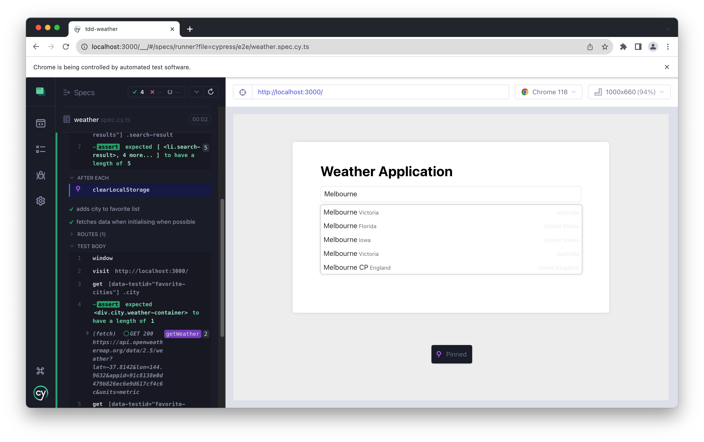

# Recap

In this concise chapter, we'll briefly revisit the crucial insights from the book and furnish additional resources for you to delve deeper into the realm of React and software design.

The primary objective of this book was to unearth common anti-patterns often encountered in React codebases, especially within large-scale React applications. We delved into potential remedies and techniques to rectify these issues. The examples throughout the narrative were drawn either from my prior projects or are related to domains with which developers are likely to be familiar—such as shopping carts, user profiles, and network requests, to name a few.

I champion a step-by-step and incremental delivery approach, guiding you from an initial less-than-ideal implementation towards a polished version, making one small improvement at a time. We embarked on organizing a typical React application, ventured into the realm of frontend testing through Test-Driven Development, and initiated our journey with common refactoring techniques. Thereafter, we navigated the challenging waters of data/state management in React, elucidated common design principles, and explored compositional strategies. A slew of chapters were dedicated to constructing full examples from scratch, including a dropdown list, a shopping cart, and a weather application.

During this expedition, we discovered numerous handy tips, like how to stub network requests in both Cypress and Jest, applying the strategy design pattern to a JavaScript model, and employing Anti-Corruption Layers (ACL) in real-world code scenarios.

The techniques discussed in this book may not be groundbreaking or novel; indeed, many are well-established. However, their application in the React ecosystem has remained underexplored. I earnestly hope that this book has adeptly bridged that gap, reintroducing these invaluable design principles and patterns to the React community, thereby facilitating a smoother coding experience for developers in the long term.

As we transition into reviewing the common anti-patterns, it's essential to have a clear understanding and recognition of these issues, as it lays the foundation for the solutions and design principles that follow.

# Common Anti-patterns

## Props Drilling

Props drilling emerges when a prop traverses through multiple component levels, only to be employed in a deeper level component, rendering the intermediate components unnecessarily privy to this prop. This practice can lead to convoluted and hard-to-maintain code.

**Solution:** 
Employing Context API to create a central store and functions to access this store allows the component tree to access the props when needed without prop-drilling.

## Long Props List / Big Component
A component that accepts an extensive list of props or harbors a large amount of logic can become a behemoth, hard to understand, reuse, or maintain. This anti-pattern infringes upon the Single Responsibility Principle, which advocates that a component or module should only have one reason to change.

**Solution:** 
Dismantling the component into smaller, more digestible components and segregating concerns can ameliorate this issue. Each component should embody a clear, singular responsibility. Custom hooks also serve as a potent means to simplify the code within a component and reduce its size.

## Business Leakage
Business leakage transpires when business logic is implanted within components that should remain purely presentational, which can complicate application management and reduce component reusability.

**Solution:** 
Extricating business logic from presentation logic using custom hooks or relocating the business logic to a separate module or layer can address this issue. Employing an Anti-Corruption Layer can be an effective technique to rectify this issue.

## Complicated Logic in Views
The embedding of complex logic within view components can muddle the code, making it arduous to read, comprehend, and maintain. Views should remain as uncluttered as possible, solely responsible for rendering data.

**Solution:** 
Relocating complex logic to custom hooks, utility functions, or a separate business logic layer can help keep view components clean and manageable. Initially, breaking down the component into smaller ones, and then gradually segregating the logic into appropriate places can be beneficial.

## Lack of Tests (at each level)
The absence of adequate unit, integration, or end-to-end tests to ascertain the application functions as anticipated can usher in bugs, regressions, and code that's challenging to refactor or extend.

**Solution:** 
Adopting a robust testing strategy encompassing unit testing, integration testing, and end-to-end testing, coupled with practices like Test-Driven Development (TDD), can ensure code correctness and ease of maintenance.

## Code Duplications
Reiterating similar code across multiple components or sections of the application can complicate codebase maintenance and augment the likelihood of bugs.

**Solution:** 
Adhering to the DRY (Don't Repeat Yourself) principle and abstracting common functionality into shared utility functions, components, or hooks can help curtail code duplication and enhance code maintainability.

Having dissected the common anti-patterns, it's now imperative to delve into the design principles that act as antidotes to these prevalent issues. These principles not only provide solutions but also guide you towards writing cleaner, more efficient code.

# Design Principles to Counter Anti-patterns

## Higher-Order Components (HOCs)
Higher-Order Components (HOCs) are a potent pattern in React for reusing component logic. HOCs are functions that accept a component and return a new component augmented with additional properties or behaviors. By leveraging HOCs, you can extract and share common behaviors across your components, aiding in mitigating issues like props drilling and code duplications.

## Render Props
The Render props pattern encompasses a technique for sharing code between React components using a prop whose value is a function. It's a method to pass a function as a prop to a component, and that function returns a React element. This pattern can be instrumental in alleviating issues like long props lists and big components by promoting reuse and composition.

## Headless Components
Headless components are those that manage behavior and logic but do not render UI, bestowing the consumer with control over the rendering. They separate the behavior logic from the presentation logic, which can be a viable solution to business leakage and complicated logic in views, making components more flexible and maintainable.

## Data Modelling
Data modeling entails organizing and defining your data, which aids in understanding and managing the data within your application, thereby simplifying the logic within your components. This principle can be employed to tackle complicated logic in views and business logic leakage.

## Layered Architecture
Layered architecture involves segregating concerns and organizing code such that each layer has a specific responsibility. This separation can lead to a more organized and manageable codebase, addressing issues like business leakage and complicated logic in views.

## Context as Interface
Utilizing context as an interface allows components to interact with data without the need to pass props down multiple levels. This strategy can alleviate props drilling and long props lists, rendering the component tree more readable and maintainable.

With a solid grasp of the foundational and design principles, it's time to explore the techniques that will arm you with the practical knowledge to implement these principles in your daily coding endeavors.

# Foundational Principles

## Single Responsibility Principle (SRP)
The Single Responsibility Principle advocates that a class or component should only harbor one reason to change. Adhering to SRP can lead to more maintainable and understandable code, mitigating issues like big components and complicated logic in views.

## Dependency Inversion Principle
The Dependency Inversion Principle emphasizes depending on abstractions, not concretions, which leads to a decoupling of high-level and low-level structures. This principle can be utilized to manage business logic leakage and promote a clean separation of concerns.

## Don't Repeat Yourself (DRY)
The Don't Repeat Yourself principle is about minimizing repetition within the code. By adhering to the DRY principle, you can minimize code duplications, making your codebase easier to maintain and extend.

## Anti-Corruption Layer (ACL)

An Anti-Corruption Layer serves as a barrier between different parts or layers of an application, creating a stable interface. Implementing an ACL can be a potent strategy to manage business leakage and ensure a clean separation of concerns.

The Anti-Corruption Layer (ACL) proves to be especially beneficial when your code needs to interact with other systems in any capacity, a scenario that often arises when collaborating with different teams - a common occurrence in many setups. By establishing a clear system boundary through ACL, we can mitigate the impact of changes in other systems on our own, thereby maintaining better control over our application and alleviating potential integration challenges.

## Using Composition
Composition is a core principle in React that empowers developers to build components from other components, promoting reuse and simplicity. Employing composition can alleviate various issues including long props lists, big components, and code duplications, leading to a more maintainable and organized codebase.

# Techniques

## Writing User Acceptance Tests (UAT)
User Acceptance Testing is a pivotal part of the development process that ensures your application aligns with its specifications and functions as desired. Implementing UAT can aid in identifying issues early in the development process, ensuring your application is on the right trajectory.

As depicted in Figure 13-2, we emphasize that tests should be written from the end users' perspective, focusing on delivering customer value rather than on the implementation details. This is especially pertinent when you commence the implementation of a feature at a higher level.

## Test-Driven Development (TDD)
Test-Driven Development is a software engineering technique where tests are penned before the code that needs to be tested. The process is primarily segmented into the following iterative development cycles: write a test, make the test pass, and then refactor. TDD can significantly help in ensuring that your codebase is functional and bug-free, addressing the lack of tests at each level.

## Refactorings & Common Code Smells
Refactoring entails enhancing the design of existing code without altering its external behavior. Being cognizant of common code smells and continuously refactoring your code can lead to a healthier, more maintainable codebase. This technique can be instrumental in tackling issues like code duplications, complicated logic in views, and business leakage, among others.

Now that we've navigated through the common anti-patterns, elucidated the design principles, and explored the techniques, it's time to look beyond this book. The following section provides a list of recommended readings that will further deepen your understanding and hone your skills in the domain of React, TypeScript, and software design principles.

# Looking forward

As we draw the curtains on the contents of this book, the journey towards mastering React and avoiding common pitfalls is far from over. The landscape of web development, particularly with frameworks like React, is ever-evolving. Continuous learning and adaptation are the keystones of staying relevant and proficient. The following section is crafted to provide you with additional avenues for learning and exploration. These books are meticulously chosen to extend your understanding and to introduce you to broader or complementary concepts in software development. Each book opens up a new dimension of knowledge, ensuring your growth trajectory remains steep and rewarding. So, as you step forward from here, let these resources be your companions in the continuous journey of learning and mastering the art of web development.

# Books

In this section, a few seminal books are recommended that can further deepen your understanding and appreciation of good design, architecture, and development practices in the realm of web applications, with a particular focus on React and TypeScript.

## Refactoring: Improving the Design of Existing Code by Martin Fowler

Martin Fowler's cornerstone work on refactoring is a repository of knowledge on how to enhance the structure of your code while preserving its functionality and bug-free nature. It's a must-read for anyone aspiring to hone their refactoring skills.

## Clean Code: A Handbook of Agile Software Craftsmanship by Robert Martin

Robert Martin's Clean Code is a hallmark in the software development world. It delves into various practices and principles of penning clean, maintainable code, which is crucial for long-term success in complex projects.

## Patterns of Enterprise Application Architecture by Martin Fowler

Expand your architectural vistas with Martin Fowler's Patterns of Enterprise Application Architecture. This book dissects various patterns crucial for designing robust and scalable enterprise applications. It's a significant read to grasp the bigger picture of application architecture, extending beyond the frontend realm.

## Test-Driven Development with React and TypeScript by Juntao Qiu

Immerse yourself in the world of test-driven development (TDD) with a lens on React and TypeScript. This book navigates you through the principles of TDD and how it can markedly improve the quality, maintainability, and robustness of your code.

# Summary

This chapter furnished a swift recap of the pivotal points covered in this book, followed by a list of recommended readings to further your knowledge and expertise in React, TypeScript, and software design principles. With a solid foundation in recognizing and rectifying anti-patterns, and a plethora of resources at your disposal, you're well on your way to evolving into a proficient and thoughtful developer.