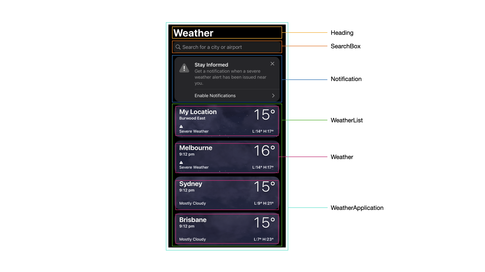
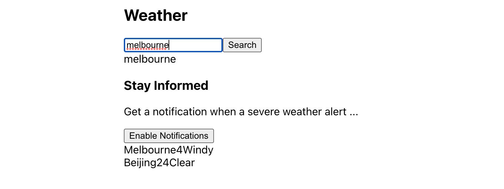
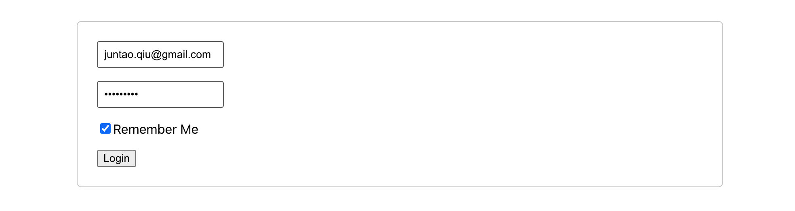
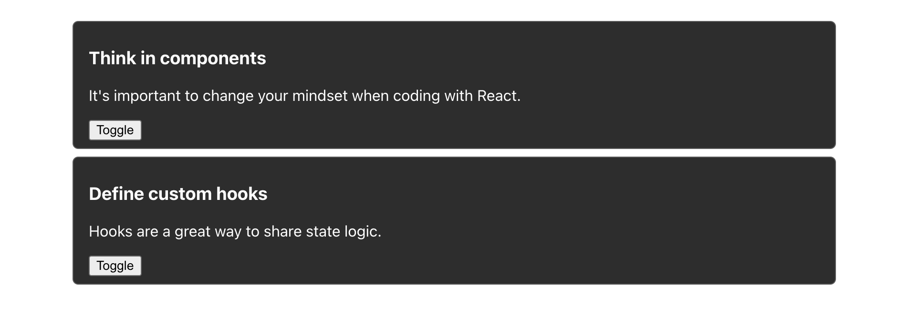

# React Essentials

Welcome to the introductory chapter of our React essential guide! This chapter serves as a solid foundation for your journey into the exciting world of React development. We will delve into the fundamental concepts of React and provide you with the essential knowledge needed to kickstart your React projects with confidence.

In this chapter, we will explore how to think in components, a crucial mindset for building reusable and modular user interfaces. You will learn the art of breaking down your application into smaller, self-contained components, enabling you to create maintainable and scalable codebases. By understanding this fundamental concept, you will be equipped with the skills to architect robust and flexible React applications.

Additionally, we will introduce you to the most commonly used hooks in React, such as `useState`, `useEffect`, and more. These hooks are powerful tools that allow you to manage state, handle side effects, and tap into React's lifecycle methods within functional components. By mastering these hooks, you will have the ability to create dynamic and interactive user interfaces effortlessly.

By the end of this chapter, you will be well-prepared to explore more advanced topics and tackle real-world React challenges in the subsequent chapters of our guide. So, buckle up and get ready to embark on an exciting journey into the world of React.

## Understanding Components in React

React applications are built on components. A component can range from a simple function returning an HTML snippet to a more complex one that interacts with network requests, dynamically generates HTML tags, and even auto-refreshes based on backend service changes.

Let's start with a basic scenario and define a static component:

```tsx
const StaticArticle = () => {
  return (
    <article>
      <h3>Think in components</h3>
      <p>It's important to change your mindset when coding with React.</p>
    </article>
  );
};
```

This static component closely resembles the corresponding HTML snippet, which uses the `<article>` tag to structure content with a title and a paragraph:

```html
<article>
  <h3>Think in components</h3>
  <p>It's important to change your mindset when coding with React.</p>
</article>
```

## Creating Reusable Components

The key difference is that a component in React is a function that returns an HTML-like snippet. Let's move beyond a static component and add more elements. Suppose we want to display a list of blog posts, each with a heading and a summary. In HTML, we would manually write the HTML fragments. However, with React components, we can dynamically generate these HTML fragments using JavaScript.

First, let's start with the basic structure:

```tsx
type ArticleType = {
  heading: string;
  summary: string;
};

const Article = ({ heading, summary }: ArticleType) => {
  return (
    <article>
      <h3>{heading}</h3>
      <p>{summary}</p>
    </article>
  );
};
```

We can then pass the desired heading and summary to the `Article` component:

```tsx
<Article
  heading="Think in components"
  summary="It's important to change your mindset when coding with React."
/>
```

Or define another article:

```tsx
<Article
  heading="Define custom hooks"
  summary="Hooks are a great way to share state logic."
/>
```

Note that the parameters passed to a component are called props. A component can have any number of props, although it's recommended to keep them to a manageable amount, preferably no more than five or six. This helps maintain clarity and understandability, as having too many props can make the component harder to comprehend and extend.

## Thinking in Components

Let's examine a more complex user interface and explore how to break it down into components and implement them separately.



The entire application can be defined as the `WeatherApplication` component, which includes several subcomponents:

```tsx
const WeatherApplication = () => {
  return (
    <>
      <Heading title="Weather" />
      <SearchBox />
      <Notification />
      <WeatherList />
    </>
  );
};
```

Each subcomponent can perform various tasks, such as fetching data from a remote server, conditionally rendering a dropdown list, or auto-refreshing periodically. 

For example, the `SearchBox` component might have the following structure:

```tsx
const SearchBox = () => {
  return (
    <div className="search-box">
      <input type="text" />
      <button>Search</button>
      <div className="search-results" />
    </div>
  );
};
```

The `search-results` section will only appear when data is fetched from the search query. On the other hand, a `Weather` component can be more straightforward, rendering whatever is passed to it:

```tsx
type WeatherType = {
  cityName: string;
  temperature: number;
  weather: string;
};

const Weather = ({ cityName, temperature, weather }: WeatherType) => {
  return (
    <div>
      <span>{cityName}</span>
      <span>{temperature}</span>
      <span>{weather}</span>
    </div>
  );
};
```

When implementing components in real-world scenarios, it is crucial to pay attention to styling and refine the HTML structure with meticulous detail. Additionally, components should effectively manage their own state, ensuring consistency and responsiveness across renders.

By grasping the concept of components and their proper structuring in React, you gain the ability to construct dynamic and reusable UI elements that contribute to the overall functionality and organization of your application. As you advance in your React development journey, don't forget to polish the visual presentation through styling and consider efficient state management techniques to enhance the performance and interactivity of your components.

A complete Weather component could be something like:

```tsx
type WeatherType = {
  name: string;
  weather: Weather;
}

export function WeatherCard({ name, weather }: WeatherType) {
  return (
    <div className={`weather-container ${weather.main}`}>
      <h3>{city.name}</h3>
      <div className="details">
        <p className="temperature">{weather.temperature}</p>
        <div className="weather">
          <span className="weather-category">{weather.main}</span>
        </div>
      </div>
    </div>
  );
}
```

## Manage States in React

State in React refers to the internal data that components can hold and manage. It allows components to store and update information, enabling dynamic UI updates, interactivity, and data persistence. State is a fundamental concept in React that helps build responsive and interactive applications.

For example, the SearchBox above can be implemented with something like:

```tsx
const SearchBox = () => {
  const [query, setQuery] = useState<string>();
  const handleChange = (e: ChangeEvent<HTMLInputElement>) => {
    const value = e.target.value;
    setQuery(value);
  };

  return (
    <div className="search-box">
      <input type="text" value={query} onChange={handleChange} />
      <button>Search</button>
      <div className="search-results">{query}</div>
    </div>
  );
};
```

The code snippet showcases that `SearchBox` includes an input field, a search button, and a display area for search results. The `useState` hook is used to create a state variable called `query`, initialized as an empty string. The `handleChange` function captures the user's input and updates the `query` state accordingly. The component renders the input field with the current value of `query`, a search button, and a div displaying the search results.

Note here the `useState` hook is used to manage state within the `SearchBox` component. Here's an explanation of the `useState` part of the code:

```tsx
const [query, setQuery] = useState<string>("");
```

- `useState<string>("")`: This line declares a state variable called `query` and initializes it with an empty string (`""`).
- `const [query, setQuery]`: This syntax uses array destructuring to assign the state variable (`query`) and its corresponding update function (`setQuery`) to variables with the same names.

As we enter a city name in the input box, the "search-results" area is automatically updated, along with the input value. Although there are multiple rerenders occurring as we typing, the state value persists throughout the process.



## The rendering process 

When the underlying data changed, React need to update the UI to refelct the changes. The process is called rendering.

1. Initial Render: When a functional component is first rendered, it generates a virtual representation of the component's UI using JSX syntax. This virtual representation describes the structure and content of the UI elements.

2. State and Props Changes: When there are changes in the component's state or props, React re-evaluates the component's function body. It performs a diffing algorithm to compare the previous and new function bodies, identifying the differences between them.

3. Reconciliation: React determines which parts of the UI need to be updated based on the differences identified during the diffing process. It updates only those specific parts of the UI, keeping the rest unchanged.

4. Re-Rendering: React re-renders the component by updating the virtual representation of the UI. It generates a new virtual DOM based on the updated function body, replacing the previous virtual DOM.

5. DOM Update: Finally, React efficiently updates the real DOM to reflect the changes in the virtual DOM. It applies the necessary DOM manipulations, such as adding, removing, or updating elements, to make the UI reflect the updated state and props.

This process ensures that the UI remains in sync with the component's state and props, enabling a reactive and dynamic user interface. React's efficient rendering approach minimizes unnecessary DOM manipulations and provides a performant rendering experience in functional components.

In this book, we will explore situations where writing high-performance code is crucial, ensuring that components only re-render when necessary while preserving the unchanged parts. Achieving this requires utilizing hooks effectively, employing various techniques to optimize rendering.

## Common hooks in React

React hooks are a feature introduced in React 16.8 that enable functional components to have state and lifecycle features. They provide a way to manage state, perform side effects, and tap into React's lifecycle methods without using class components. Hooks allow for code reuse, improved readability, and easier testing by separating concerns and making component logic more modular. 

Let's discuss the most common few hooks in this section.

### useState

We have already seen the basic usage of `useState` hook above. You can define as many states as you like inside a component, and it's quite common to do so in real world project. For example, a login form might include username, password and a Remember Me flag. All these states need to be remembered before user click the submit button.



```tsx
const Login = () => {
  const [username, setUsername] = useState<string>("");
  const [password, setPassword] = useState<string>("");
  const [rememberMe, setRememberMe] = useState<boolean>(false);

  return (
    <div className="login-form">
      <div className="field">
        <input
          type="text"
          value={username}
          onChange={(event) => setUsername(event.target.value)}
          placeholder="Username"
        />
      </div>

      <div className="field">
        <input
          type="password"
          value={password}
          onChange={(event) => setPassword(event.target.value)}
          placeholder="Password"
        />
      </div>

      <div className="field">
        <label>
          <input
            type="checkbox"
            checked={rememberMe}
            onChange={(event) => setRememberMe(event.target.checked)}
          />
          Remember Me
        </label>
      </div>

      <div className="field">
        <button>Login</button>
      </div>
    </div>
  );
};
```

In the code snippet above we have to manage three different states, so it uses the `useState` hook to manage state for the `username`, `password`, and `rememberMe` fields. The component renders input fields for username and password, a checkbox for "Remember Me," and a login button. User input updates the corresponding state variables, enabling the capture of form data.

### useEffect

In React, a side effect refers to any code that is not directly related to rendering a component but has an impact outside the component's scope. Side effects often involve interacting with external resources, such as making API calls, modifying the underlying DOM (not using the normal React virutal DOM), subscribing to event listeners, or managing timers.

React provides a built-in hook called `useEffect` to handle side effects within functional components. The `useEffect` hook allows you to perform side effects after rendering or when specific dependencies change.

By using the `useEffect` hook, you can ensure that side effects are executed at the appropriate times during the component's lifecycle. This helps maintain the consistency and integrity of the application while separating side effects from the core rendering logic.

Let's take a look at a typical use case of `useEffect`. In the article list example above, normally the article list could return from some API calls, in JSON format, for example.

```ts
const ArticleList = () => {
  const [articles, setArticles] = useState<ArticleType[]>([]);

  useEffect(() => {
    const fetchArticles = async () => {
      fetch("/api/articles")
        .then((res) => res.json())
        .then((data) => setArticles(data));
    };

    fetchArticles();
  }, []);

  return (
    <div>
      {articles.map((article) => (
        <Article heading={article.heading} summary={article.summary} />
      ))}
    </div>
  );
};
```

The code snippet demonstrates the usage of the `useEffect` hook in a React functional component. Let's break it down:

1. `useEffect(() => { ... }, []);`: This line declares the `useEffect` hook and provides two arguments. The first argument is a callback function that contains the side effect code to be executed. The second argument is an array of dependencies that determines when the side effect should be triggered. An empty array `[]` indicates that the side effect should only run once, during the initial render.

2. `const fetchArticles = async () => { ... }`: This line declares an asynchronous function called `fetchArticles`. Inside this function, an API call is made to fetch data from the `/api/articles` endpoint.

3. `fetch("/api/articles")...`: This line uses the `fetch` function to make a GET request to the specified API endpoint. The response is then processed using promises (`then`) to extract the JSON data.

4. `setArticles(data)`: This line updates the component's state variable `articles` with the retrieved data using the `setArticles` function. This will trigger a re-render of the component with the updated data.

5. `fetchArticles()`: This line invokes the `fetchArticles` function, triggering the API call and updating the `articles` state.

Once we have these articles, we can then use the collection API, `array.map` to generate a list of articles. Please note that the second parameter of useEffect is critical. We use an empty array above as we don't want the effect to trigger each time, but there are cases we would like to perform the effect whenever one of the dependencies changed.

For example, let's say we have an `ArticleDetail` component, and whenever the `id` of the article changed, we need to re-fetch the data and re-rendering.

```tsx
const ArticleDetail = ({ id }: { id: string }) => {
  const [article, setArticle] = useState<ArticleType>();

  useEffect(() => {
    const fetchArticleDetail = async (id: string) => {
      fetch(`/api/articles/${id}`)
        .then((res) => res.json())
        .then((data) => setArticle(data));
    };

    fetchArticleDetail(id);
  }, [id]);

  return (
    <div>
      {article && (
        <Article heading={article.heading} summary={article.summary} />
      )}
    </div>
  );
};
```

Inside the `useEffect` hook, the `fetchArticleDetail` function is defined to handle the API call. It fetches the article details based on the provided `id`, converts the response to JSON, and updates the `article` state using `setArticle`.

The effect is triggered when the `id` prop changes. Upon successful retrieval of the article data, the `Article` component is rendered with the heading and summary properties from the `article` state.

### useCallback

The `useCallback` hook in React is used to memoize and optimize the creation of callback functions. It is particularly useful when passing callbacks to child components or when using callbacks as dependencies in other hooks.

Here's a brief explanation of `useCallback`:

1. Memoizing Callbacks: When a component re-renders, any functions defined inside it are recreated. This can be problematic when passing callbacks as props to child components because it can lead to unnecessary re-renders of those child components. By using `useCallback`, you can memoize a callback function so that it is only recreated if its dependencies change. This helps optimize performance by preventing unnecessary re-rendering of child components.

2. Optimizing Dependencies in Hooks: When using hooks such as `useEffect` or `useMemo`, you may have dependencies that include callback functions. By wrapping the callback with `useCallback` and including it as a dependency, you ensure that the hook only recalculates when the callback or its dependencies change. This helps avoid unnecessary re-execution of the hook.

3. Dependency Equality: The equality of dependencies is determined using the reference comparison. If the dependencies are primitive values (like numbers or strings), reference equality is not a concern. However, if the dependencies are objects or arrays, it's important to ensure that they don't get recreated on each render, as it can cause unintended re-renders.

To use `useCallback`, you provide a callback function as the first argument and an array of dependencies as the second argument. The `useCallback` hook returns a memoized version of the callback function, which remains the same as long as the dependencies do not change.

```tsx
import React, { useState, useCallback, ChangeEvent } from "react";

const ArticleEditor = ({ id }: { id: string }) => {
  const [summary, setSummary] = useState("");

  const submitChange = useCallback(async () => {
    try {
      await fetch(`/api/articles/${id}`, {
        method: "POST",
        body: JSON.stringify({ summary }),
        headers: {
          "Content-Type": "application/json",
        },
      });
    } catch (error) {
      // handling errors
    }
  }, [id, summary]);

  const handleSummaryChange = useCallback(
    (event: ChangeEvent<HTMLTextAreaElement>) => {
      setSummary(event.target.value);
    },
    []
  );

  return (
    <div>
      <h2>Edit Article</h2>
      <textarea value={summary} onChange={handleSummaryChange} />
      <button onClick={submitChange}>Save</button>
    </div>
  );
};
```

The `ArticleEditor` component allows the user to edit the summary of an article. The `submitChange` function is defined using `useCallback` and depends on the `id` and `summary` variables. By memoizing the `submitChange` function, it remains the same as long as the dependencies (`id` and `summary`) do not change.

When the user modifies the summary by typing in the `textarea`, the `handleSummaryChange` callback updates the `summary` state. The `submitChange` function is then invoked when the user clicks the "Save Changes" button.

By caching the `submitChange` function with `useCallback`, we ensure that it remains consistent and prevents unnecessary re-renders of the component when other state values change. This optimization can be especially useful in scenarios where the function is passed down to child components or used as a dependency in other hooks.

### The React context API

React Context API is a feature that allows you to pass data directly through the component tree, without having to pass props down manually at every level. This comes in handy when your application has global data that many components share, or when you have to pass data through components that don't necessarily need the data but have to pass it down to their children.

For example, we need at the root level to set a theme for the whole application. It could be "dark" or "light" depends on the current time. For instance, if it's daytime we use "light" mode. 

First, we define a `ThemeContext`:

```ts
import React from "react";

export type ThemeContextType = {
  theme: "light" | "dark";
};

// Create the context with default value. 
// It's not directly usable without a Provider
export const ThemeContext = React.createContext<ThemeContextType | undefined>(
  undefined
);
```

Then we create a `ThemeProvider` component, which will use a React state to manage the current theme:

```tsx
import React, { useState } from "react";
import { ThemeContext, ThemeContextType } from "./ThemeContext";

export const ThemeProvider = ({ children }) => {
  const [theme, setTheme] = useState<"light" | "dark">("light");

  const value: ThemeContextType = { theme };

  return (
    <ThemeContext.Provider value={value}>{children}</ThemeContext.Provider>
  );
};
```

Finally, we can use the `ThemeProvider` in our application:

```tsx
import React from "react";
import { ThemeProvider } from "./ThemeProvider";
import App from "./App";

const Root = () => {
  return (
    <ThemeProvider>
      <App />
    </ThemeProvider>
  );
};

export default Root;
```

In any component in our application, we can now access the current theme:

```tsx
import React, { useContext } from "react";
import { ThemeContext } from "./ThemeContext";

const ThemedComponent = () => {
  const context = useContext(ThemeContext);

  const { theme } = context;

  return <div className={theme}>Current Theme: {theme}</div>;
};

export default ThemedComponent;
```

In this setup, the `ThemeContext` provides the current theme to any components in the tree that are interested in it. The theme is stored in a state variable in the `ThemeProvider`, which is the root component of the app.

The provided code may not offer much utility since the theme cannot be modified. However, by utilizing the Context API, you can define a modifier that allows children nodes to alter the status. This mechanism proves highly beneficial for data sharing, making it a valuable tool.

Let's modify the context interface a little bit:

```tsx
type Theme = {
  theme: "light" | "dark";
  toggleTheme: () => void;
};

const ThemeContext = React.createContext<Theme>({
  theme: "light",
  toggleTheme: () => {},
});
```

And for the provider, we can use `useState` to define a internal state, and expose the modifier so the children can access:

```tsx
const ThemeProvider = ({ children }: { children: ReactNode }) => {
  const [theme, setTheme] = useState<"light" | "dark">("light"); // default theme is light

  const toggleTheme = () => {
    setTheme((prevTheme) => (prevTheme === "light" ? "dark" : "light"));
  };

  return (
    <ThemeContext.Provider value={{ theme, toggleTheme }}>
      {children}
    </ThemeContext.Provider>
  );
};
```

And then in the calling site, it's straightforward to use `useContext` hook to access the values in the context:

```tsx
const Article = ({ heading, summary }: ArticleType) => {
  const { theme, toggleTheme } = useContext(ThemeContext);

  return (
    <article className={theme}>
      <h3>{heading}</h3>
      <p>{summary}</p>
      <button onClick={toggleTheme}>Toggle</button>
    </article>
  );
};
```

And then whenever we click the button Toggle, it will change the theme and trigger a re-render.



In React, the Context API allows you to create and manage global state that can be accessed by components throughout your application. This capability enables you to combine multiple context providers, each representing a different slice or aspect of your application's state.

By using separate context providers, such as one for security, another for logging, and potentially others, you can organize and share related data and functionality efficiently. Each context provider encapsulates a specific concern, making it easier to manage and update related state without impacting other parts of the application.

```tsx
import InteractionContext from "xui/interaction-context";
import SecurityContext from "xui/security-context";
import LoggingContext from "xui/logging-context";

const Application = ({ children }) => {
  const context = useMemo(() => {
    return {
      interact: (e, t) => {
        console.log(`sending to another remote server ${e}: ${t}`);
      },
    };
  }, []);

  //... define securityContext
  //... define loggingContext

  return (
    <InteractionContext.Provider value={context}>
      <SecurityContext.Provider value={securityContext}>
        <LoggingContext.Provider value={loggingContext}>
          {children}
        </LoggingContext.Provider>
      </SecurityContext.Provider>
    </InteractionContext.Provider>
  );
};
```

The example above demonstrates the usage of React's Context API to create and combine multiple context providers within an application component. The `InteractionContext.Provider`, `SecurityContext.Provider`, and `LoggingContext.Provider` are used to wrap the `children` components and provide the respective context values.

There are several additional built-in hooks available in React that are used less frequently. In the following chapters, we will introduce these hooks as needed, focusing on the ones that are most relevant to the topics at hand.

## Summary

In this introductory chapter, we covered the essential concepts of React and laid the groundwork for your React development journey. We explored the concept of thinking in components, emphasizing the importance of breaking down applications into reusable and modular pieces. By adopting this mindset, you'll be able to create maintainable and scalable codebases.

Furthermore, we introduced you to the most commonly used hooks in React, such as `useState` and `useEffect`, which empower you to manage state and handle side effects efficiently within functional components. These hooks provide the flexibility and power to build dynamic and interactive user interfaces.

By mastering the fundamental principles of React and familiarizing yourself with the concept of thinking in components, you are now well-prepared to dive deeper into the world of React development. In the upcoming chapters, we will explore more advanced topics and tackle real-world challenges, enabling you to become a proficient React developer.

Remember, React is a powerful tool that opens up endless possibilities in creating modern and robust web applications. So, let's build upon this foundation and continue our journey to unlock the full potential of React!