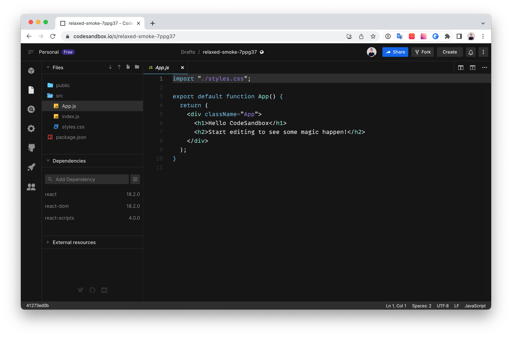
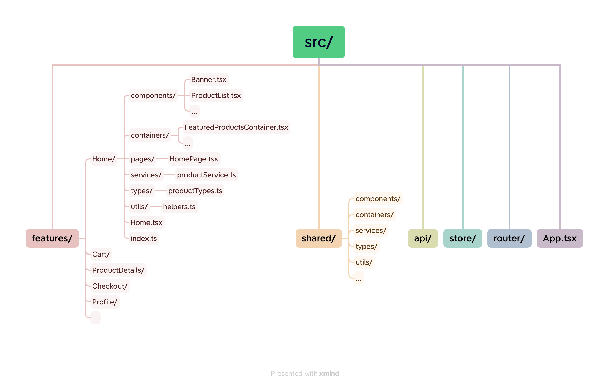
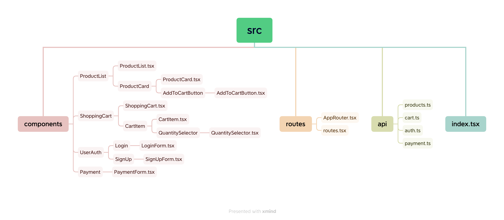
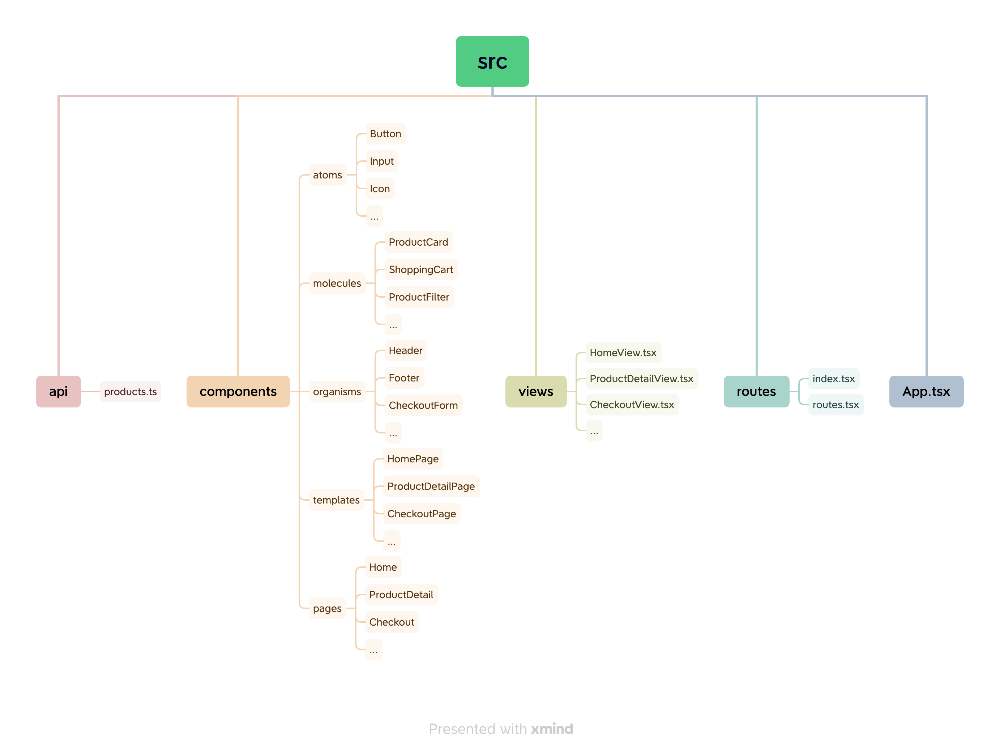
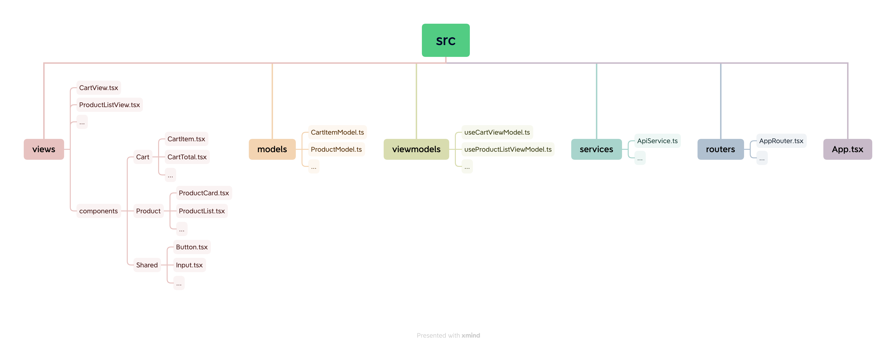
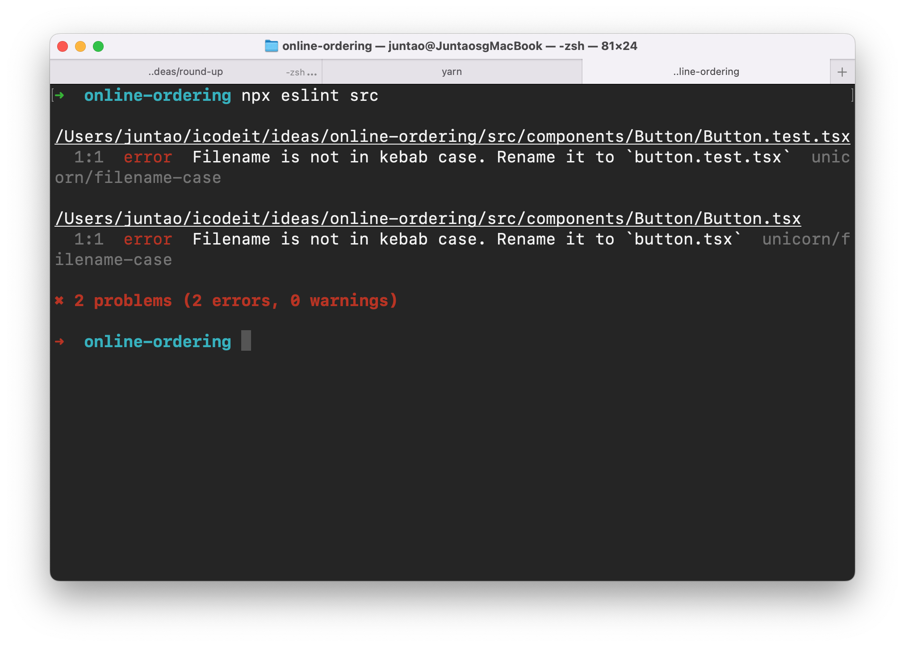
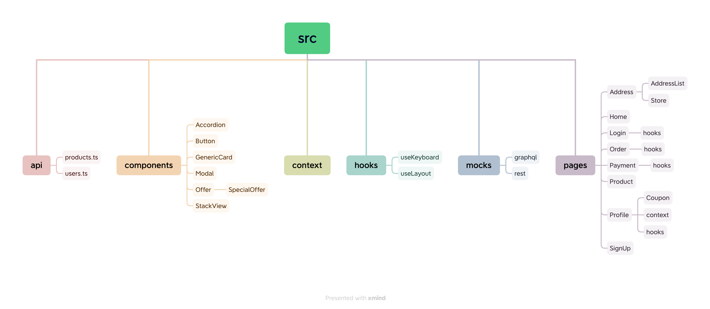

# How to Organise Your React Application

The rapid growth of a project can be astonishing, leading to a sense of things spiraling out of control. Initializing a frontend project is typically straightforward, and for small-scale projects, there may be little concern regarding file structure since the number of files to manage is minimal. However, as the project expands, the need for proper file organization becomes apparent.



The problem with having a less-structured project is that it can lead to several challenges and difficulties in managing and maintaining the codebase effectively. Some of the key problems that arise from a lack of structure include:

1. Code Disorganization: Without a clear structure, it becomes harder to locate specific code files or components. This can result in wasted time and effort spent searching for relevant code, especially as the project grows larger.

2. Poor Code Reusability: Without a proper structure, it becomes challenging to identify reusable components or functions. This can lead to code duplication and a lack of consistency, making it harder to maintain and update the codebase in the long run.

3. Difficulty in Collaboration: When team members are working on a less-structured project, it becomes harder to understand and navigate each other's code. This can lead to communication gaps, slower development, and an increased risk of introducing bugs or conflicts.

4. Scalability Issues: As the project expands and new features are added, the lack of structure can make it challenging to integrate new components seamlessly. This can result in a tangled codebase that is difficult to extend or modify, leading to decreased productivity and increased development time.

5. Maintenance Complexity: Without a clear organization, maintaining the codebase becomes more complex. Making changes or fixing issues can become a time-consuming task, as there may be a lack of consistency in how code is structured or named.

Before proposing a recommended project structure, let's take a look at the typical components of a modern frontend project. Understanding these components will provide a foundation for designing an effective project structure.

# Front-end applications are complex

In a medium-sized front-end project, you may be surprised by the multitude of components required for its successful implementation. Alongside the core features, there are numerous other elements that contribute to the project's functionality. The folder structure of a React project provides a glimpse into the various aspects you'll need to manage within a typical React codebase:

1. Source Code:
   - JavaScript/TypeScript files: These files contain the application logic, including components, utilities, and other code.
   - CSS/SCSS/LESS files: Style files that define the visual appearance of the application.
   - HTML files: Markup templates used to structure the application's user interface.

2. Assets:
   - Images: Graphics, icons, and other visual assets used in the application.
   - Fonts: Custom font files for styling text elements.
   - Videos and Audio: Multimedia files used in the application.

3. Configuration:
   - Package.json: Configuration file specifying dependencies, scripts, and project metadata.
   - Environment Variables: Configuration variables for different environments (development, production, etc.).
   - Build Configuration: Configuration files (e.g., webpack.config.js) for building and bundling the project.

4. Tests:
   - Unit Tests: Tests that validate the functionality of individual units of code.
   - Integration Tests: Tests that verify the interactions between different components or modules.
   - End-to-End (E2E) Tests: Tests that simulate user interactions and validate the application as a whole.

5. Documentation:
   - Readme.md: Document providing an overview, setup instructions, and usage guidelines for the project.
   - API Documentation: Documentation for the project's APIs or backend integration points.
   - Style Guide: Guidelines for code style, naming conventions, and best practices.

6. Build Artifacts:
   - Bundled Files: Optimized and bundled JavaScript, CSS, and HTML files for deployment.
   - Build Output: Temporary build files and artifacts generated during the build process.

7. Development Tools and Configurations:
   - Linters: Tools like ESLint to enforce code quality and style guidelines.
   - Formatters: Tools like Prettier to ensure consistent code formatting.
   - Version Control: Tools like Git for source code versioning and collaboration.
   - Continuous Integration/Deployment (CI/CD) Configurations: Configuration files for automating testing and deployment processes.

These diverse components collectively form the foundation of a typical React codebase, highlighting the complexity and breadth of considerations involved in medium-sized front-end projects.

## Open Up A Feature folder

Exploring each feature folder can be an enjoyable experience, as it unravels a variety of elements:

- Common components, such as modal dialogues, navigation menus, buttons, and cards.
- Dedicated components tailored to specific features, like "SpecialOffer," "PayWithApple," and "AddressSearch."
- Style definitions using CSS-in-JS or SCSS/LESS code.
- Various types of testing code, including unit tests and browser tests.
- Calculation logic encapsulated within utility/helper functions.
- Custom hooks for reusable functionality.
- Contexts for security, internationalization (i18n), and other specific needs.
- Additional configuration files like eslint.config, jest.config, webpack settings, and more.

Given the multitude of files, how can we arrange them in a manner that facilitates easy navigation and quick access for modifications? While there is no one-size-fits-all solution, organizing the codebase in a consistent manner can greatly assist in this endeavor.

Consistency is paramount when it comes to naming and structuring code elements. Regardless of the approach chosen, it is crucial to maintain uniformity throughout the project. For example, if you decide to place style files alongside their respective components, it is essential to adhere to this convention across all components in the codebase. Similarly, if a "__tests__" folder is utilized, consistency should be maintained throughout the other folders as well.

By establishing and following consistent organizational practices, developers can streamline code navigation and enhance the maintainability of the project.

# Common structures in React Applications

There are many different ways of orgainising a large React applicaiton, here we'll have a quick look at the most common four strucutres, and in the following sections we'll dive into each to discuss more details.

1. **Feature-Based Structure:** In this approach, the application is organized based on features or modules. Each feature contains its own set of components, views, API calls, and state management. This structure allows for clear separation and encapsulation of functionality.

2. **Component-Based Structure:** In this structure, the application is organized around reusable components. Components are categorized based on their functionality and can be composed together to build larger views. The benefits include modularity, reusability, and easier maintenance. However, as the application grows, it may become harder to manage the relationships between components.

3. **Atomic Design Structure:** The atomic design structure emphasizes the hierarchy of components based on their level of complexity. It follows a systematic approach of breaking down components into atoms, molecules, organisms, templates, and pages. This structure promotes reusability, consistency, and scalability. However, it may introduce additional complexity and require a deep understanding of atomic design principles.

4. **MVVM (Model-View-ViewModel) Structure:** MVVM separates the application into models, views, and view models. Models represent the data, views handle the rendering of UI, and view models act as intermediaries between the views and models, providing necessary data and logic. The benefits include separation of concerns, declarative UI, and maintainability. However, it may introduce additional complexity for small projects and requires a good understanding of MVVM principles.

Each structure has its own set of benefits and drawbacks, and the choice depends on the specific requirements and complexity of the project. Sometimes we might need to mix them in some way to fit our project speicific needs.

In the following of the chapter, we'll use online shopping application as example since it's relatively complicated and you should have some familiarity around that domain already. The application also contains elements like API calls, router and state management. 

## Feature-based Strucutre

With a feature-based architecture in the context of online shopping, you can organize your files and folders as follows:



In this structure:
- The `features` directory represents different features of the application, such as Home, Cart, ProductDetails, Checkout, Profile, etc.
- Each feature has its own folder containing components, containers, pages, services, types, and utils related to that feature.
- The `shared` directory contains reusable components, containers, services, types, and utilities that can be shared across multiple features.
- The `api` directory houses modules for making API calls.
- The `store` directory contains modules for state management (e.g., Redux).
- The `router` directory contains routing configuration and related components.
- The `App.tsx` file serves as the entry point of the application.

### Benefits
- Clear separation of concerns: Each feature has its own folder, making it easier to locate and modify related code.
- Modularity: Features are self-contained, allowing for easier testing, maintenance, and reuse.
- Scalability: New features can be added without directly impacting existing code.
- Team collaboration: Developers can work on different features concurrently with minimal conflicts.

### Drawbacks
- Potential duplication: Features may share similar components or logic, leading to some duplication. Careful planning and refactoring can help mitigate this.

## Component-based Structure

With a component-based architecture in the context of online shopping, you can organize your files and folders as follows:



In this structure:
- Components: The `components` folder contains individual components related to various features of the online shopping application. Each component is organized into its own folder, which may contain child components as necessary. 
- Frontend Router: The `routes` folder handles frontend routing in the application. It includes the main `AppRouter.tsx` file that configures the routing logic and the `routes.tsx` file defining the individual routes and their corresponding components.
- API Calls: The `api` folder contains separate files for different API domains or functionalities. These files, such as `products.ts`, `cart.ts`, `auth.ts`, and `payment.ts`, handle the API calls related to their respective domains.
- State Management: The example assumes the use of a state management library like Redux or React Context API for managing global application state.

### Benefits

- Modularity: The component-based structure promotes modularity by organizing components into separate files and folders based on their functionality. This enhances code maintainability and reusability.
- Separation of Concerns: Each component focuses on its specific functionality, leading to clearer code and easier debugging. The separation of concerns improves code readability and maintainability.
- Code Reusability: With components organized in a modular structure, it becomes easier to reuse components across the application or in future projects, leading to improved development efficiency.
- TypeScript Support: Using TypeScript provides static typing and better tooling support, catching errors at compile-time and improving overall code quality.

### Drawbacks

- Project Complexity: As the project grows, maintaining a complex component structure can become challenging. It requires careful planning and adherence to best practices to avoid component sprawl and keep the structure manageable.
- Learning Curve: The initial learning curve for component-based development and TypeScript may be steeper for developers who are new to these concepts. However, the benefits gained in terms of code organization and maintainability outweigh the initial learning

## Atomic Design Structure

[Atomic Design](https://bradfrost.com/blog/post/atomic-web-design/) is a methodology for designing and organizing user interfaces. It emphasizes the construction of user interfaces by breaking them down into small, reusable components called atoms, which are combined to form molecules, organisms, templates, and pages.

The key idea behind Atomic Design is to create a systematic approach to building UI components that encourages reusability, scalability, and maintainability. It provides a clear structure for organizing and naming components, making it easier to understand and navigate the UI codebase.

Here's how the Atomic Design methodology categorizes UI components:

1. **Atoms**: Atoms are the smallest building blocks of a UI, representing individual elements such as buttons, inputs, icons, or labels. They are typically simple and self-contained.

2. **Molecules**: Molecules are combinations of atoms and represent more complex UI components. They encapsulate a group of atoms working together to form a functional unit, such as a form field or a navigation bar.

3. **Organisms**: Organisms are larger components that combine molecules and/or atoms to create more significant sections of a UI. They represent distinct sections of a user interface, such as a header, sidebar, or card component.

4. **Templates**: Templates provide a layout structure for arranging organisms and/or molecules. They define the overall skeleton of a page or a specific section of a UI.

5. **Pages**: Pages represent complete user interface screens that are composed of templates, organisms, molecules, and atoms. They represent the final output visible to the user.


With a Atomic Design architecture in the context of online shopping, you can organize your files and folders as follows:



In this structure, the "atoms," "molecules," "organisms," "templates," and "pages" directories represent the different levels of component composition and abstraction. The "api" directory contains the API-related files for making API calls. The "hooks" directory holds custom hooks for managing state and other functionalities. The "context" directory includes context providers for managing global state. The "views" directory contains the individual views that render the components. The "routes" directory handles the routing configuration.

### Benefits

- Reusability: Components can be easily reused across the application, promoting code efficiency.
- Consistency: The structure encourages a consistent design language and UI patterns.
- Scalability: The modular approach allows for easy scaling and addition of new components.
- Maintainability: Components are organized in a logical hierarchy, making them easier to locate and update.
- Collaboration: The atomic design structure facilitates collaboration between designers and developers, as it provides a common language for discussing UI components.

### Drawbacks
- Learning curve: It may require some initial learning and adaptation to understand and implement the atomic design principles effectively.
- Complexity: As the application grows, managing a large number of components and their relationships can become challenging.
- Overengineering: It's important to strike a balance between component reusability and overengineering, as excessive abstraction can introduce unnecessary complexity.

## MVVM Structure

To structure a React application with the MVVM (Model-View-ViewModel) architecture in the context of online shopping, you can organize your files and folders as follows:



In this structure:
- The `components` directory contains reusable UI components, organized by their respective features.
- The `models` directory includes the data models or entities representing the application's domain objects, such as CartItemModel and ProductModel.
- The `viewmodels` directory holds the hooks responsible for managing the state, logic, and interactions of the views.
- The `services` directory contains modules for handling API calls and other external services.
- The `views` directory includes the view components that display the UI based on the ViewModel state.
- The `routers` directory houses the routing configuration and components.
- The `App.tsx` file serves as the entry point of the application.

### Benefits

- Separation of concerns: The ViewModel separates the business logic from the UI components, promoting cleaner and more maintainable code.
- Testability: The ViewModel can be easily unit tested without the need for the actual UI components.
- Reusability: Components, models, and services can be reused across different features and views.
- Scalability: New features and views can be added while reusing existing ViewModel and service modules.

### Drawbacks

- Complexity: Implementing the MVVM pattern may introduce additional layers of abstraction and complexity to the application, especially for smaller projects.
- Learning curve: Developers need to understand the concepts and principles of MVVM to effectively structure and manage the application.

Now that we have explored these four popular structures, let's delve into the continuous evolution of our application's structure. This ongoing process ensures that the structure remains beneficial for developers in terms of easy navigation, seamless addition of new features, and the ability to maintain scalability over time.

# Keep Orgnaising Your Project Structure

Feature-based strucutre is always a good starting point. As the project expands and patterns of duplication start to emerge, an additional layer can be introduced to eliminate redundancy.

For instance, let's use the onlin-shopping application again, and it contains various pages:

- Home Page
- Login / Sign Up
- Store Address Search
- Product List
- Shopping Cart
- Order Details
- Payment
- Profile
- Coupon

In the initial stages, organizing pages based on their features is a common approach. However, as the project expands, duplication may become apparent. To tackle this issue, an additional layer can be introduced to consolidate and eliminate redundancy in the codebase.

This strategy leads to a more efficient and organized structure, enabling increased reusability and maintainability. By identifying recurring patterns and extracting shared components or utilities into separate layers, developers can enhance code consistency and minimize duplication. This approach promotes a modular and scalable architecture, allowing for easier management and future growth of the project.

## First attempt

The initial folder structure under the `src` directory is quite straightforward and follows a feature-based approach, with each page having its own folder:

```
├── Address
│   ├── AddressList
│   └── Store
├── Home
├── Login
├── Order
├── Payment
├── Product
├── Profile
│   └── Coupon
└── SignUp
```

However, as the project evolves, you may encounter duplication of components or functionalities across different pages. To address this, it becomes necessary to introduce an additional layer of abstraction.

For example, if both the `Login` and `Order` pages require a `Button` component, it would be impractical to have separate implementations of the button on each page. Instead, you can extract the `Button` component into its own separate layer, such as a `components` or `shared` folder. This way, the `Button` can be reused across multiple pages without duplication.

By adding this extra layer, you promote reusability and maintainability in your codebase. It helps in eliminating redundancy, streamlining development efforts, and ensuring consistency throughout the application. As the project expands, this modular approach allows for easy management and scalability, making it easier to add new features or make changes without impacting the entire codebase.

## One more layer

So you can create a `components` folder for all these reusable components and a `pages` folder for all these feature pages.

```
├── components
│   ├── Accordion
│   ├── GenericCard
│   ├── Modal
│   ├── Offer
│   │   └── SpecialOffer
│   └── StackView
└── pages
    ├── Address
    │   ├── AddressList
    │   └── Store
    ├── Home
    ├── Login
    ├── Order
    ├── Payment
    ├── Product
    ├── Profile
    │   └── Coupon
    └── SignUp
```

As the project expands, it becomes necessary to create a separate `components` folder to house reusable components that are shared across different pages. In this structure, each component is organized within its respective folder, promoting modularity and code reuse. Additionally, you can introduce nested folders to represent component hierarchies, such as the `Offer` folder containing a specific component called `SpecialOffer`.

Alongside the `components` folder, you may also need folders for other essential elements. The `pages` folder contains the feature-specific pages, while the `hooks` folder houses React hooks that provide reusable logic and functionality. The `context` folder is used for managing global state and provides different contexts that can be shared throughout the application.

It's important to note that not all components need to be moved to the `components` folder. Only components that exhibit duplication across different pages should be lifted to the shared folder, ensuring that you maintain a balance between modularity and unnecessary complexity.

This file structure allows for better organization, code reuse, and scalability as the project grows. It promotes maintainability by reducing redundancy and ensuring consistency across the application. Additionally, having a separate folder for hooks and contexts helps centralize related code and makes it easier to manage and maintain global state and reusable logic.

## Inside a component

In an individual component, there are different approaches to naming files, and each approach has its advantages and considerations. Let's explore the two approaches mentioned:

### Naming Files with `index` and Explicit Component Name:

```
components/Button
├── Button.test.tsx
├── Button.tsx
├── index.tsx
└── style.css
```

In this approach, each file within the component folder has an explicit name that corresponds to the component it represents. The `index.tsx` file serves as the default export file, allowing for convenient importing of the component from the folder directly. This approach promotes clear and self-descriptive file names, making it easier to understand the purpose and content of each file. However, it can result in a long list of `index` files when browsing or searching for components in an editor or file explorer.

### Naming Files with Kebab Case:

```
components/Button
├── Button.test.tsx
├── button.tsx
├── index.tsx
└── style.css
```

In this approach, the files within the component folder are named using kebab case, following a consistent convention used in the JavaScript community. The component file is explicitly named using kebab case (e.g., `button.tsx`) to match the component's name. This approach maintains consistency with the convention of kebab case file names and promotes a unified naming structure throughout the project. However, it may require specifying the file name explicitly when importing the component.

Both approaches have their merits, and the choice depends on personal preference and the project's requirements or team conventions. It is crucial to establish and maintain consistency within the project to enhance collaboration and understanding among team members.

You can use ESlint and FolderLint to ensure your team has the same naming standard for files and folders.



For example, the image above shows that the filename should be in the kebab case and suggests changing `Button.tsx` into `button.tsx`.

## The Sturcture We Have Now

As your application grows and different types of abstractions are added, it becomes necessary to organize the project structure accordingly. The provided folder structure reflects this evolution:

- `api`: This folder represents the module or directory for managing API-related code, including functions for making network requests, handling responses, and interacting with the backend services.

- `components`: This folder contains reusable UI components that can be used across different pages or features of the application. It includes components such as `Accordion`, `Button`, `GenericCard`, `Modal`, `Offer`, and `StackView`. These components can be organized into subfolders based on their functionality or purpose.

- `context`: This folder represents the module or directory for managing React context, which allows for global state management and data sharing across components.

- `hooks`: This folder contains custom React hooks that encapsulate reusable logic and behavior. These hooks can be shared across different parts of the application.

- `mocks`: This folder holds mock data or mock implementations for testing purposes. It includes subfolders for `graphql` and `rest`, representing mocks for GraphQL and REST APIs, respectively.

- `pages`: This folder represents the different pages or features of the application. Each page or feature has its own folder, and the folders included are `Address`, `Home`, `Login`, `Order`, `Payment`, `Product`, `Profile`, `SignUp`, and their respective subfolders. The subfolders may contain additional components, hooks, or context related to that specific page or feature.

As the application grows larger, it may be beneficial to extract the `components` folder into a shared library that can be used across multiple projects or as an internal design system. This approach promotes code reuse, consistency, and maintainability. The shared library can be hosted on an internal registry or published to npmjs for easy distribution and consumption.

By structuring the project in this way, you achieve a modular and organized codebase that facilitates code reuse, separation of concerns, and scalability. Each directory represents a specific aspect of the application, making it easier to locate and manage code related to that particular functionality.



When your application grows this large, it might be a good idea to extract the `components` folder entirely as a shared library hosted on either your internal registry or `npmjs`. It is like an internal design system.

While this structure provides a solid foundation, it's important to adapt it based on the specific needs and scale of your project. Regularly reviewing and refactoring the structure can help maintain its effectiveness and accommodate future changes.

As your application evolves and new features are introduced, the existing structure may no longer fully meet your requirements. In such cases, it can be beneficial to incorporate architectural patterns like MVVM, which follows a layered approach. This allows for better separation of concerns and facilitates the management of complex features and state in a more organized manner. We'll have a in-depth discussion about using Layered Architecuture in Chapter 11.

# Summary

In this chapter, we explored the challenges that arise when managing a large React application and the importance of establishing a solid project structure. We discussed various styles of structuring a React application, including feature-based, component-based, MVVM, and atomic design. Each approach offers its own benefits and considerations, allowing developers to choose the most suitable structure for their specific project requirements.

Additionally, we proposed a continuous evolving approach to shaping the folder structure as the project grows. Starting with a simple initial structure, we emphasized the need to adapt and introduce new layers and abstractions to reduce duplication and maintain code organization. By continuously refining the structure and adhering to consistent conventions, developers can navigate, add new features, and maintain scalability effectively.

Throughout the chapter, we highlighted the importance of keeping the project structure flexible and evolving to meet the changing needs of the application. By staying proactive in shaping the folder structure, developers can mitigate the challenges of managing a large React application and ensure maintainability and scalability in the long run.