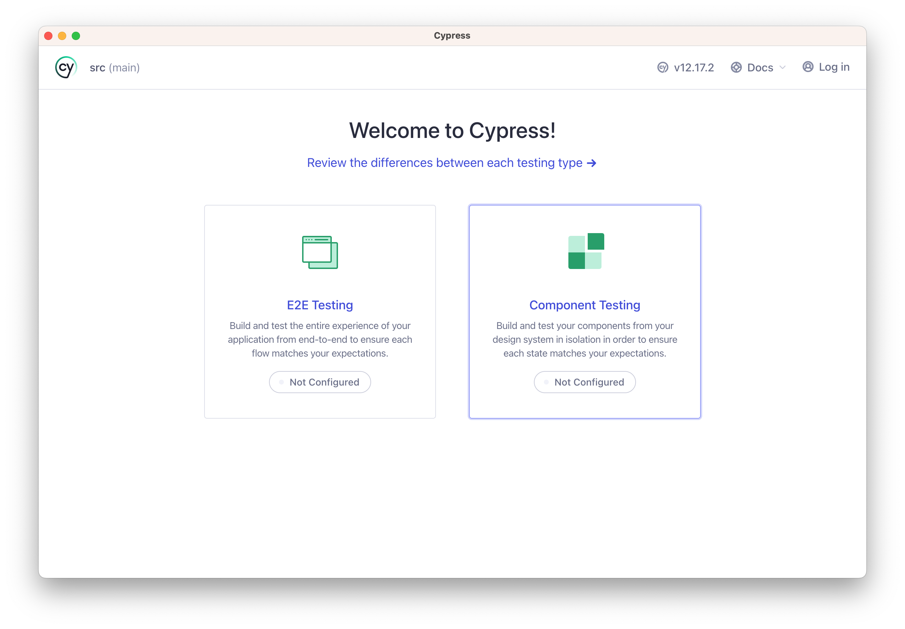
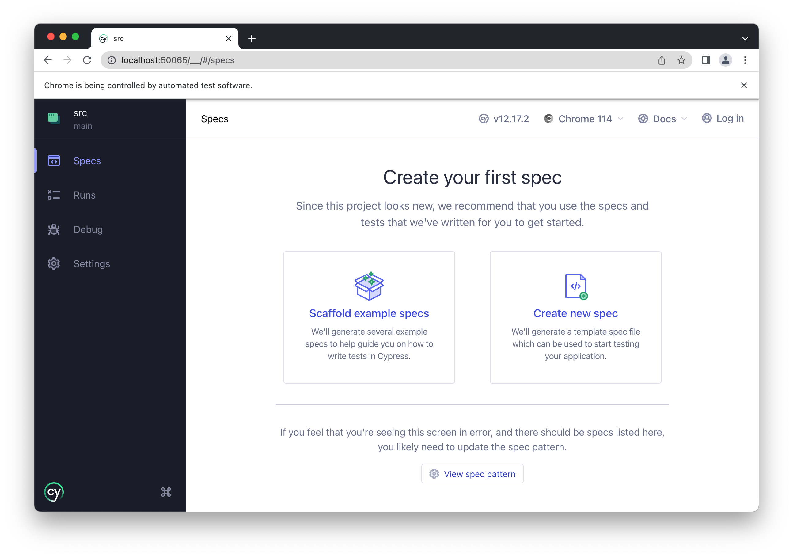
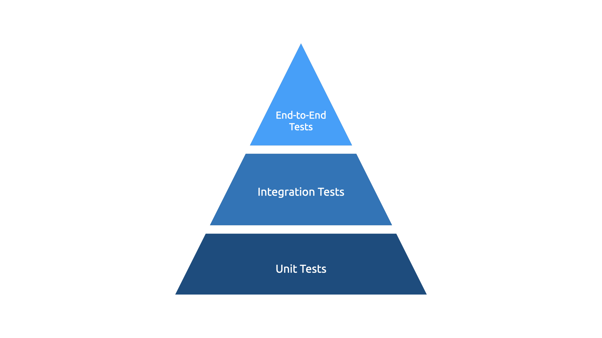
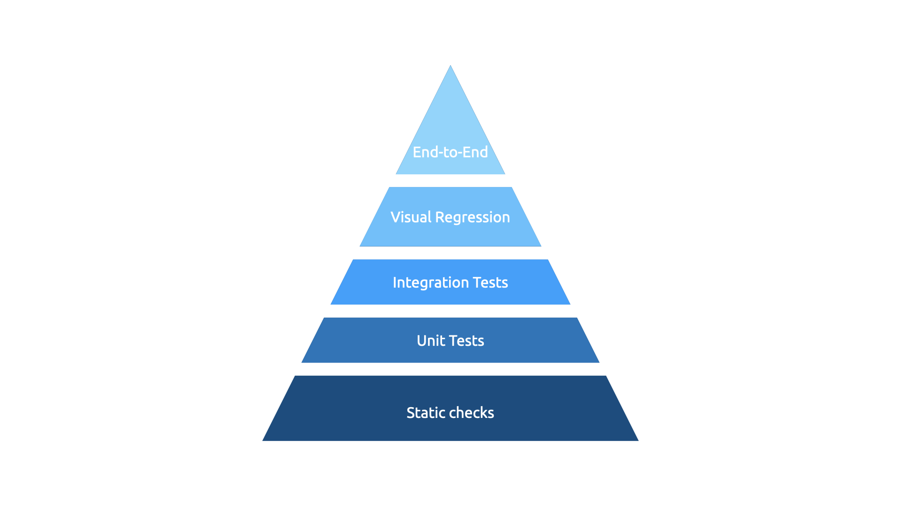
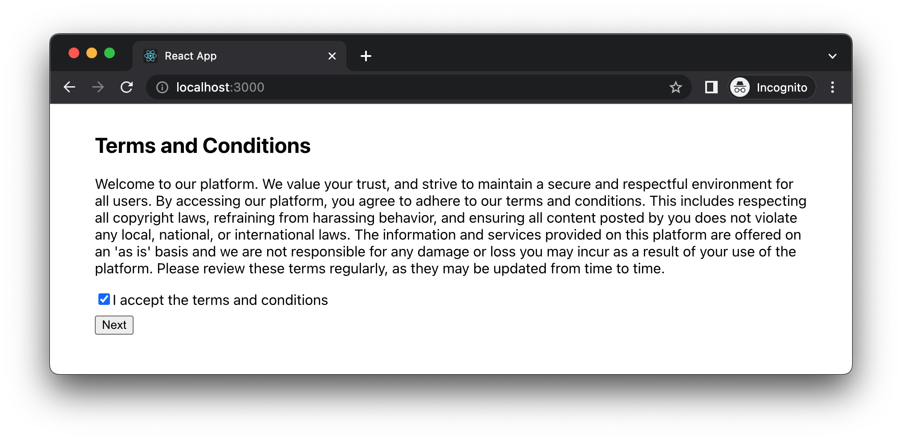
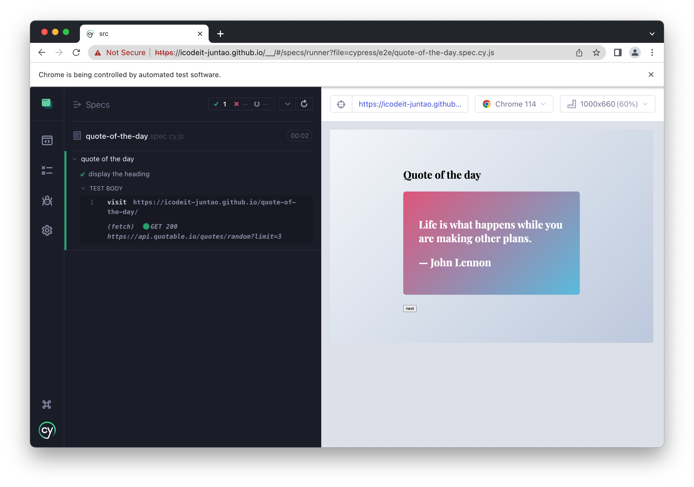

# Testing in React

Welcome to the immersive chapter on 'Testing in React'. As we embark on this journey, the road ahead is full of enlightening discussions, real-world scenarios, and hands-on practice, aiming to build your confidence and proficiency in software testing within React applications.

This chapter is divided into several key areas of focus. You will learn the importance of software testing, understand the different types of testing - including unit, integration, and end-to-end testing, and delve into the use of popular testing tools such as Cypress, Jest, and the React Testing Library. In addition, we will demystify concepts like stubbing and mocking, ensuring you are well-equipped to handle complex testing scenarios.

Our overarching goal is to foster a solid understanding of testing strategies and their implementation in React. We aim to enhance your ability to write tests that make your application resilient to bugs and regressions, and ensure the seamless addition of new features. 

By the end of this chapter, you'll have a comprehensive understanding of React testing, and be ready to implement efficient testing practices in your projects. So, let's turn the page and step into the exciting world of React testing!

In this chapter, we will cover the following topics:

- Understanding why we need tests
- Learning different types of tests
- Testing individual units with jest
- Learning integration tests for interactions
- Verifying end-to-end features with cypress

# Technical requirements

A GitHub repository has been created to host all the code we discuss in the book. For this chapter, you can find the recommended structure under https://github.com/PacktPublishing/React-Anti-Patterns/tree/main/ch5. 

## Introducing cypress

Cypress is a powerful tool for end-to-end testing of modern web applications. Its unique approach sets it apart from many other testing tools. Instead of using Selenium, a common engine for many testing systems, Cypress operates directly on the actual browser. This results in more reliable tests and a superior debugging experience.

You can either install cypress into a existing project, like what we’re doing in this book. Or install it in another folder other than your project. The Cypress has been added as a project dependency in the codebase above, so you only need to run `npm install` in the project root.

Once you have the package installed, simply run `npx cypress open` to launch the config wizard.



And following the wizard to configure a "E2E Testing", and choose "Chrome" as the browser for run all the tests. Then we can ask Cypress to create a spec from template for us.



Cypress will create a folder with all the necessary files for us

```sh
cypress
├── downloads
├── e2e
│   └── quote-of-the-day.spec.cy.js
├── fixtures
│   └── example.json
└── support
    ├── commands.js
    └── e2e.js
```

At the top level, we have the `cypress` directory, which is the root directory for all the Cypress related files. The `downloads` directory is usually where files downloaded during Cypress tests would be stored, but we're not going to use it here. The `e2e` directory is where end-to-end test files are located. In this case, it contains `quote-of-the-day.spec.cy.js`, which is a Cypress test file for testing the 'quote of the day' feature of an application. The `fixtures` directory is a place to put external static data that your tests will use. We can put some static files that can be used in our tests. The `support` directory houses Cypress commands and support files, which we will not touch either here.

Once we have the folder structure set up, we are good to proceed. We will look into how to modify the test code and run it in the "Verifying end-to-end features with cypress" section.

# Understanding why we need tests

Testing is not just an optional best practice; it's a critical part of building reliable and maintainable software. Without tests, you're essentially navigating the complex seas of software development without a compass. Let's understand the multiple benefits that testing brings:

1. **Ensuring Code Correctness**: Tests serve as a seal of validation that your code performs exactly the way it's supposed to. A well-written test verifies that your functions return the expected output for a given input, your components render correctly, and your application behaves as anticipated.

2. **Preventing Regression**: As applications grow and evolve, new code can sometimes unintentionally break existing functionality. This is known as a regression. Automated tests act as a safety net, catching these regressions before they reach production.

3. **Facilitating Refactoring and Maintenance**: Fear often surrounds the process of refactoring or updating legacy code. Tests alleviate this fear. They provide a comfort zone, assuring that if you accidentally break something during the update or refactoring process, your tests will catch it.

4. **Boosting Confidence in Code Quality**: Tests elevate the confidence level of your team. When a suite of well-written tests backs your code, you have a quantifiable measure of your code's quality. This assurance is especially beneficial when adding new features or making changes to the system.

5. **Documentation**: Tests also serve as a form of documentation. They provide a clear understanding of what a function or component is supposed to do, helping new developers on the team understand the project's functionality.

In the subsequent sections, we'll delve deeper into the various types of testing you'll commonly use in React applications, and learn how to use testing tools effectively. Buckle up for an engaging ride into the realm of software testing.

# Learning different types of tests

Testing, in the realm of software development, isn't a one-size-fits-all approach. Rather, it is categorized into different types, each serving a distinct purpose and offering unique insights into the functionality and reliability of the application. It is important to understand these categories to ensure the overall health and robustness of your application. Typically you will have unit tests, integration tests and end-to-end tests in one codebase.

The traditional test pyramid, conceived by Mike Cohn, suggests that you should have many more unit tests than integration or E2E tests. The rationale behind this is that unit tests are simpler, faster, and less costly to maintain.



However, in the modern frontend world, this model is evolving. More value is being placed on integration and E2E tests due to the increasing complexity and interactivity of frontend applications. Tools like Cypress and Puppeteer facilitate writing E2E tests that emulate user behavior on the browser, while libraries like React Testing Library encourage more integration tests by making it easier to test component interactions. 

There are also new types of tests introduced in frontend applications. The visual regression tests is one of them. Visual regression testing is a method of testing in which the visual aspects of a web application are captured and compared to previous states or versions. This type of testing is particularly useful in catching unintended visual bugs and changes in a user interface, which may be introduced during development.

Visual regression tests work by taking screenshots (or snapshots) of web pages or components at different stages, and then comparing these screenshots pixel by pixel to identify any visual differences. When a difference is detected, it is flagged for review. The review can then determine if the change is expected (due to a new feature or design update) or if it's an unintended regression that needs to be fixed.



The exact shape of your test pyramid might vary depending on your application's needs. The critical takeaway is to have a balanced testing strategy that provides quick and useful feedback at different levels of your application. 

The next sections in this chapter will give you a hands-on experience of writing these types of tests for a React application, ensuring that you are well-equipped to bring these concepts into your own projects. Let's forge ahead!

# Testing individual units with jest

Unit tests are the smallest and most foundational part of the testing pyramid, unit tests verify the behavior of individual units of code in isolation, like functions, methods, or components. These tests are quick to write and execute, offering immediate feedback to developers.

We'll use jest to write unit tests and integration tests in this book. Jest is a comprehensive JavaScript testing framework built by Facebook, with a strong focus on simplicity. It's feature-rich and supports asynchronous testing, mocking, and snapshot testing, making it a great choice for React applications.

## Writing your first test

Let's write a simple test. Say you have a function `add` in a file `math.ts`:

```ts
export function add(a: number, b: number) {
  return a + b;
}
```

To test this function, you create a file `math.test.ts` in the same directory:

```ts
import { add } from './math';

test('add adds numbers correctly', () => {
  expect(add(1, 2)).toBe(3);
});
```

You've now written your first test! The `test` function takes two arguments: a string description of the test, and a callback function that implements the test. `expect` is a Jest function that takes the actual value, and `toBe` is a matcher function that compares the actual value with the expected value.

Another way of writing a test is to use `it` function. In Jest, `test` and `it` are actually the same function and can be used interchangeably. The function names come from different testing conventions: `test`: This is a common name for a test function in many testing frameworks and languages. If you come from a background of using other testing libraries, you might find `test` to be more intuitive or familiar. `it`: This comes from BDD (Behavior-Driven Development) style frameworks like Jasmine or Mocha. The idea is to make the tests read more like sentences. For example, `it("adds 1 + 2 to equal 3", () => expect(1 + 2).toBe(3))` reads like "it adds 1 + 2 to equal 3".

## Note - Behavior-Driven Development

Behavior-Driven Development (BDD) is a software development approach that emphasizes collaboration between developers, QA and non-technical participants in a software project. It highlights the need to start with a clear understanding of desired behavior before development starts, thereby aligning development with business needs. 

BDD encourages expressing software behaviors in plain, descriptive language that can be read and understood by all stakeholders. It leverages executable specifications, often written in a language like Gherkin, that guide development and serve as acceptance criteria.

The aim of BDD is to reduce misunderstandings by encouraging collaboration, to make the behavior of a system explicit and understandable by all, and to ensure that the software developed truly meets the needs of the business.

---

It's really a matter of team preference and what aligns best with your team's testing philosophy. Some teams prefer the sentence-like structure that `it` provides as it often makes it clearer what a test is trying to verify, especially to non-developers. Others might find `test` to be more straightforward and less verbose. We're going to following BDD style in this book.

## Grouping tests

Grouping related tests in one block significantly improves the readability of your test files. By clearly delineating different areas of functionality, a block allows anyone reading the tests to understand the context of the test suite at a glance. This enhanced understanding is crucial for comprehension of what functionality is being verified. In a large codebase, with numerous tests, this organization can greatly decrease the cognitive load required to understand how different parts of the application are tested.

And in Jest, we can use `describe` to group related tests into one unit. For instance, consider a function `add` that includes multiple cases: the addition of negative numbers, the combination of one negative and one positive number, decimal sums, or even computations involving imaginary numbers. It would be prudent to gather all these distinct cases under one `describe` block.

```typescript
import { add } from './math';

describe('math functions', () => {
  it('adds positive numbers correctly', () => {
    expect(add(1, 2)).toBe(3);
  });

  it('adds negative numbers correctly', () => {
    expect(add(-1, -2)).toBe(-3);
  });

  // More tests...
});
```

The `describe` function is used to group related tests, in this case, tests for some math functions. Within this group, there are two `it` functions, each representing a single test. The first test checks if the `add` function correctly adds two positive numbers, and the second test checks if the `add` function correctly adds two negative numbers.

With Jest, you can nest `describe` blocks to organize your tests more systematically. For example, suppose we're expanding our suite to include subtraction, multiplication, and division in our calculator functionality. We can structure our test suite in the following manner:

```ts
describe('calculator', () => {
  describe('addition', () => {
    it('adds positive numbers correctly', () => {
        expect(add(1, 2)).toBe(3);
    });

    it('adds negative numbers correctly', () => {
        expect(add(-1, -2)).toBe(-3);
    });

    // More tests...  
  })
  
  describe('subtraction', () => {
    it('subtracts positive numbers', () => {});
  })

  // Other describe blocks for multiplication and division
});
```

In this code snippet, we have a top-level `describe` block labeled 'calculator'. Within this block, we have nested `describe` blocks for each mathematical operation. For instance, in the 'addition' block, we have individual `it` tests for different scenarios of adding numbers. Similarly, we start a new `describe` block for 'subtraction'. This nested structure makes our test suite more organized, readable, and easier to navigate, particularly when dealing with a large number of tests or complex scenarios.

## Testing React component

As we mentioned previously, jest is a great tool to test different types of application, and it supports React application out of box. Although it's possible to use jest alone, it would be a bit more cumbersome and verbose than using a dedicated library like React Testing Library.

React Testing Library is a lightweight yet powerful library for testing React components. It's built on top of the popular JavaScript testing framework, Jest, and adds specific utilities for working with React components.

The philosophy of React Testing Library is to encourage writing tests that closely resemble how your software is used. It encourages you to interact with your app just like how users would, meaning you test the functionality and not the implementation details. This approach leads to more robust and maintainable tests that will give you confidence that your app will work in production.

In the code provided in this book, the project has already set up for you with React Testing Library. You can checkout the code in "Technical Requirements" and you are good to go. 

All right, Let's start with a simple React component. The following component `Section` is a presentational component that accepts two props heading and content, and it renders the props in a article tag.

```tsx
type SectionProps = {
  heading: string;
  content: string;
};

const Section = ({ heading, content }: SectionProps) => {
  return (
    <article>
      <h1>{heading}</h1>
      <p>{content}</p>
    </article>
  );
};

export { Section };
```

And then we can create a new file next to `Section.tsx`, we call it `Section.test.tsx`. And we'll use React Testing Library to check the `Section` component.


```tsx
import React from "react";
import { render, screen } from "@testing-library/react";

import { Section } from "../Section";

describe("Section", () => {
  it("renders a section with heading and content", () => {
    render(<Section heading="Basic" content="Hello world" />);

    expect(screen.getByText("Basic")).toBeInTheDocument();
    expect(screen.getByText("Hello world")).toBeInTheDocument();
  });
});
```

This test code is making use of `@testing-library/react` to verify that the `Section` component behaves as expected. The `render` function provided by `@testing-library/react` is used to render the `Section` component with specific props: a `heading` of "Basic" and `content` of "Hello world".

Following the rendering, `screen.getByText` function is used to query the DOM (which represents the rendered output of the `Section` component) for elements containing specific text. 

`expect` and `toBeInTheDocument` are then used to make assertions about the state of these elements. Specifically, the test is asserting that there is an element with the text "Basic" and an element with the text "Hello world" present in the DOM, which would indicate that the `Section` component has correctly rendered its `heading` and `content` props.

This straightforward unit test for a React component serves as a useful starting point. However, in complex real-world projects, we often encounter scenarios where multiple components need to interact harmoniously. For instance, consider a checkout page that integrates an address collection component, a payment component, and a price calculation logic component. To confidently ensure the seamless interaction of these distinct components, we must employ a more comprehensive testing strategy: Integration tests.

# Learning the integrationg tests

**Integration Tests** are positioned above unit tests in the pyramid, integration tests validate the interactions between multiple units of code. These could be component interactions, or interactions between the client and server. Integration tests aim to identify issues that may arise when different parts of the system are combined.

One such scenario involves testing the interaction between two separate components to verify they function correctly together. This is a kind of integration testing at a component level. Additionally, if you're looking to ensure the smooth collaboration between your frontend code and backend services, the tests you write for this purpose would also be classified as integration tests. This kind of testing verifies that different layers of your application are working correctly together. 

Let's have a look at a example of integration test to a React comopnent. There is a "Terms and Conditions" component, which includes a long text about the legal information, and a checkbox for user to consent. There is a button beanth the whole section, and it's disabled by default, once user selected "Accept the Terms and Conditions", the button is enabled and user can proceed.



The integration test can be described as the following code snippet:

```tsx
describe('Terms and Conditions', () => {
  it("renders learn react link", () => {
    render(<TermsAndConditions />);
    const button = screen.getByText('Next');
    expect(button).toBeDisabled();

    const checkbox = screen.getByRole('checkbox');

    act(() => {
      userEvent.click(checkbox);
    })

    expect(button).toBeEnabled();
  });
})
```

The `describe` function is used to group all tests associated with the `TermsAndConditions` component together, forming a so-called test suite. Within this suite, we have a single test case denoted by the `it` function. The description of this test is "renders learn react link", which appears to be a misnomer considering the operations carried out in this test. A more suitable description might be "Enables the next button upon accepting terms and conditions".

Initially, the `render` function is invoked to display the `TermsAndConditions` component. This function produces a series of output, or render results, that can be queried in various ways to assess whether the component behaves as expected.

We then retrieve the "Next" button by its text using the `screen.getByText` function. At this point, we expect this button to be disabled, so we confirm this expectation by calling `expect(button).toBeDisabled()`.

Next, we look for the checkbox using the `screen.getByRole` function. This function allows us to find the checkbox based on its role, which is 'checkbox'.

The user interaction of ticking the checkbox is simulated using the `userEvent.click` function wrapped in React's `act` function. The `act` function ensures that all updates related to these 'actions' are processed and applied before moving forward. This way, our assertions will examine the component in its updated state.

Finally, we verify that the button is enabled after the checkbox has been clicked. This is done using `expect(button).toBeEnabled()`. If this statement holds true, we know that our component behaves as intended: disabling the "Next" button until the user accepts the terms and conditions.

The component `TermsAndConditions` under test is composed by a few components, a heading, a LegalContent and a UserConsent.

```tsx
const TheLegalContent = () => {
  return (
    <p>
      {/*...*/}
    </p>
  );
};

const UserConsent = () => {
  const [isChecked, setIsChecked] = useState(false);

  const handleCheckboxChange = (event: React.ChangeEvent<HTMLInputElement>) => {
    setIsChecked(event.target.checked);
  };

  return (
    <>
      <label>
        <input
          type="checkbox"
          checked={isChecked}
          onChange={handleCheckboxChange}
        />
        I accept the terms and conditions
      </label>

      <div style={{margin: '0.5rem 0'}}>
        <button disabled={!isChecked}>Next</button>
      </div>
    </>
  );
};

const TermsAndConditions = () => {
  return (
    <div>
      <h2>Terms and Conditions</h2>
      <TheLegalContent />
      <UserConsent />
    </div>
  );
};

export { TermsAndConditions };
```

The sole component that gets exported in this code is `TermsAndConditions`, which is the primary subject of our testing strategy. In our tests, we employ `userEvent.click` to initiate a click event within the realm of a `jsdom` environment. Essentially, our focus is not on testing the isolated React component, but rather on the DOM elements and their interactions. It's important to clarify that we're not invoking a full-fledged browser here, but rather a headless `jsdom` variant that exists in-memory. Yet, despite the simulated environment of these integration tests, they still provide us with the confidence that the click event and button enablement are functioning as expected.

## Note - jsdom

`jsdom` is a JavaScript-based headless browser that can be used to create a realistic testing environment that simulates a web browser's environment. It is an implementation of web standards like HTML, DOM, CSS, and others, entirely in JavaScript.

When we run JavaScript that manipulates the DOM in a browser, the browser provides the DOM. However, when we are running tests using a testing framework like Jest in a Node.js environment, there isn't a DOM by default. This is where jsdom comes into play. jsdom provides a virtual DOM, thereby allowing our tests to run as though they were in a browser-like environment, even when they're running in Node.js.

Why do we need jsdom? In modern frontend development, particularly with frameworks like React, Angular, and Vue, our JavaScript code often interacts directly with the DOM. For our tests to be useful, they need to be able to simulate this interaction. jsdom allows us to do this without needing to open a browser window.

---

# Learning the end-to-end tests

**End-to-End Tests (E2E)** at the top of the test pyramid. E2E tests simulate real user flows and interactions, testing the system as a whole. These tests help to ensure that all parts of the application work together as expected, from the user interface to the backend systems.

Let's modify the `quote-of-the-day.spec.cy.js` to make it access a remote website. Cypress will actively watch the files under `cypress/e2e/` folder, and whenever the content changes, it will rerun the test. Make sure you have launched cypress in a terminal with `npx cypress run`.

```js
describe('quote of the day', () => {
  it('display the heading', () => {
    cy.visit('https://icodeit-juntao.github.io/quote-of-the-day/');
  })
});
```

In this code snippet, `describe` is used to declare a test suite, in this case for the "quote of the day" feature. Within this suite, there's a single test case defined by `it`, labeled as "display the heading". The purpose of this test case is to visit a web page - in this instance, 'https://icodeit-juntao.github.io/quote-of-the-day/'. And this web page returns **a random quote** each time when user refresh the page.

However, it's important to note that this test case doesn't perform any actual tests or assertions yet. It merely navigates to the page. To make this a meaningful test, you would typically add assertions to check the state of specific elements on the page, like the heading or a quote displayed.

```js
it('display the heading', () => {
  cy.visit('https://icodeit-juntao.github.io/quote-of-the-day/');
  cy.contains("Quote of the day");
})
```

This code snippet is a meaningful test now. After visiting the webpage 'https://icodeit-juntao.github.io/quote-of-the-day/', this test now contains an additional check with the `cy.contains()` method.

`cy.contains()` is used to search for and get a DOM element that contains the specified text, in this case, "Quote of the day". This method will get the first element it finds that contains the text, and it will fail the test if no such element is found.

If the test can pass, we're confident that the url is accessible to the public, and the page doesn't throw any exceptions. 



Note in the Figure 5-6, on the right side of the screen you can see what is displaying on the real browser, while on the left side you can see the test cases and steps. You can even use mouse to hover on a step to see the page snapshot at that point.

In addition, we can add another test case to verify a `quote-container` is presented on the page. That is the most important part of the "Quote of the day" application.

```js
it('display a quote', () => {
  cy.visit('https://icodeit-juntao.github.io/quote-of-the-day/');
  cy.get('[data-testid="quote-container"]').should('have.length', 1);
})
```

In this test, the `cy.get()` method is used to retrieve a DOM element by its `data-testid` attribute. This attribute is typically used for testing, allowing you to select elements without worrying about their CSS selectors or contents, which might change over time.

The element being selected in this test has a `data-testid` attribute of `"quote-container"`. Once the element is retrieved, the `should()` method is invoked to assert something about the state of that element. In this case, it checks that the length of the element (i.e., the number of matching elements) is 1.

So in this test, after navigating to the webpage, it looks for an element with the `data-testid` attribute of `"quote-container"`, and checks that exactly one such element exists. If it does, the test will pass; if not (either because there are no matching elements or more than one), the test will fail.

That is awesome, but there is a problem here through. What if the page isn't blank and the heading is rendered correctly, but the actual content of a quote isn't shows up for some reason. So we need a controlled way to be able to test an application that has these randomnesses.

## Intercept the network request

In some cases, we don’t want to send actual network requests for the UI to work, while in other cases it's not practical to rely on the response directly. For example, if we want to verify whether the quote is rendered correctly, but as the quote is generated randomly we cannot prodict it before we make the request. That means we need a machnism to pin-down the response, but we also would like to send the request.

One way to achieve that is to intercept the network request send to the end point and return some fixed data. In cypress, we can do that through `cy.intercept` API. 

Firstly we can define a data array in the `quote-of-the-day.spec.cy.js` file. It's a normal JavaScript array contains the data we expect to return from server side. 

```js
const quotes = [
  {
    content:
      "Any fool can write code that a computer can understand. Good programmers write code that humans can understand.",
    author: "Martin Fowler",
  },
  {
    content: "Truth can only be found in one place: the code.",
    author: "Robert C. Martin",
  },
  {
    content:
      "Optimism is an occupational hazard of programming: feedback is the treatment.",
    author: "Kent Beck",
  },
];
```

And in the test code, we would like to intercept any network request send to url starts with `https://api.quotable.io/quotes/random`, and whenever the request is send from React, we'll cancel the request and return the `quotes` array.

```js
it("display the quote content", () => {
  cy.intercept("GET", "https://api.quotable.io/quotes/random*", {
    statusCode: 200,
    body: quotes,
  });

  cy.visit("https://icodeit-juntao.github.io/quote-of-the-day/");
  
  cy.contains(
    "Any fool can write code that a computer can understand. Good programmers write code that humans can understand."
  );
  
  cy.contains(
    "Martin Fowler"
  );
});
```

The `cy.intercept` function here is being used to stub the HTTP GET request to the quote API. When such a request is detected, rather than letting the request go through to the actual API, Cypress will instead respond with a predefined HTTP response. This response has a status code of 200, indicating success, and the body of the response is set to be our predefined `quotes` data. This technique allows us to control the data being returned, making our test more deterministic and isolated from any potential instability or variation in the actual API.

The test then navigates to the quote web page. After the page is loaded, it verifies if the page contains the expected quote text and the quote author. If these two checks pass, the test case succeeds.

There is something interesting here we need to highlight. An end-to-end test, by definition, tests the whole software stack from the front end through to the back end, including all the intermediate layers such as databases and network infrastructure. The aim of end-to-end testing is to simulate real-world scenarios and confirm that the entire application is functioning correctly.

However, when we use the `cy.intercept` function to stub HTTP requests, we are indeed modifying this behavior. We are no longer testing the complete end-to-end flow because we are controlling and replacing the actual back-end response with a mock response. This technique transforms the test from an end-to-end test into something more akin to an integration test for the front end, as we are testing the integration of different components of the front end while mocking the backend responses.

This is not necessarily a bad thing, however. Often in testing, especially in complex systems, it is beneficial to isolate different parts of the system to gain more control over what we are testing and to ensure we can test different scenarios more reliably and deterministically.

# Summary

In this chapter, we embarked on an exploration of the world of testing in a React application. We understood that the necessity of testing goes beyond mere validation of code correctness. It paves the path towards maintainability, improves readability, and drives the evolution of our application, ultimately, ensuring we build software that meets expectations consistently. 

Testing is a vital practice in software development, one that ensures our application not only works correctly but is also resilient to future changes. The React ecosystem, with tools like Jest, React Testing Library, and Cypress, provides us a powerful arsenal to implement comprehensive testing strategies, thus bolstering the robustness and reliability of our applications.

In next chapter, we'll look into the common refactoring techniques and see how the tests can help us during the refactoring process.