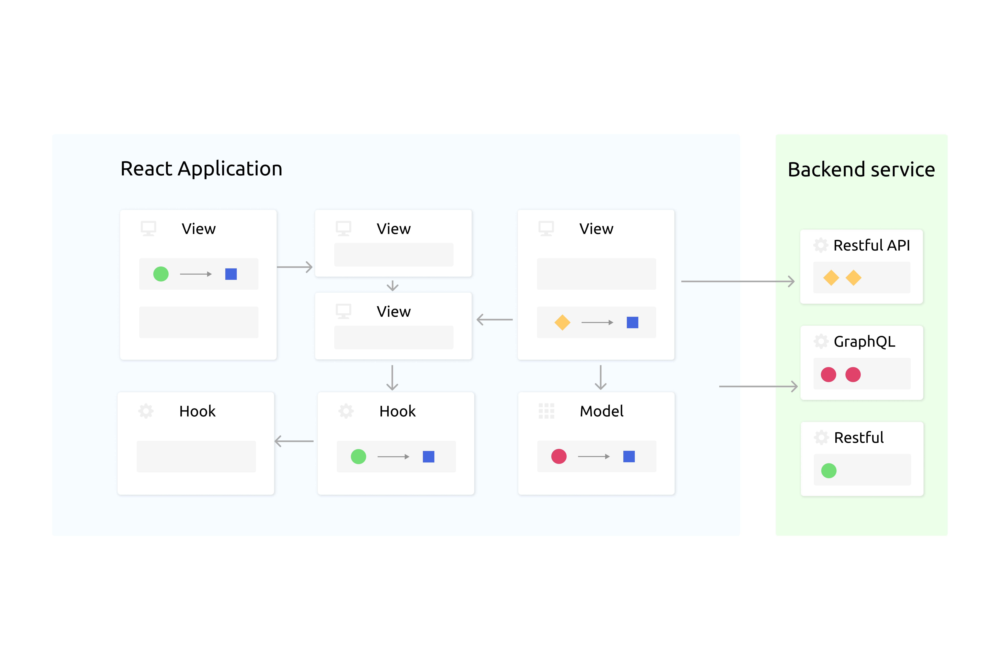
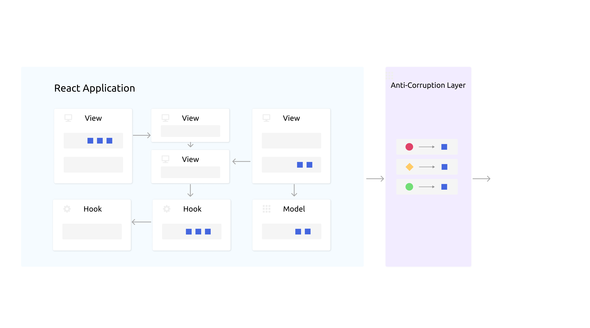
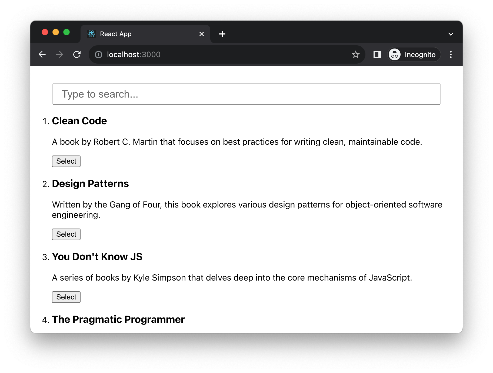

In modern frontend development, the way we handle state and data access can make or break an application. Whether you're a solo developer or part of a large team, understanding best practices and common pitfalls is critical. This chapter aims to elevate your proficiency in state management and data handling within React applications, focusing on scalable and maintainable approaches.

React provides immense flexibility, but with that comes the potential for pitfalls. A poorly designed state management system can lead to tangled logic that's hard to follow, debug, and test. It can also lead to performance issues, which negatively affect the user experience. Therefore, understanding how to correctly manage state becomes indispensable.

State management is challenging, in React particularly, there are many issues developers tend to facing in their day to day work. When business logic infiltrates UI components, it compromises their reusability. This usually occurs when computational logic is inserted either deliberately or unintentionally. 

Another issue is prop drilling, where passing props from a parent component to deeply nested children becomes both cumbersome and susceptible to errors. This often leads to code duplication, as the same snippets find their way into multiple files, making any future updates a complicated task. 

Lastly, sharing state in a React application presents its own set of challenges. Various mechanisms exist for this, but choosing the most efficient way to share stateful logic across components can be quite perplexing.

In this chapter, we will cover the following topics:

- Understanding businesss logic leaks
- Introducing Anti-Corruption Layer
- Exploring the prop drilling issue
- Using context to resolve the drilling

# Technical requirements

A GitHub repository has been created to host all the code we discuss in the book. For this chapter, you can find the recommended structure under https://github.com/PacktPublishing/React-Anti-Patterns/tree/main/ch8.

# Understanding businesss logic leaks

Business logic refers to the rules, calculations, and processes that are essential to the operation of a business application. When this business logic "leaks" into components or areas of the application where it doesn't belong, this is known as a business logic leak.

The issue frequently crops up in various projects, partly because there's no widely agreed-upon approach for handling business logic in React. The framework's flexibility allows you to implement this logic directly in components, hooks, or helper functions. As a result, developers often end up embedding the logic directly into components, where it's immediately needed.

The leakage can cause many problems. Business logic leaks can result in tightly coupled components that become difficult to test, maintain, or reuse. When business logic is scattered across different parts of the application, it leads to code duplication and inconsistency, making the application more prone to errors and harder to debug. Additionally, this scattering complicates any future modifications to the business rules, as changes will likely have to be made in multiple places, increasing the risk of introducing new issues.

There are various indicators that business logic is leaking into your code, but the most prevalent sign is the incorporation of data transformation directly within views or UI components. In this section, we'll delve into the issue in depth, and in the following section, we'll explore solutions to mitigate this problem.

Tata transformation is a function that take one shape of data (usually from another module or from a remote service), and map the data to the shape that fit to other usage. Following is a typically issue you would see in many React applications:

```tsx
function UserProfile({ id }: { id: string }) {
  const [user, setUser] = useState<User | null>(null);

  useEffect(() => {
    async function fetchUser() {
      const response = await fetch(`/api/users/${id}`);
      const data = await response.json();

      setUser({
        id: data.user_identification,
        name: data.user_full_name,
        isPremium: data.is_premium_user,
        subscription: data.subscription_details.level,
        expire: data.subscription_details.expiry,
      });
    }

    fetchUser();
  }, [id]);

  if (!user) {
    return <div>Loading...</div>;
  }

  return (
    <div data-testid="user-profile">
      <h1>{user.name}</h1>
    </div>
  );
}
```

The `UserProfile` function component receives a user `id` as a prop and uses it to fetch the corresponding user data from an API. The `useEffect` hook ensures that data fetching happens whenever the `id` changes. The fetched data is then stored in a local state variable `user`, and the component displays the user's name once the data is available. If the data is still loading, a "Loading..." message is displayed.

In the `useEffect` block, the fetched data undergoes a transformation before being stored in the `user` state variable. Specifically, the keys from the fetched JSON response are mapped to new names that are more suitable for the frontend application. For example, `data.user_identification` becomes `id`, and `data.user_full_name` becomes `name`. This transformation allows for easier handling and readability within the React component.

As you might imagine, this type of transformation can happen in many places in an application, and it isn't limit inside a React component, sometimes in hooks and other places as demonstrated in the image below. 



The UI expects data in a specific format, represented by the blue square, but backend services could deliver it in various other forms, such as a green circle, red circle, or orange diamond. This discrepancy necessitates data transformations across multiple areas in the code. When such transformations are duplicated, there's a higher risk of overlooking changes, especially if the backend alters the structure of their data.

All these varied transformations can be centralized into a single location where data reshaping occurs, along with empty field checks, field renaming, and the elimination of unnecessary fields. This segues into our next topic: the Anti-Corruption Layer, commonly abbreviated as ACL.

# Introducing Anti-Corruption Layer

In software development, an Anti-Corruption Layer (ACL) acts like a translator or a mediator between different subsystems that may not speak the same "language," so to speak. Imagine you have two systems, each with its own set of rules, structures, and complexities. If these systems interact directly, there's a risk that they could influence each other in unintended ways, leading to what is called "corruption" in the domain logic.

In the context of frontend development, especially in complex applications, an Anti-Corruption Layer becomes crucial for managing the interactions between the frontend and various backends or APIs. Frontend developers often have to deal with multiple services that may have inconsistent or convoluted data formats. Implementing an Anti-Corruption Layer in the frontend allows you to create a unified interface to interact with these services.

For example, if your frontend application has to communicate with multiple RESTful APIs, GraphQL services, and even WebSocket servers, each may have its own set of rules, data structures, and complexities. A frontend Anti-Corruption Layer would take on the role of translating these disparate forms of data into a format that your frontend application understands. This means that your UI components don't have to worry about the intricate details of each service's data format, making the components easier to develop, test, and maintain.

The Anti-Corruption Layer can also be a strategic place to handle caching, error transformations, and other cross-cutting concerns. By centralizing these functionalities, you avoid scattering similar logic all over your frontend codebase, thus adhering to the DRY (Don't Repeat Yourself) principle.



As illustrated in Figure 8-2, all data transformations are now centralized, eliminating the need for such operations in the views. You might be curious about how to put this into practice in your own code. To get started, let's build on the example from the previous section and introduce a basic function as the starting point for our ACL.

To get started, let's define a type for the user data format we receive from the remote server. By using TypeScript, we gain the advantage of compile-time checks—ensuring that any inconsistencies in the data format are flagged before the application runs.

```tsx
type RemoteUser = {
  user_identification: string;
  user_full_name: string;
  is_premium_user: boolean;
  subscription_details: {
    level: string;
    expiry: string;
  }
}
```

And also we will define the local type so so know exactly what to use in React views.

```tsx
type UserSubscription = "Basic" | "Standard" | "Premium" | "Enterprise";

type User = {
  id: string;
  name: string;
  isPremium: boolean;
  subscription: UserSubscription;
  expire: string;
};
```

The type definition specifies the structure of a user object that will be used in React components. Note here the `subscription` property uses a custom type, `UserSubscription`, which can take one of four string values: "Basic", "Standard", "Premium", or "Enterprise". Finally, `expire` is a string indicates when the user's subscription will expire.

With this setup, we can define a new function `transformUser` in a file called `transformer.ts`, and the file simply return the mapped object with type `User` we just defined.

```ts
import {RemoteUser, User, UserSubscription} from "./types";

export const transformUser = (remoteUser: RemoteUser): User => {
  return {
    id: remoteUser.user_identification,
    name: remoteUser.user_full_name,
    isPremium: remoteUser.is_premium_user,
    subscription: remoteUser.subscription_details.level as UserSubscription,
    expire: remoteUser.subscription_details.expiry,
  };
};
```

With this new extracted function in `transfomer.ts`, our component can be simplifed a bit into:

```tsx
async function fetchUserData<T>(id: string) {
  const response = await fetch(`/api/users/${id}`);
  const rawData = await response.json();

  return transformUser(rawData) as T;
}


function UserProfile({ id }: { id: string }) {
  const [user, setUser] = useState<User | null>(null);

  useEffect(() => {
    async function fetchUser() {
      const response = await fetchUserData<User>(id);
      setUser(response);
    }

    fetchUser();
  }, [id]);

  if (!user) {
    return <div>Loading...</div>;
  }

  return (
    <div data-testid="user-profile">
      <h1>{user.name}</h1>
    </div>
  );
}
```

The `UserProfile` component relies on the `fetchUserData` helper function to retrieve and process user data from an API. This design insulates `UserProfile` from any knowledge of the remote data structure. If there are future changes to the `RemoteUser` type, `UserProfile` remains unaffected, as all the adjustments will be confined to `transformer.ts`.

## Using fallback or default value

Another frequently observed issue related to data transformation is the excessive use of defensive programming in React views. While defensive programming is generally a good practice and useful in various contexts, overloading React components with too many null checks and fallbacks can clutter the code and make it difficult to comprehend.

---

Note:
Defensive programming is a practice that involves writing code in a way that anticipates possible errors, failures, or exceptions, and handles them gracefully. The goal is to make your application more resilient and maintainable by minimizing the impact of unexpected scenarios.

---

For instance, in the `UserProfile` example, you might encounter situations where certain values from the remote service are empty. Instead of displaying `null` or `undefined` to end-users, you would need to implement fallback values. This is a classic example of where defensive programming can be useful, but if overused, it could make the component more complex and harder to maintain.

```tsx
export const transformUser = (remoteUser: RemoteUser): User => {
  return {
    id: remoteUser.user_identification,
    name: remoteUser.user_full_name,
    isPremium: remoteUser.is_premium_user,
    subscription: remoteUser.subscription_details.level as UserSubscription,
    expire: remoteUser.subscription_details.expiry,
  };
};
```

What if `subscription_details` doesn't exist (in that case access `remoteUser.subscription_details.level` will throw an exception - **Uncaught TypeError: Cannot read properties of undefined (reading 'level')**), or `expiry` isn't a valid date format from backend? 

Without a ACL, we might end up with some logic in the `UserProfile` like:

```tsx
function UserProfile({ user }: { user: User }) {
  const fullName = user && user.name ? user.name : "Loading...";
  const subscriptionLevel =
    user && user.subscription ? user.subscription : "Basic";
  const subscriptionExpiry = user && user.expire ? user.expire : "Never";

  return (
    <div>
      <h1>{fullName}</h1>
      <p>Subscription Level: {subscriptionLevel}</p>
      <p>Subscription Expiry: {subscriptionExpiry}</p>
    </div>
  );
}
```

The `UserProfile` function component takes a `user` object as a prop. It displays the user's full name, subscription level, and subscription expiry date. If any of these values are missing or falsy, it provides default fallback text such as "Loading...", "Basic", or "Never."

As such logic begins to infiltrate the `UserProfile` component, the component's length and complexity increase. This kind of logic can be better managed by moving it into a function like `transformUser`, where it can be thoroughly tested.

```tsx
export const transformUser = (remoteUser: RemoteUser): User => {
  return {
    id: remoteUser.user_identification ?? 'N/A',
    name: remoteUser.user_full_name ?? 'Unknown User',
    isPremium: remoteUser.is_premium_user ?? false,
    subscription: (remoteUser.subscription_details?.level ?? 'Basic') as UserSubscription,
    expire: remoteUser.subscription_details?.expiry ?? 'Never',
  };
};
```

The `transformUser` function maps fields from the remote user data structure to the application's expected user data structure, providing default values for each field in case they are missing or null. For example, if `remoteUser.user_identification` is null, it will use 'N/A' as the default `id`. This function serves as a translation layer between the backend's data shape and what the frontend expects.

---

Note: Optional Chaining
Starting from ES2020, JavaScript has optional chaining (`?.`). This allows you to access deeply nested properties without checking each level of nesting:

```ts
const value = a?.b?.c;
```

If `a` or `b` is `null` or `undefined`, `value` will also be `undefined`, and no errors will be thrown.

---

Note: Nullish Coalescing (`??`)

The nullish coalescing operator (`??`) takes the value on its left if that value is not `null` or `undefined`. Otherwise, it takes the value on its right.

In this case, `rawData?.subscription_details?.level ?? 'Basic'` will return `rawData.subscription_details.level` if that value is not `null` or `undefined`. If it is `null` or `undefined`, the expression will return `'Basic'`.


Excellent, the ACL pattern effectively isolates business logic from your views. But there are additional challenges in managing data within a React application, such as sharing data between components and avoiding prop drilling. In the following section, we'll explore how to tackle these issues using the React Context API.

# Exploring the prop drilling issue

Prop drilling is an issue that arises when you have to pass data through multiple levels of components that don't actually need the data, just so it can reach a component deeper in the hierarchy that does need it. This often makes the code harder to follow, understand, and maintain.

Consider a standard scenario in React where we have a universal searchable list component. This component takes in a list and displays each item, whether it's a list of books, menus, tickets, or anything else you can think of. In addition to displaying the list, the component also includes a search box, allowing users to easily filter through a lengthy list.



At first glance, the implementation seems straightforward and not overly complicated.

```tsx
import React, { ChangeEvent, useState } from "react";

export type Item = {
  id: string;
  name: string;
  description: string;
};

const SearchableList = ({ items }: { items: Item[] }) => {
  const [filteredItems, setFilteredItems] = useState<Item[]>(items);

  const handleChange = (e: ChangeEvent<HTMLInputElement>) => {
    setFilteredItems(
      items.filter((item) => item.name.includes(e.target.value))
    );
  };

  return (
    <div>
      <input type="text" onChange={handleChange} />
      <ul>
        {filteredItems.map((item, index) => (
          <li key={index}>{item.name}</li>
        ))}
      </ul>
    </div>
  );
};

export default SearchableList;
```

The code defines a `SearchableList` component in React, which filters and displays a list of items based on user input. It starts with a full list of items and updates the filtered list whenever the text in the input box changes.

Over time, as the component evolves and is used in more diverse scenarios, the codebase becomes increasingly complex, resulting in additional layout changes and more lines of code.

```tsx
const ListItem = ({ item }: { item: Item }) => {
  return (
    <li>
      <h2>{item.name}</h2>
      <p>{item.description}</p>
    </li>
  );
};

const List = ({ items }: { items: Item[] }) => {
  return (
    <section data-testid="searchable-list">
      <ul>
        {items.map((item) => (
          <ListItem item={item} />
        ))}
      </ul>
      <footer>Total items: {items.length}</footer>
    </section>
  );
};

const SearchInput = ({ onSearch }: { onSearch: (keyword: string) => void }) => {
  const handleChange = (e: ChangeEvent<HTMLInputElement>) => {
    onSearch(e.target.value);
  };

  return <input type="text" onChange={handleChange} />;
};

const SearchableList = ({ items }: { items: Item[] }) => {
  const [filteredItems, setFilteredItems] = useState<Item[]>(items);

  const onSearch = (keyword: string) => {
    setFilteredItems(items.filter((item) => item.name.includes(keyword)));
  };

  return (
    <div>
      <SearchInput onSearch={onSearch} />
      <List items={filteredItems} />
    </div>
  );
};
```

Now, for the sake of simplicity, we have bundled three React components — `ListItem`, `List`, and `SearchableList` — even though they reside in separate files. `ListItem` displays an individual item's name and description. `List` iterates over an array of items and uses `ListItem` to display each one, showing the total number of items at the bottom. `SearchableList` combines `SearchInput` and `List`, filtering the list based on user input from `SearchInput`. And the `SearchableList` is still the public interface, meaning that's the only component the consumer sees just like before.

The consumer has requested a new feature: they wish to track user interactions for analytics, specifically to gauge the popularity of items and the utilization of the search function. To meet this requirement, two new props are being introduced: an `onItemClicked` callback to capture when an item is clicked, and an `onSearch` callback to monitor when a search is performed.

So we need to modify our code to meet these requirments, start from the new type used in `SearchableList`:

```tsx
type SearchableListProps = {
  items: Item[];
  onSearch: (keyword: string) => void;
  onItemClicked: (item: Item) => void;
};

const SearchableList = ({
  items,
  onSearch,
  onItemClicked,
}: SearchableListProps) => {
  //...
}
```

To pass `onSearch` and `onItemClicked`, we'll make a lot of changes:

```tsx
const ListItem = ({
  item,
  onItemClicked,
}: {
  item: Item;
  onItemClicked: (item: Item) => void;
}) => {
  return (
    <li onClick={() => onItemClicked(item)}>
      <h2>{item.name}</h2>
      <p>{item.description}</p>
    </li>
  );
};

const List = ({
  items,
  onItemClicked,
}: {
  items: Item[];
  onItemClicked: (item: Item) => void;
}) => {
  return (
    <section data-testid="searchable-list">
      <ul>
        {items.map((item) => (
          <ListItem item={item} onItemClicked={onItemClicked} />
        ))}
      </ul>
      <footer>Total items: {items.length}</footer>
    </section>
  );
};

const SearchableList = ({
  items,
  onSearch,
  onItemClicked,
}: SearchableListProps) => {
  const [filteredItems, setFilteredItems] = useState<Item[]>(items);

  const handleSearch = (keyword: string) => {
    setFilteredItems(items.filter((item) => item.name.includes(keyword)));
  };

  return (
    <div>
      <SearchInput onSearch={handleSearch} />
      <List items={filteredItems} onItemClicked={onItemClicked} />
    </div>
  );
};
```

Observe how we transfer the `onItemClicked` prop to the `ListItem` component. It first goes through the `List` component, which directly passes it down to `ListItem` without using it for anything. This is a classic example of prop drilling. The same could happen with `SearchInput`. As we continue to add more and more props from the outside and drill them down through the component tree, the entire structure could soon become unmanageable.

Fortunately, React's Context API provides an elegant solution to the prop drilling issue. We've already covered the fundamentals of using Context in Chapter 2 on React Essentials; you can revisit that section if you'd like a refresher.

# Using context to resolve the drilling 

The concept behind using the Context API to address prop drilling is to create a shared container for all sub-components under a common parent. This eliminates the need for explicitly passing down props from parent to child. Sub-components can instead directly access the shared context whenever necessary. Another advantage of using Context is that it triggers automatic re-rendering of components whenever the data within the context changes.

Returning to our searchable list example, the first step is to define a context with an appropriate type.

```tsx
import { createContext } from "react";
import { Item } from "./types";

type SearchableListContextType = {
  onSearch: (keyword: string) => void;
  onItemClicked: (item: Item) => void;
};

const noop = () => {};

const SearchableListContext = createContext<SearchableListContextType>({
  onSearch: noop,
  onItemClicked: noop,
});

export { SearchableListContext };
```

The code defines a React context called `SearchableListContext`. It specifies the types of functions `onSearch` and `onItemClicked` that the context will hold. It also initializes these functions with a no-operation function (`noop`) as a default.

We can use the context as a wrapper now in the searchable list, to provide the context to all its children component:

```tsx
const SearchableList = ({
  items,
  onSearch,
  onItemClicked,
}: SearchableListProps) => {
  const [filteredItems, setFilteredItems] = useState<Item[]>(items);

  const handleSearch = (keyword: string) => {
    setFilteredItems(items.filter((item) => item.name.includes(keyword)));
  };

  return (
    <SearchableListContext.Provider value={{ onSearch, onItemClicked }}>
      <SearchInput onSearch={handleSearch} />
      <List items={filteredItems} />
    </SearchableListContext.Provider>
  );
};
```

The `SearchableList` component wraps its children, `SearchInput` and `List`, inside a `SearchableListContext.Provider`. This allows these child components to access `onSearch` and `onItemClicked` functions from the context without passing them down explicitly as props. The `handleSearch` function filters items based on the search keyword.

That means our `List` component can be revert back to the simple version before we introduce `onItemClicked`:

```tsx
const List = ({ items }: { items: Item[] }) => {
  return (
    <section data-testid="searchable-list">
      <ul>
        {items.map((item) => (
          <ListItem item={item} />
        ))}
      </ul>
      <footer>Total items: {items.length}</footer>
    </section>
  );
};
```

And for the `ListItem`, we can directly access `onItemClicked` from the context.

```tsx
const ListItem = ({ item }: { item: Item }) => {
  const { onItemClicked } = useContext(SearchableListContext);

  return (
    <li onClick={() => onItemClicked(item)}>
      <h2>{item.name}</h2>
      <p>{item.description}</p>
    </li>
  );
};
```

The `ListItem` component now uses `useContext` to access the `onItemClicked` function from `SearchableListContext`. When a list item is clicked, `onItemClicked` is called with the clicked item as an argument.

Likewise, for the `SearchInput` component, there's no need to pass down extra props from `SearchableList`. Instead, we can directly access what we need from the context.

```tsx
const SearchInput = ({ onSearch }: { onSearch: (keyword: string) => void }) => {
  const { onSearch: providedOnSearch } = useContext(SearchableListContext);

  const handleChange = (e: ChangeEvent<HTMLInputElement>) => {
    onSearch(e.target.value);
    providedOnSearch(e.target.value);
  };

  return <input type="text" onChange={handleChange} />;
};
```

The `SearchInput` component uses the `useContext` hook to access the `onSearch` function from `SearchableListContext`. When the input changes, it calls both the local `onSearch` and the one from context, effectively merging external and internal behaviors.

# Summary

In this chapter, we tackled key challenges in React development: business logic leaks, prop drilling, and complex state sharing. We introduced solutions like the Anti-Corruption Layer and Context API to make your code more maintainable and effective. Next up, we'll dive into common React design patterns to further refine your coding skills. Stay tuned.