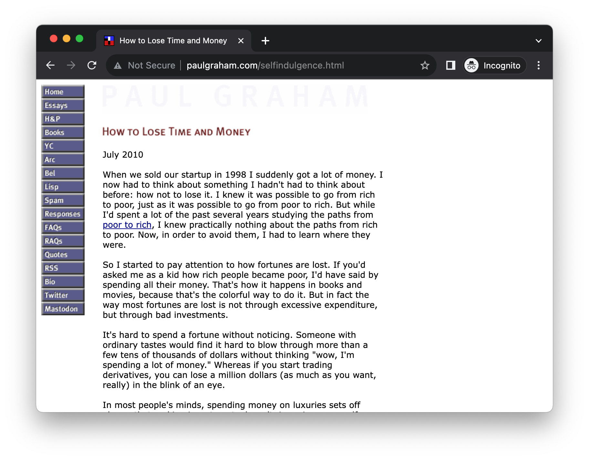

# Introduction

Navigating the complexities of building large React applications can be daunting. This opening chapter serves as a roadmap, outlining the challenges often encountered in projects of all sizes that I've been a part of. We'll delve into the intricacies later; for now, consider this a preview of the common hurdles we face. 

# What will be coverd

- Understanding why ui is difficult
- Exploring different ways of building ui
- Introducing our approach

# Understanding why build ui is difficult

Unless you're building a straightforward, document-like webpage—such as a basic article without advanced UI elements like search boxes or modals—the built-in languages offered by web browsers are generally insufficient. Most web applications are much more complex than a simple document.



The disparity between the language of the web and the UI experiences people encounter daily is substantial. Whether it's a ticket booking platform, a project management tool, or an image gallery, modern web UIs are intricate, and native web languages don't readily support them. You can go the extra mile to "simulate" UI components like accordions, toggle switches, or interactive cards, but fundamentally, you're still working with what amounts to a document, not a genuine UI component.

In an ideal world, building a user interface would resemble working with a visual UI designer. Tools like C++ Builder or Delphi, or more modern alternatives like Figma, let you drag-and-drop components onto a canvas that then renders seamlessly on any screen.

This isn't the case with web development. For instance, to create a custom search input, you'll need to wrap it in additional elements, fine-tune colors, adjust padding and fonts, and perhaps add an icon for user guidance. Creating an auto-suggestion list that appears right under the search box, matching its width exactly, is often far more labor-intensive than one might initially think.


Above is a Jira ticket - an issue view, and as you can tell it’s a relatively complicated user interface. For such a UI you might expect there is `Navigator` component, `Dropdown` list, `Accordion` and so on. But there isn’t, or should I say not directly. 

Developers have worked hard to simulate these with HTML, CSS and JavaScript. If I disable the CSS for the site temporarily, I will get something like this:


Utilizing a design system library can alleviate some of these challenges, offering developers a head start rather than building from scratch. However, design systems come with their own set of drawbacks and require thorough evaluation before integration into your project.

Note: Design System
A design system is a comprehensive set of guidelines, reusable UI components, and principles that help teams design and build digital products more efficiently and consistently. It serves as the single source of truth for both designers and developers, facilitating collaboration and speeding up the product development process. 

# Exploring a bit on ways of building ui

Let's move a bit back to history to see how the way we build web ui in the old time, and how the technique at different stage solve problems and why we end up with declartive ui library like React.

Firstly, let's start from a simple feature: given an array of strings, make a HTML list on the page. This is a common problem we face as a web developer - in real world scenario the data might come from a remote server, and the data might be more complicated, say, a nested object contains more data in each item, and we might need to render more sophiscated user interface, for example, a product card or a property listing. But we'll skip all these details and over simplify it for the demo here.

So the array is defined as the following content - it contains three famous quotes.

```ts
const quotes = [
    "The only way to do great work is to love what you do.",
    "The only limit to our realization of tomorrow is our doubts of today.",
    "In the end, we will remember not the words of our enemies, but the silence of our friends."
];
```

Let's beginging with implementing the feature with native DOM APIs.

Note: DOM
The Document Object Model (DOM) is a programming interface for web documents. It represents the structure of a document as a tree of objects, where each object corresponds to a part of the page such as an HTML tag. Essentially, the DOM serves as a representation of the web page so that languages like JavaScript can interact with it to change the document structure, style, and content. 

The DOM is not part of the JavaScript language, but rather a standard object-based representation of a web page, which can be manipulated using JavaScript. It allows for dynamic changes, enabling rich interactive web applications.

## Using DOM API

With the raw DOM API, you'll have to create each element and append it to the parent manually.

```ts
const ul = document.createElement('ul');

quotes.forEach(quote => {
  const li = document.createElement('li');
  li.innerText = quote;
  ul.appendChild(li);
});

document.body.appendChild(ul);
```

We use JavaScript's native DOM API to create an unordered list by invoking document.createElement('ul'). Then, for each quote in our quotes array, we create a new li element and set its inner text to the quote description. Finally, we append each li to the ul, and the ul gets appended to the document body with `document.body.appendChild(ul)`.

This approach offers the most control but is quite verbose and easy to get wrong. You directly interact with the DOM, meaning you're responsible for managing all aspects of element creation, updating, and deletion. This could lead to more errors and makes the code harder to manage and debug.

The native DOM API is a bit verbose and easy to go wrong if you don't pay enough attention. And jQuery changed the way people write code to manipulate the DOM.

## Using jQuery

```ts
const ul = $('<ul>');

quotes.forEach(quote => {
  const li = $('<li>').text(quote);
  ul.append(li);
});

$('body').append(ul);
```

Similarly, we start by creating an empty `<ul>` element using the jQuery constructor function `$('<ul>')`. For each quote in our array, we create a new `<li>` element, setting its text to the quote string using `.text()`. We then append each `<li>` to the `<ul>` using the `.append()` method. Finally, we append the complete `<ul>` to the body of the document using `$('body').append(ul)`.

Using jQuery simplifies the process and reduces boilerplate code. It abstracts away many complexities of native DOM manipulation, making the code more concise and less prone to errors. Instead of directly interacting with the DOM, we benefit from the utility methods jQuery offers, which internally handle the lower-level operations. This generally results in cleaner, more maintainable code that is easier to debug.

But still, we're thinking in how to do DOM manipulations, we need to consider which node to be inserted to where. 

## Using Early Frameworks like Backbone.js

Frameworks like Backbone.js attempted to bring structure to the frontend, introducing the MVC (Model-View-Controller) pattern to JavaScript development. While Backbone.js added more organization, it also increased complexity by necessitating a deep understanding of models, views, and routers.

For example, if we write the same function above with Backbone.js, we'll end up with some fairly complicated code like following:

```ts
const QuoteView = Backbone.View.extend({
  tagName: 'li',
  initialize: function(options) {
    this.text = options.text;
  },
  render: function() {
    this.$el.html(this.text);
    return this;
  }
});

const QuotesListView = Backbone.View.extend({
  el: '#quote-list',
  initialize: function(options) {
    this.quotes = options.quotes;
  },
  render: function() {
    this.quotes.forEach((quoteText) => {
      const quoteView = new QuoteView({ text: quoteText });
      this.$el.append(quoteView.render().el);
    });
    return this;
  }
});

const quotesListView = new QuotesListView({ quotes });
quotesListView.render();
```

In the Backbone.js code, we define two distinct views: `QuoteView` and `QuotesListView`. A view in Backbone.js is a piece of the user interface that is responsible for displaying data and handling user interactions. The `QuoteView` is responsible for rendering a single quote as a list item. It uses the `tagName` property to specify that it should generate an 'li' element. When initialized, it sets its internal `text` property to the quote text passed through the `options` argument.

The `QuotesListView` is a more complex view that manages a collection of `QuoteView` instances. A collection in Backbone.js is an ordered set of models that provides methods for managing them. The `el` property links the view to an existing DOM element, in this case, an element with the id `quote-list`. When the `QuotesListView` is initialized, it receives an array of quotes via `options`, which it sets as its internal `quotes` property.

The `render` method in `QuotesListView` iterates over the `quotes` array and for each quote, creates a new `QuoteView` instance, renders it, and appends it to its root element. This composition of views makes the application easier to manage and scale, as each view has a well-defined role.

In contrast to directly manipulating the DOM or using jQuery, Backbone.js offers a structured approach that separates the concerns of data management and UI rendering, making it easier to maintain and extend the codebase.

Backbone.js, while offering a structured approach to building web applications, has some challenges that led developers to explore alternative paradigms like two-way data binding:

1. Boilerplate Code: Backbone often requires a lot of boilerplate to get simple features up and running. For example, you have to manually set up listeners for model changes to update the view.

2. Manual DOM Management: With Backbone, you're still required to write logic to manipulate the DOM. This is tedious and error-prone.

3. Lack of Data Binding: Unlike frameworks that support two-way data binding, Backbone requires you to write custom code to sync your views with your models. This can become cumbersome for complex applications.

4. Complexity: As your application grows, you may find yourself managing a lot of views, models, and their interconnections. This could lead to spaghetti code if not managed carefully.

Two-way data binding frameworks like AngularJS (1.x) sought to address these issues by providing a more declarative way to sync the view with the model. With two-way data binding, any changes to the model are automatically reflected in the view and vice versa, without the need for manual DOM manipulation or event handling for synchronization.

Note: Two-way data binding
Two-way data binding is a mechanism where the User Interface (UI) fields are bound to model data dynamically, such that when a UI field changes, the model data changes with it and vice versa. This can significantly simplify how changes in your UI are reflected in your application state and how changes in your application state are reflected back in your UI.

Two-way data binding also had its downsides, such as performance issues on large applications and difficulties in debugging, as changes could be triggered from either the view or the model. This led to the adoption of a one-way data flow architecture in newer frameworks like React and Angular 2+, which offer greater control and predictability.

- Performance: Constantly watching for changes in the DOM and updating the model, and vice versa, can be resource-intensive, especially for large applications.
- Complexity: It can make the data flow in your application harder to understand and debug because changes can be initiated from both the UI and the model.
- Predictability: Two-way data binding can lead to situations where changes in one part of the application unexpectedly and undesirably affect other parts, which makes the system harder to reason about.

## Introducing React and Modern Frontend Frameworks

There are many new things with React compare to its predecessors. Namingly:

1. **One-Way Data Flow**: React employs a unidirectional data flow, ensuring that child components can't affect parent data. This creates a single source of truth within the application, which simplifies debugging and makes the state more predictable. This is a departure from two-way data binding methods found in older frameworks, where changes could propagate in both directions, often making it harder to track state changes and debug issues.

2. **Virtual DOM**: Unlike earlier libraries and frameworks that directly manipulated the real DOM, React creates a virtual DOM in-memory. When an element's state changes, React first performs the changes on the virtual DOM, then compares it with the real DOM, and finally updates only the differing parts. This results in enhanced performance by reducing costly DOM manipulations and repaints.

3. **Component-Based Architecture**: React brought a highly composable component-based architecture to the forefront. This not only allows for better code reusability but also makes it easier to manage state and lifecycle methods. Components are the building blocks of a React application, and they make it simpler to develop, maintain, and scale large applications.

4. **Server-Side Rendering**: Unlike some client-side rendering-only libraries, React allows for server-side rendering (SSR) out of the box. SSR can significantly improve the initial load time of a web application, which is crucial for both user experience and SEO.

5. **Immutable Data**: React pairs well with immutable data structures. This enables optimized rendering and improves the application's performance. When data is immutable, React can more easily determine changes, which is beneficial for optimizing re-renders.

These features set React apart from many of its predecessors, offering a more robust, maintainable, and scalable solution for building modern web applications.

Now let's write the same example with in React:

```tsx
function Quotes() {
  return (
    <ul>
      {quotes.map((quote, index) => <li key={index}>{quote}</li>)}
    </ul>
  );
}
```

In this React functional component named `Quotes`, an unordered list (`<ul>`) is rendered. Inside this list, the `.map()` function iterates over the `quotes` array to generate a list item (`<li>`) for each quote. The `{quote}` syntax injects the actual text of the quote into each list item.

A `key` attribute is also set to the index of each quote within the array, ensuring each list item has a unique identifier, as per React's best practices. This helps React optimize re-rendering by quickly identifying which items have changed.

Compared to the vanilla JavaScript example (and jQuery version), this React code is more declarative and easier to understand. You describe what you want (a list of quotes) rather than detailing all the steps to create it. This makes the code easier to debug and maintain in the long run.

## The Key Takeaways

You can see that as we progress from the raw DOM API to React, the code becomes easier to read and understand. In the DOM API, you have to explicitly create and append each element. jQuery improves upon this but still involves manual DOM manipulation. Backbone introduces the concept of views, but you still have to handle the rendering yourself.

React takes a step further by letting you focus on describing what the UI should look like, not how to get there. This declarative approach simplifies the mental model, reduces side effects, and makes the code much more maintainable.

The benefits of using a declarative API, as found in React, are manifold. One of the most significant advantages is that it abstracts away the manual manipulation of the DOM, allowing developers to focus more on the application's state and logic rather than how it is rendered. You describe what you want the UI to look like, and React takes care of making it so. This simplifies the codebase and makes it easier to maintain.

Another benefit is reusability. In React, components can be easily shared and reused across different parts of an application or even across different projects. This DRY (Don't Repeat Yourself) approach enhances code quality and speeds up development.

Declarative APIs also enhance the predictability and reliability of applications. Because you're describing what the UI should look like for a given state, it's easier to reason about the application's behavior. This makes debugging and testing simpler, as well as improves the overall maintainability of the codebase.

Lastly, React's declarative nature works well with modern development tooling and practices, such as component-driven development and various state management libraries. This ecosystem integration further eases the development process, providing a robust, efficient, and scalable way to build user interfaces.

In summary, React's declarative API offers a more maintainable, reusable, and predictable way to build UIs compared to the manual and error-prone methods required when using the native DOM API. It lets you focus on the 'what' rather than the 'how,' streamlining the development process and improving code quality.

# Introducing our approach

By this point, it's evident that React's declarative model for UI development has been a game-changer. Creating dynamic, maintainable, and scalable user interfaces has never been more straightforward. React alleviates many of the labor-intensive and error-prone tasks associated with direct DOM manipulation, offering a more abstracted, simplified path for web development.

However, React's powerful abstractions are not without their challenges. While these abstraction layers certainly make life easier, they can also introduce their own set of complexities and stumbling blocks. What may start as a 'best practice' can, over time and as circumstances change, morph into an anti-pattern.

This segues into the central theme of this book: the multifaceted challenges such as state management, separating business logic from views, and modularity, along with prevalent anti-patterns and code smells in extensive React applications. While React provides a host of advantages, it also leaves room for errors that can turn your codebase into a tangled, challenging-to-maintain structure.

Don't worry, though; this book serves as your roadmap through these intricate challenges. We will delve deep into common anti-patterns, dissect their underlying issues, and learn how to transform them into best practices.

The remedies to these problems often exist in proven software engineering practices like design patterns, refactoring, clean code, and Test-Driven Development (TDD). These aren't merely theoretical constructs; they're practical tools with a proven track record, applicable across various programming paradigms and languages.

So, as we shift our focus from lauding React's groundbreaking features to examining its inherent intricacies, remember: every challenge is a stepping stone for growth and learning.

## Understanding Anti-Patterns

First and foremost, understanding common anti-patterns is vital. These are pitfalls that ensnare developers regularly, giving rise to code that's less efficient, difficult to maintain, and more prone to errors. The first step to avoiding these traps is recognizing them. Doing so not only results in a sturdier codebase but also one that's more comprehensible. In coding, ignorance isn't a virtue—especially when it jeopardizes your application's quality.

In the pages to come, we will explore a wide array of such anti-patterns specific to React applications. But before we dive in, let's briefly examine a few to provide you with an initial overview.

- **Prop Drilling**: This refers to the practice of threading props through multiple layers of components to reach their ultimate destination. While seemingly benign at the outset, this can rapidly descend into complexity as your application grows.
  
- **Spaghetti State Management**: An unplanned approach to state management can result in a state that resembles a plate of spaghetti—tangled and tricky to manage. This complicates debugging, testing, and future enhancements.
  
- **Mixing Logic with Views**: React components are easiest to maintain when they strictly define the UI. Integrating business logic or data-fetching directly into these view components muddies the waters between what's presentational and what's functional, making it tougher to test and reuse. This also adds an unwarranted level of complexity that obscures the component's primary role.

To illustrate, let's make a minor alteration to the Quotes example from the previous section, this time incorporating data fetching from a remote server.

```tsx
function Quotes() {
  const [quotes, setQuotes] = useState([]);
  const [isLoading, setIsLoading] = useState(false);
  const [error, setError] = useState(null);

  useEffect(() => {
    setIsLoading(true); // Set loading to true

    fetch('https://quote-service.com/quotes')
      .then(response => {
        if (!response.ok) {
          throw new Error('Failed to fetch quotes');
        }
        return response.json();
      })
      .then(data => {
        setQuotes(data);  // Update the quotes state
      })
      .catch(err => {
        setError(err.message); // Set error message
      })
      .finally(() => {
        setIsLoading(false); // Set loading to false
      });
  }, []);

  return (
    <div>
      {isLoading && <p>Loading...</p>}
      {error && <p>Error: {error}</p>}
      <ul>
        {quotes.map((quote, index) => <li key={index}>{quote}</li>)}
      </ul>
    </div>
  );
}
```

Here, the `useState` hook manages three different state variables: `quotes` to hold the fetched quotes, `isLoading` to indicate loading status, and `error` to capture any fetch-related issues. The `useEffect` hook initiates the fetch operation. If successful, the state is updated with the retrieved quotes, and `isLoading` is toggled off. Conversely, if an error arises, it's captured and displayed, with `isLoading` also being set to false.

## Leveraging Established Design Patterns

Grasping the essence of time-tested design patterns can act as a compass for shaping your frontend architecture. These patterns have stood the test of time across various scenarios, offering repeatable solutions to common challenges. The advantages are dual-faceted: you not only gain a reliable roadmap for solving particular issues but also simplify the task for other developers to grasp your methodology, thus enhancing teamwork.

1. **Single Responsibility Principle (SRP)**: This tenet advocates that each function or component should have just a single reason to undergo change. In the context of React, this usually means dedicating each component to a particular aspect of the UI or functionality, which streamlines understanding, testing, and maintenance.

2. **Don't Repeat Yourself (DRY)**: This principle urges developers to maximize code reusability, minimizing duplication. In a React-based project, you could achieve this by crafting reusable components, hooks, or utilities that encapsulate common tasks.

3. **Composition Over Inheritance**: Given that React's architecture leans towards composition, this pattern empowers you to build more adaptive and maintainable components by assembling them from smaller, focused building blocks rather than extending capabilities through class inheritance.

We'll also explore some reputable design patterns that, while more commonly seen in backend development, are equally applicable in the frontend landscape.

1. **Strategy Pattern**: This design pattern provides the framework for defining a suite of algorithms or behaviors that can be switched interchangeably. In React, you might employ this pattern to alternate between different rendering or validation strategies for a form component based on specific conditions or settings.

2. **Decorator Pattern**: This pattern enables you to augment objects or components with new features without modifying their basic structure. In React, this could manifest as using Higher-Order Components (HOCs) or custom hooks to integrate analytics, logging, or extra state management into existing components.

By internalizing these design patterns, you'll be better equipped to develop effective React components and architectures, steering clear of the anti-patterns and pitfalls we'll dissect in subsequent chapters.

## Embracing Test-Driven Development and Continuous Refactoring

In the realm of coding, Test-Driven Development (TDD) and ongoing refactoring serve as powerful allies for enhancing code quality. TDD advocates for writing tests before the actual code, providing an immediate layer of scrutiny for potential issues. This approach is well-supported by the discipline of constant refactoring, where the code is routinely reviewed and improved. Such practices not only uphold a high standard of code quality but also render your codebase more flexible for future modifications.

Before diving into the usage of various refactoring methods, it's crucial to understand what these techniques are and when they are most effective. The following is a curated list of prevalent techniques that we will explore in greater depth throughout this book. Fear not the particulars; we'll cover each in detail in upcoming chapters.

1. **Extract Function**: Isolating specific blocks of code into their own functions can greatly improve code readability, emphasizing each function's singular purpose.

2. **Inline Function**: Essentially the antithesis of "Extract Function," this technique replaces function calls with the actual logic when it simplifies the code.

3. **Rename Variable**: The clarity of your code significantly depends on how well variables are named. A well-chosen name can make the code much more self-explanatory.

4. **Introduce Parameter Object**: Combining multiple related parameters into a single object can clarify a function's signature, making it more comprehensible and easier to manage.

5. **Decompose Conditional**: Unraveling complex conditional statements into smaller, well-named functions can alleviate the cognitive load of reading the code.

Implementing these refactoring methods will contribute positively to your code's readability, maintainability, and overall performance.

# Summary

In this chapter, we explored the challenges of UI development. We also discussed various UI building methods, how to handle errors, and introduced our approach that combines best practices and effective testing strategies. This sets the foundation for more efficient and robust frontend development.

In the upcoming chapter, we'll dive deep into React Essentials, giving you the tools and knowledge you need to master this powerful library. Stay tuned!
