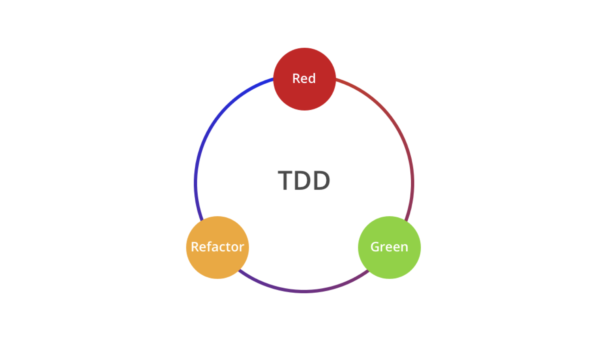
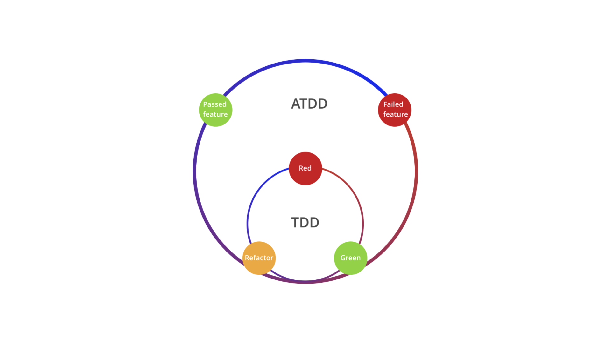
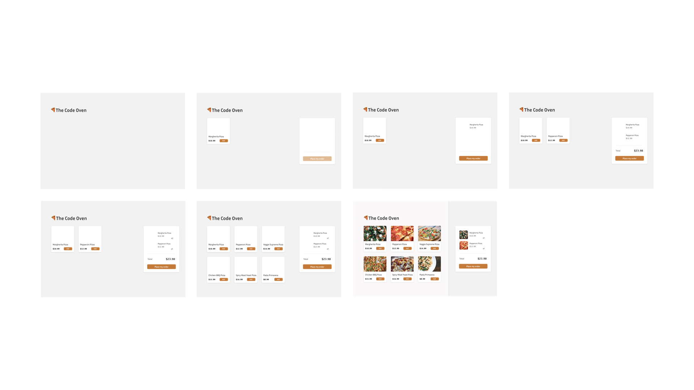
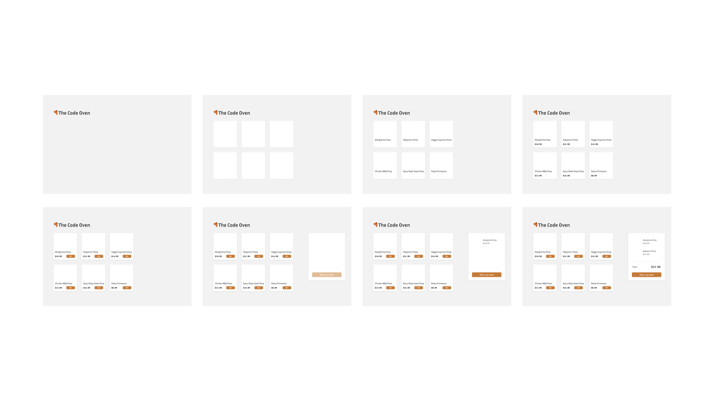
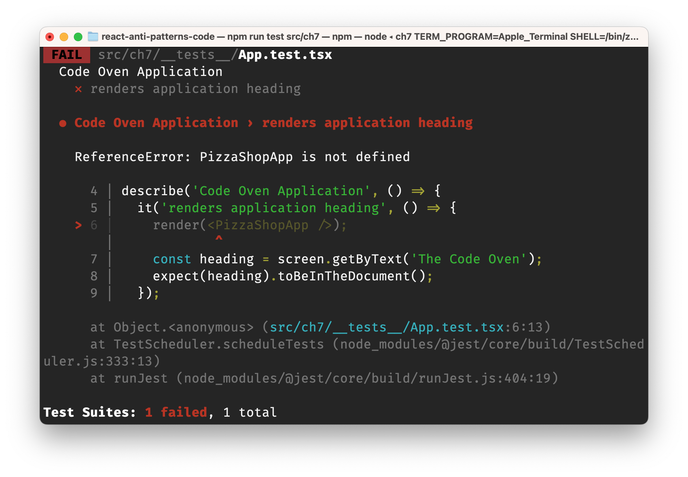

Welcome to a chapter that could potentially revolutionize your approach to React development—Test-Driven Development or TDD for short. If you've been building React applications, you know how complex and intricate they can get. With various states to manage, components to juggle, and user interactions to facilitate, ensuring the reliability of your codebase can be challenging. That's where TDD comes in.

In the ever-changing landscape of software development, where features are continuously added or modified, TDD serves as a lighthouse that guides you safely through the rough seas of bugs and regressions. By writing tests before your actual code, you not only confirm that your code does what it's supposed to, but you also create a safety net that makes future changes less risky.

This chapter aims to deepen your understanding of TDD and how to implement it effectively in React applications. We'll introduce the core principles of TDD, explore various styles including Unit Test-Driven Development, Acceptance Test-Driven Development, and Behavior-Driven Development (BDD), and even examine the nuanced differences between the Chicago and London styles of TDD.

But we won't stop at theory. To make these concepts come alive, we'll walk you through a practical example of creating a Pizza Store Menu page. From setting up the initial structure to managing complex features, we'll guide you through each step with the TDD approach. By the end of this chapter, you'll have a firm grasp on TDD's capabilities, and you'll be well-equipped to start writing more reliable, robust React applications.

So, get ready to dive into a world where tests lead the way and code follows, creating a harmonious balance that results in better, more reliable software.

In this chapter, we will cover the following topics:

- Understanding Test-Driven Development
- Introducing the core step of TDD: Tasking
- Introducing the online pizza store application
- Breaking down the requirements
- Implementing the menu list
- Refactoring the menu list
- Implementing the shopping cart
- Refactoring the shopping cart

# Technical requirements

A GitHub repository has been created to host all the code we discuss in the book. For this chapter, you can find the recommended structure under https://github.com/PacktPublishing/React-Anti-Patterns/tree/main/ch7.

# Understanding Test-Driven Development

## A Brief History

Test-Driven Development, commonly known by its acronym TDD, isn't exactly a new kid on the block. Originating from Extreme Programming (XP), a software development methodology that encourages frequent releases in short cycles, TDD has roots going back to the late 1990s. It was Kent Beck, one of the original signatories of the Agile Manifesto, who popularized this practice as a core part of Extreme Programming. The practice has since grown beyond the realm of XP and is now commonly utilized in various methodologies and frameworks, React included.

## The Red-Green-Refactor Loop

At the heart of TDD is a very simple, yet profoundly effective cycle known as the Red-Green-Refactor Loop.



Red: Write a test that defines a function or improvements of a function, which should fail initially because the function isn't implemented yet.

Green: Write the minimum amount of code necessary to pass the test. The key in this step is to write as little code as possible to make the test pass, no more.

Refactor: Clean up the code while keeping it functional. The refactor phase is about making the code efficient, readable, or understandable without changing its behavior. The tests written should still pass after the refactoring.


When developers first encounter TDD, it often feels counter-intuitive. The practice of writing tests before the actual code contradicts traditional development instincts. However, once you get past the initial discomfort, the advantages of TDD become hard to ignore:

- Focused Problem-Solving: By writing a test for a specific functionality first, you focus your attention solely on solving one problem at a time, making the development process less overwhelming.
- Predictable Next Steps: When you follow a test-driven approach, you always know what to do next: make the test pass. This reduces the cognitive load, making it easier to focus on the task at hand.
- Simple, Maintainable Design: The process naturally encourages the simplest code necessary to pass tests, resulting in a design that is as minimal as possible, and thereby easier to understand and maintain.
- Facilitates Mental Flow: The loop provides a structured approach to coding that helps maintain a state of mental 'flow,' reducing the constant context-switching that interrupts a productive coding session.
- Automatic Test Coverage: TDD ensures that your application has robust test coverage by default. You're not adding tests as an afterthought; they're integral to the development process, ensuring a more stable codebase.

Test-Driven Development is a practice deeply rooted in the principles of agile and extreme programming but has found relevance far beyond those methodologies. With its structured Red-Green-Refactor loop, TDD provides a solid framework for writing high-quality code. Although it may appear counter-intuitive initially, adopting TDD can result in more focused problem-solving, predictable development, simpler design, enhanced productivity, and robust test coverage.

## Different Styles of Test-Driven Development

The core principles of TDD have been adapted and extended into various styles, each offering different perspectives on how best to approach testing and development. Let's explore some of these styles to understand how they can apply to React development.

### Unit Test-Driven Development

The original form of TDD, often simply referred to as TDD, mainly focuses on unit tests. In this style, you write tests for the smallest pieces of your code—often individual methods or functions. The aim is to ensure that each part of your codebase works as expected in isolation. While this is powerful for testing logic and algorithms, it may not fully capture how various parts interact, especially in a complex UI framework like React.

### Acceptance Test-Driven Development (ATDD)

ATDD extends TDD by beginning the development process with user acceptance tests. This means before writing any code, you define what "done" looks like from a user's perspective, often in collaboration with stakeholders. These acceptance tests are then used as the foundation for developing features. ATDD is particularly useful for ensuring that you're building what the user actually needs and wants.



### Behavior-Driven Development (BDD)

BDD is a further refinement of TDD and ATDD, focusing on the behavior of an application for a given input. Rather than writing tests that check if a particular method returns an expected value, BDD tests check if a system behaves as expected when subjected to certain conditions. BDD often uses a more descriptive language to define tests, making it easier for non-technical stakeholders to understand what is being tested.

Behavior-Driven Development (BDD) often makes use of tools like Cucumber to define behavior specifications in a human-readable format. In a Cucumber test, you specify behavior using a plain-text language called Gherkin. Here's a simple example of a BDD test case using Cucumber for a pizza ordering feature:

```
Feature: Pizza Ordering

  Scenario: Customer orders a single pizza
    Given I'm on the PizzaShop website
    When I select the "Order Pizza" button
    And I choose a "Margherita" pizza
    And I add it to the cart
    Then the cart should contain 1 "Margherita" pizza

  Scenario: Customer removes a pizza from the cart
    Given I'm on the PizzaShop website
    And the cart contains 1 "Margherita" pizza
    When I remove the "Margherita" pizza from the cart
    Then the cart should be empty
```

This Gherkin file defines the expected behavior of the pizza ordering functionality. The scenarios describe the behavior in terms of the steps to be performed and the expected outcomes. Gherkin syntax is more than just readable documentation; it's executable. Tools like Cucumber can parse the Gherkin files and execute tests based on them. This ensures that the software behaves exactly as described in the feature files, making it a source of truth that evolves along with the application. 

BDD feature files serve as a form of living documentation that gets updated as the application changes. This makes them incredibly valuable for new team members, or even for seasoned developers, to understand the expected behavior of the application quickly.

## TDD in React: A User-Centric Approach

Regardless of the style you choose, when working with React, it's crucial to focus on the user's perspective. React components are pieces of UI that users interact with, so your tests should reflect that interaction. The user doesn't care about how your state is managed or how efficient your lifecycle methods are; they care about whether clicking a button shows a dropdown, or whether a form submission produces the expected result.

> The more your tests resemble the way your software is used, the more confidence they can give you. - Kent C. Dodds

This user-centric approach aligns well with BDD and ATDD, where the focus is on the end result of an interaction, not the minutiae of the implementation. By adhering to these principles, you can ensure your React components not only work well but also deliver the user experience you aim to achieve.

# Introducing the core step of TDD: Tasking

Tasking is an essential step in the TDD process that involves breaking down a feature or user story into small, manageable tasks. These tasks then serve as the basis for your test cases. The goal of tasking is to create a clear roadmap for what you're going to code, how you'll test it, and in what order you'll proceed. 

## The Importance of Tasking

1. **Clarifies Scope**: Breaking down a feature into tasks helps to establish a better understanding of what needs to be done and how to approach it.
  
2. **Simplifies Problem**: By dissecting a complex problem into smaller tasks, you make it easier to tackle.

3. **Prioritizes Work**: Once the tasks are laid out, they can be prioritized to deliver the most value first or to build logically upon one another.
  
4. **Focuses Effort**: Tasking ensures that each test you write serves a clear, immediate purpose, making your TDD cycle more efficient.

5. **Facilitates Collaboration**: Team members can pick up individual tasks, safe in the knowledge that they are all contributing to a cohesive whole.

## How to Do Tasking

1. **Review User Story or Requirement**: Understand the user story or feature you are supposed to implement.

2. **Identify Logical Components**: Break the story down into its logical components, which often correspond to domain concepts, business rules, or individual steps in a user workflow.

3. **Create Task List**: Write down a list of tasks. These tasks should be small enough that you can write a few test cases and the corresponding implementation code in a short amount of time (say, 15 to 30 minutes).

4. **Sequence the Tasks**: Determine the most logical order for completing these tasks, often starting with the "happy path" and then moving on to edge cases and error handling.

5. **Map Tasks to Tests**: For each task, identify the tests that will verify that part of the functionality. You don't need to write the tests at this stage; you're simply identifying what they'll be.

Tasking might be a part of your daily workflow without you even realizing it. It's a systematic approach to problem-solving that involves breaking down a requirement into manageable, sequential tasks. These tasks should ideally be completable within a few minutes to an hour.

The process of Test-Driven Development (TDD) is akin to the art of painting. You begin with a sketch or draft, outlining basic shapes and lines with a pencil, much like framing the initial structure of your code. In the beginning, the vision might be vague, a mere idea or concept in your mind. But as you draw - or write tests and code - the image begins to take shape. More elements are added, details emerge, and adjustments are made, allowing for continuous refinement. With each layer or iteration, clarity emerges, yet the exact final appearance remains a mystery until the very last stages. Just as an artist crafts a masterpiece through gradual development, TDD shapes a robust and elegant piece of software.

All right, we have covered a lot of theory so far. Let's look into a concrete example to fully understand how to do tasking and use the tasks as guideline to applying the Red-Green-Refactor loop.

# Introducing the Online Pizza Store Application

We'll be diving into the TDD process through a deliciously practical example: Code Oven, an online pizza store. Named to celebrate the fusion of coding and culinary arts, Code Oven aims to serve both your appetite and your intellectual curiosity. This digital storefront will offer us a comprehensive sandbox where we can apply all the TDD principles and techniques we discuss.

## Features Overview

Here's what you can expect to see in Code Oven:

1. **Pizza Menu**: At the heart of Code Oven is an appetizing menu of 8 delectable pizzas. Each pizza is presented with its name and cost, designed to whet your appetite and inform your choice.

2. **Add to Cart Button**: Beside each mouth-watering option is an "Add to Cart" button. This enables users to start the ordering process by adding their chosen pizzas to a virtual shopping cart.

3. **Shopping Cart**: A designated section on the screen shows users their current shopping cart, complete with the names and prices of each selected pizza.

4. **Modify Cart**: Should you get second thoughts or just need more pizza, Code Oven allows you to modify your cart by adding or removing items dynamically.

5. **Order Total**: No need for manual calculations; Code Oven's cart automatically computes and displays the total price of your chosen items.

6. **Place Order Button**: And finally, a prominent "Place My Order" button serves as the final step, which would, in a real-world application, process the order for delivery or pick-up.


As we build out Code Oven, we'll be applying TDD at every stage to ensure that our virtual pizzeria is not just functional but robust and easily maintainable. Get ready to roll up your sleeves, both for coding and for some virtual pizza-making!

# Breaking down the requirements

## The Bottom-Up Style

In the bottom-up style of TDD, developers start by writing tests and implementing functionality for the smallest and most fundamental components of the system. This approach emphasizes the construction of individual units or classes, thoroughly testing them before integrating them into higher-level components. It provides strong validation for the underlying parts of the system and helps in creating a robust foundation. 

However, this style might lead to challenges in integrating the components if the bigger picture and interactions between the units are not carefully considered.

Back to the online pizza store, we can break the whole page down into the following tasks.

- Implement a single `PizzaItem` component with pizza name
- Add price to `PizzaItem`
- Add a button to `PizzaItem`
- Implement a `PizzaList` (render only 3 items per line for example)
- Implement a simple `ShoppingCart` component with a button
- Support add/remove items to the `ShoppingCart`
- Add total number calculation
- Implement the whole application with these individual atom components

We’ll focus on one component at a time. We would add many test cases to cover the functionality required, as well as other reasonable edge cases. And once `PizzaList` and `ShoppingCart` are done, we integrate them together and then test a few overall functions from the user’s perspective.



## The Top-Down Style

The top-down style of TDD takes an opposite approach, beginning with the high-level architecture and overall functionality of the system. Developers first write tests and implement features for the main components and then gradually work their way down to the more detailed and specific functionalities. 

This style helps to ensure that the system's primary objectives and workflow are established early on, providing a clear roadmap for the development process. It can foster better integration and alignment with the overall goals but may sometimes require the use of temporary "stubs" or "mocks" to simulate lower-level components before they are actually developed.

- Implement the page title
- Implement a menu list, each has a pizza name
- Implement a `ShoppingCart` with only a button (disabled by default)
- Add an item to `ShoppingCart` when button is clicked, then `ShoppingCart` button is enabled
- Add price to a `section`
- Add total number in `ShoppingCart`
- Remove an item from `ShoppingCart`, the total number changes correspondingly

For the top-down approach, we don’t have a clear picture of the individual units, but a working integration. And gradually extract code from the big component, we can stop at anytime without break the functionality - but the risk is we might leave some unwanted code in the codebase if we don’t pay attention.  



Both styles have contributed to the rich variety of methodologies in modern software development, and neither is definitively "right" or "wrong." Instead, they offer different perspectives and tools that developers can choose from based on their particular needs and preferences.

In the following parts of the chapter, we are going to use Top-Down style as it forces us to think from the user's perspective. We'll explore more the Bottom-Up approach in the following chapters when we introduce other design patterns.

# Implementing the application headline

Let's now start with the implementation of the pizza store application. If you have cloned the repo mentioned in the techinique requirements, simply go to the folder `react-anti-patterns-code/src/ch7`.

As we're applying test-driven development, the first thing here is to write a test that fails. And what to test is listed in the previous section "Implement the page title". So let's create a file called `App.test.tsx` with the following code:

```ts
import React from 'react';
import {render, screen} from '@testing-library/react';

describe('Code Oven Application', () => {
  it('renders application heading', () => {
    render(<PizzaShopApp />);
    const heading = screen.getByText('The Code Oven');
    expect(heading).toBeInTheDocument();
  });
});
```

We're writing a test for the yet-to-be-created React component `PizzaShopApp`. Using React Testing Library, we render this component and verify if it includes a heading labeled 'The Code Oven'. The assertion `expect(heading).toBeInTheDocument();` confirms that the heading is successfully rendered.

And now if we run the test with the following command in terminal:

```ts
npm run test src/ch7
```

There will be an error shows up in the termail, and saying that `ReferenceError: PizzaShopApp is not defined`.



We're in the red status of the red-green-refactoring loop now. We then make the test pass by the simplest possbile code. Nothing beats a static component returns exactly "The Code Oven" at the moment. That means we can simply define a function component in the test at the moment to make the test pass:

```tsx
import React from 'react';
import {render, screen} from '@testing-library/react';

function PizzaShopApp() {
  return <>The Code Oven</>;
}

describe("Code Oven Application", () => {
  it("renders application heading", () => {
    render(<PizzaShopApp />);
    const heading = screen.getByText("The Code Oven");
    expect(heading).toBeInTheDocument();
  });
});
```

And we re-run the test, and it passes now. The `PizzaShopApp` does exactly the thing the test expects - showing a "The Code Oven" text. Now we're at the green status of the red-green-refactoring loop. Next we could look into opportunities for improvment. 

Obviously we don't want to write all our code inside the test file, we can use Move Function refactoring method we have learnt from the previous chapter, move the `PizzaShopApp` into a separate file `App.tsx`.

```tsx
import React from "react";

export function PizzaShopApp() {
  return <>The Code Oven</>;
}
```

Awesome, now we have done a complete red-green-refactoring loop. We can remove that task from our task list and move on to the next one. Please note that we don't have to be perfect at the begining as we know the test-driven development is a iterative process, we always have chance to make the code better as we have good tests protecting us.

# Implementing the menu list

The menu list is an important feature, even the list of pizza names can help our customer to order - maybe not ready for order online - but a good start point if they just want to browser and decide what to eat.

We can write our second test like so according to the second task we have split:

```tsx
it("renders menu list", () => {
  render(<PizzaShopApp />);
  const menuList = screen.getByRole('list');
  const menuItems = within(menuList).getAllByRole('listitem');

  expect(menuItems.length).toEqual(8);
});
```

The test starts by rendering the component. Then it identifies the HTML element tagged with the role 'list' from the rendered component. Using the `within` function, it narrows down the search to only that list and locates all items within it tagged with 'listitem'. Finally, it asserts that the number of such items should be equal to 8. So essentially we want to see 8 list items to show up on the page (assume the pizza shop only have 8 items to offer).

Now the test failed again, and to make the above test to pass, in the simplest way, we can hard code 8 empty list item on the page:

```tsx
import React from "react";

export function PizzaShopApp() {
  return <>
    <h1>The Code Oven</h1>
    <ol>
      <li></li>
      <li></li>
      <li></li>
      <li></li>
      <li></li>
      <li></li>
      <li></li>
      <li></li>
    </ol>
  </>;
}
```

It doesn't look too good, but it makes the test pass. This is a important step, during the TDD, we always want to make the test pass first and then loop for opportunites to improve. The advantage of this mindset forces us to think on delivery and production readyness. We should be able to stop at any point and go production - even the code isn't perfect yet.

Rerun the test to see it pass, then we do the refactoring. To reduce the long hard-coded `li`, we can use a array with 8 elements and do a `map` to generate the `li` dynamically.

```tsx
import React from "react";

export function PizzaShopApp() {
  return <>
    <h1>The Code Oven</h1>
    <ol>
      {new Array(8).fill(0).map(x => <li></li>)}
    </ol>
  </>;
}
```

Inside this list, an array with 8 elements (all initialized to 0) is mapped over, generating 8 empty list items (`li`). This matches the test criteria of having a menu list with 8 items. And the tests pass with the new structure.

So basically we've done another red-green-refactor loop. Then we can verify the pizza names are correctly displayed. Let's adding a few more lines in the second test case:

```tsx
it("renders menu list", () => {
  render(<PizzaShopApp />);
  const menuList = screen.getByRole('list');
  const menuItems = within(menuList).getAllByRole('listitem');

  expect(menuItems.length).toEqual(8);

  expect(within(menuItems[0]).getByText('Margherita Pizza')).toBeInTheDocument();
  expect(within(menuItems[1]).getByText('Pepperoni Pizza')).toBeInTheDocument();
  expect(within(menuItems[2]).getByText('Veggie Supreme Pizza')).toBeInTheDocument();
  //...
});
```

To make all the new added lines to pass, we'll need to define a list of pizza names in our `PizzaShopApp`, and map through these names into `li`s:

```tsx
const pizzas = [
  "Margherita Pizza",
  "Pepperoni Pizza",
  "Veggie Supreme Pizza",
  "Chicken BBQ Pizza",
  "Spicy Meat Feast Pizza",
  "Pasta Primavera",
  "Caesar Salad",
  "Chocolate Lava Cake"
];

export function PizzaShopApp() {
  return <>
    <h1>The Code Oven</h1>
    <ol>
      {pizzas.map((x) => <li>{x}</li>)}
    </ol>
  </>;
}
```

And the tests are passing once again.

# Making the ShoppingCart to work

To drive out a `ShoppingCart` component, we can start with a simple test that expecting a empty container to show on the page, inside the container there should be a button. And we don't have to describe everything at beginning.

```tsx
it('renders a shopping cart', () => {
  render(<PizzaShopApp />);

  const shoppingCartContainer = screen.getByTestId('shopping-cart');
  const placeOrderButton = within(shoppingCartContainer).getByRole('button');

  expect(placeOrderButton).toBeInTheDocument();
})
```

The Jest test renders the `PizzaShopApp` component and then locates a shopping cart container by its 'data-testid'. Within this container, it looks for a button element by its role. The test concludes by using the `toBeInTheDocument()` matcher to verify that this button is present in the rendered output.

To make this test pass, we can add an empty `div` as a container with the data-testid, and put a empty button in it.

```tsx
export function PizzaShopApp() {
  return <>
    <h1>The Code Oven</h1>
    <ol>
      {pizzas.map((x) => <li>{x}</li>)}
    </ol>

    <div data-testid="shopping-cart">
      <button></button>
    </div>
  </>;
}
```

As the tests pass, we then add more details in the test, checking if the button is by default disabled. Note how we back and forth between the test code and implementation, this could happen frequently at beginining. Once you familiar with the red-green-refactor cycle, you could make each test a bit complicated, and modify the code to pass all tests, the point is to establish this fast feedback first.

```tsx
it('renders a shopping cart', () => {
  render(<PizzaShopApp />);

  const shoppingCartContainer = screen.getByTestId('shopping-cart');
  const placeOrderButton = within(shoppingCartContainer).getByRole('button');

  expect(placeOrderButton).toBeInTheDocument();
  expect(placeOrderButton).toHaveTextContent('Place My Order');
  expect(placeOrderButton).toBeDisabled();
})
```

We want the button to have text "Place My Order", and it should be disabled by default as there isn't anything in the cart. The test failed again, waiting us to put more details in the implementation. 

```tsx
export function PizzaShopApp() {
  return <>
    <h1>The Code Oven</h1>
    <ol>
      {pizzas.map((x) => <li>{x}</li>)}
    </ol>

    <div data-testid="shopping-cart">
      <button disabled>Place My Order</button>
    </div>
  </>;
}
```

The tests are all passing again. And then we can tick off one more task from the task list. Note that how maintaining a task list can help me to focus and gradually shapping our application code. 

Next, we can look into the next task - adding item from menu to shopping cart.

# Adding item to shopping cart

```tsx
it('adds menu item to shopping cart', () => {
  render(<PizzaShopApp />);

  const menuList = screen.getByRole('list');
  const menuItems = within(menuList).getAllByRole('listitem');

  const addButton = within(menuItems[0]).getByRole('button');
  userEvent.click(addButton);

  const shoppingCartContainer = screen.getByTestId('shopping-cart');
  const placeOrderButton = within(shoppingCartContainer).getByRole('button');

  expect(within(shoppingCartContainer).getByText('Margherita Pizza')).toBeInTheDocument();
  expect(placeOrderButton).toBeEnabled();
})
```

The test renders the `PizzaShopApp` component, fetches the menu list, and grabs all the list items within it. It then simulates a user clicking the 'Add' button of the first menu item. Next, it locates the shopping cart container and checks two things: 

- the added item, 'Margherita Pizza,' appears in the cart, 
- that the 'Place Order' button is enabled

Let's add the button to a menu item first, and then adding a state to manage the user selection and enable the "Place Your Order" button according to the selection.

```tsx
export function PizzaShopApp() {
  const [cartItems, setCartItems] = useState<string[]>([]);

  const addItem = (item: string) => {
    setCartItems([...cartItems, item]);
  }

  return <>
    <h1>The Code Oven</h1>
    <ol>
      {pizzas.map((x) => <li>
        {x}
        <button onClick={() => addItem(x)}>Add</button>
      </li>)}
    </ol>

    <div data-testid="shopping-cart">
      <ol>
        {cartItems.map(x => <li>{x}</li>)}
      </ol>
      <button disabled=>Place My Order</button>
    </div>
  </>;
}
```

The `PizzaShopApp` function component uses React's `useState` hook to manage an array of `cartItems`. It defines a function `addItem` to add items to this cart. The component renders a list of pizzas, each with an 'Add' button. Clicking the 'Add' button invokes the `addItem` function, adding the corresponding pizza to the `cartItems` array. The shopping cart displays the items in `cartItems` in a list. The 'Place My Order' button's disabled state is controlled by the length of the cartItems array. Specifically, the button is disabled when the cart is empty (cartItems.length === 0).

The implementation looks great, but if we run the tests, something weird happens. The test failed in the terminal with error message like this: TestingLibraryElementError: Found multiple elements with the role "list".

That is because we have two list on the screen now, and React Testing Library is confused which one should it look for "Add" button, and which to look for added items. We can fix that by adding a more specific data-testid to the menu list, and modify the test accordingly. 

So firstly, let's change our `PizzaShopApp`, and move the first `ol` into a `div` attributed with `data-testid="menu-list"`:

```tsx
<div data-testid="menu-list">
  <ol>
    {pizzas.map((x) => <li>
      {x}
      <button onClick={() => addItem(x)}>Add</button>
    </li>)}
  </ol>
</div>
```

And then we modify the test into the following code. Note we explictly ask the React Testing Library to search inside `menu-list` for all list items.

```tsx
it('adds menu item to shopping cart', () => {
  render(<PizzaShopApp />);

  const menuItems = within(screen.getByTestId('menu-list')).getAllByRole('listitem');

  const addButton = within(menuItems[0]).getByRole('button');
  userEvent.click(addButton);

  const shoppingCartContainer = screen.getByTestId('shopping-cart');
  const placeOrderButton = within(shoppingCartContainer).getByRole('button');

  expect(within(shoppingCartContainer).getByText('Margherita Pizza')).toBeInTheDocument();
  expect(placeOrderButton).toBeEnabled();
})
```

And when we re-run the test, it failed one more time with the error message like this: 

```
    TestingLibraryElementError: Unable to find an element with the text: Margherita Pizza. This could be because the text is broken up by multiple elements. In this case, you can provide a function for your text matcher to make your matcher more flexible.
```

The expected "Margherita Pizza" doesn't show up in the shopping cart. This is because we use event to trigger React to re-render by modify the `cartItems` array. But when React detect and re-render, the test isn't waiting for that to happen. We need to give React a bit time to digest the change and re-render. We can mark the test case as async and wait the `userEvent.click` to make the state change.

```tsx
it('adds menu item to shopping cart',  async () => {
  render(<PizzaShopApp />);

  const menuItems = within(screen.getByTestId('menu-list')).getAllByRole('listitem');

  const addButton = within(menuItems[0]).getByRole('button');
  await userEvent.click(addButton);

  const shoppingCartContainer = screen.getByTestId('shopping-cart');
  const placeOrderButton = within(shoppingCartContainer).getByRole('button');

  expect(within(shoppingCartContainer).getByText('Margherita Pizza')).toBeInTheDocument();
  expect(placeOrderButton).toBeEnabled();
})
```

In the code snippet, the use of `async` and `await` ensures that the asynchronous operations are completed before moving on to the next step in the test. The test function itself is marked as `async`, making it return a Promise, which Jest will wait for before considering the test complete.

The `await userEvent.click(addButton);` line is particularly important. `userEvent.click` simulates a real user clicking a button and might trigger state updates or effects in your React component. Using `await` here ensures that all associated updates and effects are fully completed before moving on to the subsequent lines of the test.

By ensuring that `userEvent.click` has been fully processed, the test will then safely proceed to query and assert against the updated DOM or state. This is crucial for avoiding false negatives, where the test might fail not because the code is incorrect, but because the test is checking the DOM before all updates have occurred.

Since we have all the tests passing again, it's time to look into other opportiunites for improvement.

# Refactoring the code

The code we have now isn't too hard to read, but definitely has some room for improve.

```tsx
export function PizzaShopApp() {
  const [cartItems, setCartItems] = useState<string[]>([]);

  const addItem = (item: string) => {
    setCartItems([...cartItems, item]);
  }

  return <>
    <h1>The Code Oven</h1>
    <div data-testid="menu-list">
      <ol>
        {pizzas.map((x) => <li>
          {x}
          <button onClick={() => addItem(x)}>Add</button>
        </li>)}
      </ol>
    </div>

    <div data-testid="shopping-cart">
      <ol>
        {cartItems.map(x => <li>{x}</li>)}
      </ol>
      <button disabled={cartItems.length === 0}>Place My Order</button>
    </div>
  </>;
}
```

Firstly, we could use `Rename Variable` to change the `x` to `item`. Also, there is a warning in the terminal at the moment: **Warning: Each child in a list should have a unique "key" prop.**, we can use the `item` as key for now to fix this issue. 

```tsx
export function PizzaShopApp() {
  const [cartItems, setCartItems] = useState<string[]>([]);

  const addItem = (item: string) => {
    setCartItems([...cartItems, item]);
  }

  return <>
    <h1>The Code Oven</h1>
    <div data-testid="menu-list">
      <ol>
        {pizzas.map((item) => <li key={item}>
          {item}
          <button onClick={() => addItem(item)}>Add</button>
        </li>)}
      </ol>
    </div>

    <div data-testid="shopping-cart">
      <ol>
        {cartItems.map(item => <li key={item}>{item}</li>)}
      </ol>
      <button disabled={cartItems.length === 0}>Place My Order</button>
    </div>
  </>;
}
```

The menu item list looks pretty independent, we can extract a new component here to encapulsate that logic.

```tsx
const MenuList = ({
  onAddMenuItem,
}: {
  onAddMenuItem: (item: string) => void;
}) => {
  return (
    <div data-testid="menu-list">
      <ol>
        {pizzas.map((item) => (
          <li key={item}>
            {item}
            <button onClick={() => onAddMenuItem(item)}>Add</button>
          </li>
        ))}
      </ol>
    </div>
  );
};
```

The `MenuList` component takes a single prop, `onAddMenuItem`, which is a function that accepts a string argument representing a menu item. The component renders a list of pizzas, which presumably is an array of strings. For each pizza, it creates a list item and an "Add" button. When the button is clicked, the `onAddMenuItem` function is called with the corresponding pizza name as an argument. The component uses the `data-testid="menu-list"` attribute to make it easier to query this section during testing. Overall, this is a presentational component designed to display a list of pizzas and handle the addition of menu items through the provided callback.

Similarly, we can extract a new component for the shopping cart.

```tsx
const ShoppingCart = ({ cartItems }: { cartItems: string[] }) => {
  return (
    <div data-testid="shopping-cart">
      <ol>
        {cartItems.map((item) => (
          <li key={item}>{item}</li>
        ))}
      </ol>
      <button disabled={cartItems.length === 0}>Place My Order</button>
    </div>
  );
};
```

The `ShoppingCart` component takes an array of `cartItems` as its prop. This array holds the names of the items that have been added to the shopping cart. The component renders an ordered list (`<ol>`) where each list item (`<li>`) corresponds to an item in the cart. It uses the `data-testid="shopping-cart"` attribute to make it easier to identify this component in tests. Additionally, a "Place My Order" button is rendered at the bottom of the list. The button is disabled if the `cartItems` array is empty, meaning there are no items in the cart. Overall, this component is designed to display the items in the shopping cart and provide an option to place the order.

After these extractions, we can then use these component in the main component: `PizzaShopApp`:

```tsx
export function PizzaShopApp() {
  const [cartItems, setCartItems] = useState<string[]>([]);

  const addItem = (item: string) => {
    setCartItems([...cartItems, item]);
  };

  return (
    <>
      <h1>The Code Oven</h1>
      <MenuList onAddMenuItem={addItem} />
      <ShoppingCart cartItems={cartItems} />
    </>
  );
}
```

And during these relatively big changes, our tests are always stay in the green state - meaning no function broken. We haven't finish the task list we split, but I believe you have got the idea of the red-green-refactor loop. You can use the left task as some exercises, make sure you always write test first, make the test with only the mininal code, and look for improvment after the test pass. 

You might find it's pretty hard at begining, you need to concisouly hold the attmptation of dive into the implementation right away, go baby step and enjoy the process. You will soon realise how power the small step is, and how the rhytem can help you stay focus and be more productive.

# Summary

In this chapter on Test-Driven Development (TDD), we've explored various forms of TDD, emphasizing the importance of breaking down complex problems into manageable tasks through tasking. We've delved into two key approaches: top-down and bottom-up, each with its distinct merits and use-cases. Illustrating these concepts, we used a practical example of building a pizza shop application. This hands-on example helped to solidify the theories and methodologies discussed, providing a comprehensive understanding of how TDD can be effectively employed in different scenarios.

In the upcoming chapter, we'll delve deeper into the intricate world of data management in React applications. Specifically, we'll explore various design patterns that are commonly adopted for efficient data access and manipulation. Alongside, we'll also discuss typical issues that developers often encounter, such as state management complexities and asynchronous data handling. Furthermore, we'll touch on anti-patterns to watch out for, which could negatively impact both performance and maintainability. By the end of the chapter, you'll have a more robust understanding of how to effectively manage data in your React projects.